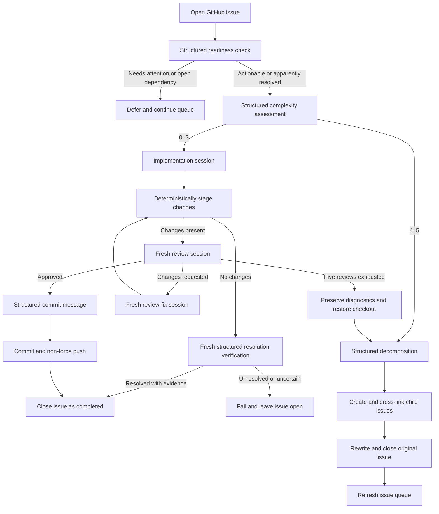
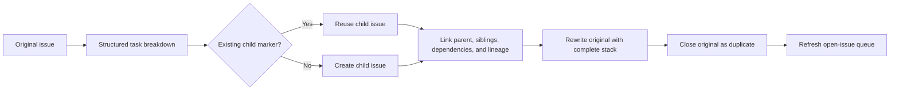
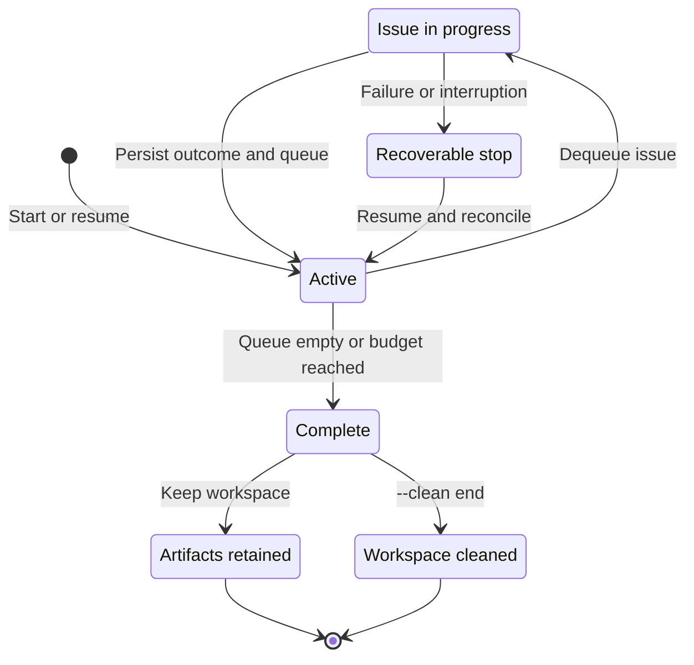
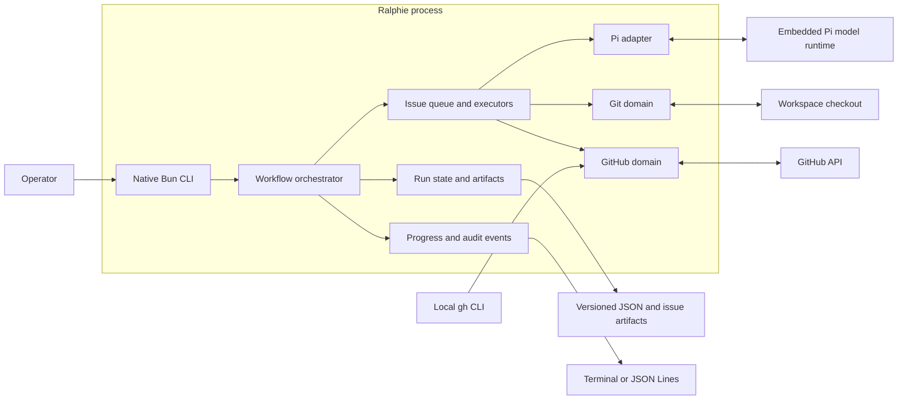

# Ralphie

**Turn a GitHub issue queue into reviewed commits with Pi.**

[](https://github.com/beremaran/ralphie/actions/workflows/ci.yml)

Ralphie is an opinionated, resumable CLI that reads open GitHub issues, asks
[Pi](https://github.com/earendil-works/pi) for schema-validated decisions, and routes each
issue through one of two workflows:

- implement, review, revise, commit, and push focused work; or
- decompose complex work into linked, dependency-aware GitHub issues.

Agents handle reasoning and code changes. Ralphie keeps Git operations, GitHub
mutations, run state, recovery, and safety checks deterministic.

> [!CAUTION]
> Ralphie defaults to the `lgtm` workflow: it works directly on the branch
> selected by `--branch`, commits approved work, and pushes directly to that
> branch. Use `--workflow pr` to deliver through an automatically merged feature
> branch and pull request instead.

> [!NOTE]
> Ralphie is pre-1.0 and can be run from its published scoped package with
> `bunx @beremaran/ralphie`. The scope is intentional: use this package name,
> not the unrelated unscoped npm package named `ralphie`. Start with a one-issue
> `--dry-run` against a repository you control before enabling mutations.

### Version and build metadata

`ralphie --version` prints only the release version. For automation,
`ralphie --version --output json` prints a stable object containing `version`
and `commitSha`. Both forms work without a repository, GitHub credentials, or
Pi configuration.

Release builds embed the immutable commit SHA supplied by the build entry point;
it is not read from the runtime environment. Local builds use the documented
`local` commit sentinel when no release SHA is supplied.

## Why Ralphie?

- **Issue-native automation** — each run focuses on one GitHub repository, with
  the issue as the unit of planning, execution, recovery, and reporting.
- **Structured agent decisions** — complexity, reviews, decompositions, and
  commit messages are validated against explicit schemas.
- **Fresh-context review loops** — implementation, review, and review-fix work
  run in separate Pi sessions to reduce context bias.
- **Deterministic delivery** — Ralphie stages, inspects, commits, and pushes the
  resulting changes itself; agents do not own the delivery protocol.
- **Crash-safe recovery** — versioned run state, issue checkpoints, artifacts,
  and idempotent reconciliation make interrupted runs resumable.
- **Observable by default** — live token-level Pi transcripts, interactive
  progress, durable audit events, JSON Lines output, quiet mode, and credential
  redaction are built in.
- **Bounded autonomy** — review loops stop after five attempts, unsafe direct
  pushes are refused, and force pushes are never used.

## Installation

### Install the standalone release

The standalone installer downloads and verifies the native release binary for
macOS or Linux. It uses this stable, unauthenticated repository entry point
and installs the latest release by default. Verification is mandatory: install
the Sigstore CLI (`sigstore`) and ensure either `sha256sum` (Linux) or
`shasum` (macOS) is available on `PATH` before running it. The installer has no
unsigned or checksum-only fallback:

```bash
curl -fsSL https://raw.githubusercontent.com/beremaran/ralphie/main/scripts/install.sh | sh
```

To download the script before running it, save it locally so you can inspect it
first:

```bash
curl -fsSL https://raw.githubusercontent.com/beremaran/ralphie/main/scripts/install.sh \
  -o install-ralphie.sh
sh install-ralphie.sh
```

With no positional argument, the installer creates the destination if needed
and installs exactly to `$HOME/.local/bin`. The optional positional argument is
a destination directory; for example, this installs to `/usr/local/bin` when
that directory is writable:

```bash
curl -fsSL https://raw.githubusercontent.com/beremaran/ralphie/main/scripts/install.sh | sh -s -- /usr/local/bin
```

To pin a release, set `RALPHIE_VERSION` to either `0.1.0` or `v0.1.0` on the
installer process:

```bash
curl -fsSL https://raw.githubusercontent.com/beremaran/ralphie/main/scripts/install.sh | RALPHIE_VERSION=0.1.0 sh
```

Add the installation directory to `PATH` persistently, then load the change in
the current shell before verifying the command:

```bash
echo 'export PATH="$HOME/.local/bin:$PATH"' >> "$HOME/.profile"
. "$HOME/.profile"
ralphie --version
```

If your shell uses a different startup file, add the same `export PATH=...`
line there instead.

The installer verifies the signed checksum manifest against the release tag,
workflow, GitHub OIDC issuer, source event, and tag commit before replacing the
binary. Missing verification tools or any failed metadata, signature, or
checksum check leave an existing installation untouched.

### Run the published package

Use Bun's package runner to run the latest published version without a global
installation:

```bash
bunx @beremaran/ralphie --version
```

The `@beremaran` scope is intentional. Do not substitute the unrelated
unscoped npm package named `ralphie`; use `@beremaran/ralphie` for this CLI.

### Alternative: install from source

For development or to run the current checkout instead of a standalone release:

```bash
git clone https://github.com/beremaran/ralphie.git
cd ralphie
bun install --frozen-lockfile
bun run index.ts --version
```

## Quick start

### Prerequisites

Ralphie expects the following tools on `PATH`:

- [Bun](https://bun.sh/)
- [Git](https://git-scm.com/)
- [GitHub CLI](https://cli.github.com/), authenticated with `gh auth login`
- model credentials supported by [Pi](https://github.com/earendil-works/pi)

By default, configure Pi in `~/.pi/agent/auth.json`, or point `--pi-dir` at an
existing Pi agent directory. For an OpenAI-compatible endpoint, set
`RALPHIE_MODEL_BASE_URL` and, when required by the provider,
`RALPHIE_MODEL_API_KEY`; when `--pi-dir` is not supplied, Ralphie creates a
temporary Pi configuration for that run.

Your GitHub account must be able to read the target repository and its issues.
Non-dry runs also require permission to push to the selected branch and create,
update, and close issues. `--workflow pr` additionally requires permission to
create, comment on, and merge pull requests.

### Verify the published installation

```bash
bunx @beremaran/ralphie --version
```

For a source checkout, use the source entry point instead:

```bash
bun run index.ts --version
```

### Preview the first issue

This performs authentication and Git preflight, prepares a clean checkout,
discovers issues, and asks Pi for a complexity decision. It may create or reset
the local workspace and write run artifacts, but it does not ask Pi to edit the
repository, create commits, push, or mutate GitHub.

```bash
bunx @beremaran/ralphie owner/repository --dry-run --max-issues 1
```

When running from source, use the source entry point instead:

```bash
bun run index.ts owner/repository --dry-run --max-issues 1
```

### Run the published container

The container runs as UID/GID `65532:65532` with `HOME` and its working
directory set to `/home/nonroot`. Supply credentials only at runtime and
keep the persistent state/workspace in a dedicated volume:

```bash
docker run --rm \
  --env GH_TOKEN \
  --env RALPHIE_MODEL_BASE_URL \
  --env RALPHIE_MODEL_API_KEY \
  --mount type=volume,source=ralphie-state,target=/home/nonroot/.ralphie \
  ghcr.io/beremaran/ralphie:latest owner/repository \
  --workspace /home/nonroot/.ralphie \
  --dry-run --max-issues 1
```

The image contains the GitHub CLI, Git, Pi's shell/search tools, and CA
certificates; it does not contain credentials or credential-bearing defaults.

### Run the issue pipeline

The top-level `--mode` defaults to `issues`:

```bash
bunx @beremaran/ralphie owner/repository --max-issues 5
```

When no branch is configured, Ralphie uses `main` when it exists and otherwise
`master`. With the default `created:asc` sort, issues are processed oldest-first;
all issue work is sequential. Without `--max-issues`, the issue budget is
unlimited.

The `get-pipelines-green` mode is selected explicitly and keeps its retry
settings separate from issue options:

```bash
bunx @beremaran/ralphie owner/repository --mode get-pipelines-green \
  --max-attempts 3 --pipeline-timeout 10m
```

`--pipeline-timeout` accepts a positive integer followed by `s`, `m`, or `h`.
Issue-only options and pipeline-only options cannot be mixed between modes.

The default `lgtm` workflow commits and pushes directly to the selected branch.
The `pr` workflow creates and pushes a feature branch, opens or reuses a matching
pull request, publishes the automated review attempts, and merges it. It is not
a wait-for-human-review mode. The pull request body links the source issue with
`Closes #<issue>` so GitHub closes the issue automatically when the pull request
is merged. Select the workflow on the command line:

```bash
bunx @beremaran/ralphie owner/repository --workflow pr
```

## How it works

For a source-level trigger-to-exit trace, see the
[end-to-end execution trace](./docs/end-to-end-execution.md).

Before normal execution, every matching open issue is checked by a read-only,
schema-validated grounding session. Actionable issues then receive a complexity
score from 0 through 5. An issue whose prerequisite is still open, or which
otherwise needs human attention, is deferred for the current run without being
closed or marked complete; Ralphie records the reason and continues with the
next queue item.

### Issue routing



### Implementation workflow: complexity 0–3

1. Capture the exact clean branch and commit as an issue checkpoint.
2. Ask a fresh Pi session to implement the issue.
3. Stage every change deterministically and capture the exact staged diff.
4. Ask a separate session for a schema-validated review.
5. If changes are requested, give the review to a fresh fix session and repeat
   staging and review.
6. Stop after approval or five review attempts.
7. Generate a validated commit message and commit the changes.
8. In `lgtm` mode, recheck the remote and push the commit without force, then
   close the source issue after the push is verified. In `pr` mode, create a
   feature branch, push it, open a pull request linked with `Closes #<issue>`,
   publish the review results, and merge it automatically so GitHub closes the
   issue.

When implementation produces no changes, a fresh read-only session must prove
that the current checkout already resolves the issue and return concrete
evidence. A proven resolution is completed and closed; an unresolved or
uncertain result fails safely and remains open. If the review budget is
exhausted, Ralphie preserves the patch and review diagnostics, restores the
clean checkpoint, and sends the issue through decomposition.

The boundary between agent work and deterministic operations stays explicit
throughout the loop:

```mermaid
sequenceDiagram
    participant R as Ralphie
    participant GH as GitHub
    participant G as Git
    participant O as Pi

    R->>G: Capture clean branch checkpoint
    R->>G: Verify destination and remote base
    R->>O: Start fresh implementation session
    O-->>R: Edit the checkout
    R->>G: Stage all changes and read exact diff

    alt Changes present
        loop Until approved or five reviews
            R->>O: Start fresh structured-review session
            O-->>R: Return approved or changes requested
            opt Changes requested and budget remains
                R->>O: Start fresh review-fix session
                O-->>R: Update the checkout
                R->>G: Restage changes and read exact diff
            end
        end
    alt Review approved: lgtm mode
            R->>O: Generate structured commit message
            R->>G: Commit exact staged tree
            R->>G: Revalidate destination, HEAD, and remote base
            R->>G: Push selected branch without force
            G->>GH: Send branch update
            GH-->>G: Accept or return authoritative policy rejection
            R->>GH: Close issue as completed
        else Review approved: pr mode
            R->>O: Generate structured commit message
            R->>G: Commit exact staged tree on feature branch
            R->>GH: Open pull request with Closes #issue
            R->>GH: Publish review comments and merge PR
            GH-->>R: Confirm merge; GitHub closes linked issue
        else Review budget exhausted
            R->>G: Preserve patch and restore checkpoint
            R->>GH: Continue through decomposition
        end
    else No changes
        R->>O: Start fresh structured resolution verification
        O-->>R: Return status and concrete evidence
        opt Resolved
            R->>GH: Close issue as completed
        end
    end
```

### Decomposition workflow: complexity 4–5

1. Ask Pi to split the issue into the next set of independently actionable
   tasks and declare their dependencies.
2. Create child issues in deterministic order.
3. Add parent, sibling, dependency, and full-lineage links.
4. Rewrite the original issue with the complete issue stack.
5. Close the original as a duplicate and refresh the open-issue queue.

Stable markers and persisted child mappings make the workflow retry-safe: a
resumed run discovers previously created children instead of duplicating them.
Eligible children can enter the main implementation loop during the same run.



## Safety model

Delivery automation deserves explicit guardrails. For `lgtm` delivery, and for
the feature-branch pushes used by `pr`, Ralphie verifies before agent work and
again before a push that:

- the checkout and `origin` match the requested GitHub repository;
- the local checkout is still on the selected branch and expected commit;
- the remote branch has not moved from the captured base;
- the result is exactly the expected local commit; and
- the push is non-force.

If any invariant fails, Ralphie halts instead of guessing or retrying a dangerous
operation.

In `pr` mode, the feature branch, pull request, review comments, and merge are
reconciled through GitHub before the linked issue is considered complete.

Ralphie does not try to predict whether GitHub will accept the update by querying
branch protection, repository rulesets, or API-reported push permission. The
actual non-force `git push` is authoritative and enforces the repository's
current policy without plan-, permission-, or timing-dependent API guesses. If
GitHub rejects the push, Ralphie surfaces the complete Git response, retains the
created commit and run artifacts, and halts for inspection or resume.

There is one intentionally destructive local behavior: when reusing an existing
repository checkout that is not clean, Ralphie runs the equivalent of `git reset
--hard` and `git clean -fd`, then aligns it with the selected remote branch.
Tracked modifications and untracked, non-ignored files inside that checkout are
discarded. Keep unrelated work outside Ralphie's workspace.

For a delivery-mutation-free validation, use:

```bash
bunx @beremaran/ralphie owner/repository --dry-run --max-issues 1
```

Dry-run mode still performs real preflight, cloning, issue discovery, and
Pi complexity assessment. It can change the local workspace during preparation
and saves state and complexity artifacts, but it cannot invoke implementation,
decomposition, commits, pushes, or GitHub mutations. A resumed dry run remains
a dry run.

## Common recipes

### Configure a run with CLI flags

Ralphie has no configuration file. The repository is required and every setting
is supplied explicitly as an option:

```bash
bunx @beremaran/ralphie owner/repository \
  --workflow pr \
  --branch main \
  --issue-label bug \
  --max-issues 10
```

Process bugs from oldest to newest on a non-default branch:

```bash
bunx @beremaran/ralphie owner/repository \
  --branch develop \
  --issue-label bug \
  --issue-sort created:asc \
  --max-issues 10
```

Require multiple labels and let Pi choose its configured model:

```bash
bunx @beremaran/ralphie owner/repository \
  --issue-label bug \
  --issue-label backend
```

Select a Pi model and thinking level explicitly:

```bash
bunx @beremaran/ralphie owner/repository \
  --model openai/gpt-5 \
  --thinking high
```

Use lower reasoning for routing and commit text while retaining a stronger
review, and override the deterministic project gate when needed:

```bash
bunx @beremaran/ralphie owner/repository \
  --grounding-thinking low \
  --complexity-thinking medium \
  --review-thinking high \
  --commit-thinking low \
  --verify-command "bun run check"
```

`--verify-command` is repeatable. Without it, Ralphie discovers a
`package.json` `check` script and runs `bun run check`; if neither exists it
fails closed before review or commit.

Write machine-readable progress to stdout:

```bash
bunx @beremaran/ralphie owner/repository --max-issues 1 --output json > ralphie.jsonl
```

Start from an empty disposable workspace and remove it after success:

```bash
bunx @beremaran/ralphie owner/repository \
  --workspace /tmp/ralphie \
  --clean both
```

> [!WARNING]
> `--clean start` and `--clean end` delete the selected workspace recursively
> after protected-path checks. Use a path dedicated to Ralphie.

Resume an interrupted run:

```bash
bunx @beremaran/ralphie owner/repository \
  --branch main \
  --resume ~/.ralphie/.ralphie/runs/<run-id>/state.json
```

The repository and branch must match the saved run. Ralphie reconciles the
checkout, queue, active issue, decomposition artifacts, and any commit that may
already have reached the remote before continuing.

## CLI reference

```text
bunx @beremaran/ralphie <repository> [options]
```

`<repository>` is required and accepts an `owner/name` slug or a GitHub
HTTPS/SSH clone URL.

| Option | Default | Description |
| --- | --- | --- |
| `--workflow <mode>` | `lgtm` | Select direct-push `lgtm` or automatically merged `pr` delivery. |
| `-b, --branch <name>` | `main`, otherwise `master` | Base branch; `lgtm` pushes it directly, while PR workflows open against it. |
| `--max-issues <count>` | unlimited | Positive maximum number of issues charged to this run. |
| `--issue-label <label>` | none | Require a label; repeat the flag to require multiple labels. |
| `--issue-sort <sort>` | `created` | Sort by `created`, `updated`, or `comments`, optionally `:asc` or `:desc`. |
| `--model <provider/model>` | Pi default | Override Pi's model selection. |
| `--thinking <level>` | Pi default | Pi thinking level: `off`, `minimal`, `low`, `medium`, `high`, `xhigh`, or `max`. |
| `--grounding-thinking <level>` | `low` | Thinking level for issue grounding/readiness. |
| `--complexity-thinking <level>` | `medium` | Thinking level for complexity routing. |
| `--review-thinking <level>` | `high` | Thinking level for staged-change reviews. |
| `--commit-thinking <level>` | `low` | Thinking level for commit-message generation. |
| `--verify-command <command>` | discovered `bun run check` | Deterministic verification command; repeat to run multiple commands in order. |
| `--pi-dir <path>` | Pi default | Existing Pi agent directory. |
| `--workspace <path>` | `~/.ralphie` | Root directory for repository checkouts and run artifacts. |
| `--dry-run` | off | Assess and route issues without implementation, GitHub, or delivery mutations. |
| `--resume <state.json>` | none | Continue a compatible saved run. |
| `--clean <when>` | off | Remove the workspace at `start`, `end`, or `both` (before any step and/or after success). |
| `--output <mode>` | `default` | Output mode: live transcript and progress, `verbose`, `quiet`, or `json`. |

Model credentials are read from environment variables:

| Variable | Purpose |
| --- | --- |
| `RALPHIE_MODEL_BASE_URL` | OpenAI-compatible model base URL; enables the throwaway Pi configuration. |
| `RALPHIE_MODEL_API_KEY` | Model API key for the throwaway Pi configuration. |

Run `bunx @beremaran/ralphie --help` for the help generated from the current command schema.

## Progress, state, and recovery

Ralphie streams the complete Pi transcript while each task runs, including
thinking deltas, assistant text, tool calls, and tool results. Tasks and issues
are intentionally processed sequentially so this output remains ordered.

Human-readable transcript output groups each Pi session into a compact block:
thinking and assistant text stream immediately, tool calls are shown as readable
commands, and tool output is indented, de-duplicated, and bounded. Use
`--output verbose` for a larger tool-output preview. JSON output remains the
lossless event stream for integrations.

Ralphie adapts its progress renderer to its environment:

- interactive terminals receive streamed Pi output plus one in-place status line
  for the active leaf stage, while completed milestones remain in the scrollback;
- CI and redirected output receive durable, append-only lines;
- `--output verbose` adds operational details;
- `--output json` writes progress and `pi_event` objects one per line to stdout; and
- `--output quiet` suppresses everything except failures.

JSON events use a stable operational vocabulary and include `runId`,
`timestamp`, `stage`, `status`, and `message`. Depending on the event, they may
also include the repository, issue position, review attempt, session ID, commit
SHA, created issue numbers, or diagnostic paths. Credentials and sensitive
environment values are redacted at the reporting boundary.

Run artifacts live under:

```text
<workspace>/.ralphie/runs/<run-id>/
├── state.json
├── events.jsonl
└── issues/
```

State is versioned, validated, and written atomically. Failed and interrupted
runs retain their state and diagnostics for inspection and `--resume`. On
cancellation, Ralphie restores the active issue's clean checkout when possible,
saves resumable state, closes the Pi runtime, and exits with status 130.
Ordinary failures exit with status 1.

One issue failure currently halts the run. This preserves the checkout and
diagnostics at the first uncertain boundary instead of allowing later issues to
continue on questionable state.

A validated needs-attention decision is not a failure. Ralphie preserves its
summary, evidence, questions, and issue freshness metadata in the run artifacts,
leaves the issue open, and advances to later work. A later run evaluates the
issue again, so completing its dependency makes it eligible without editing the
queue manually.



On resume, Ralphie compares persisted intent with both local Git and live GitHub
state before returning to `Active`. It can reconcile partially created child
issues, a commit created immediately before interruption, and an issue closure
whose response was lost without repeating the corresponding agent work.

`--clean end` removes the entire workspace after success, including completed
state, events, diagnostics, and the repository checkout. Cleanup is skipped on
failure so recovery remains possible.

## Architecture

Ralphie uses Bun's built-in argument parser and native promises. Services are
assembled as an explicit dependency object, which keeps the runtime small and
makes tests straightforward without a framework-specific execution model.



The workflow orchestrator owns sequencing, while domain services own side
effects and validate their invariants at the boundary.

| Area | Responsibility |
| --- | --- |
| `src/github/` | GitHub CLI authentication, Octokit, issue discovery, mutations, and decomposition links. |
| `src/git/` | Checkout preparation, checkpoints, deterministic issue operations, invariants, and remote safety. |
| `src/issues/` | Queueing, complexity routing, implementation, review, recovery, and decomposition. |
| `src/agent/` | Ralphie's session, prompt, schema, diagnostics, and structured-output boundary. |
| `src/pi/` | Embedded upstream Pi client, model runtime, tools, and safety policy. |
| `src/progress/` | Typed events, audit persistence, redaction, and terminal/JSON renderers. |
| `src/run/` | Versioned state, artifacts, reconciliation, and resume behavior. |
| `src/workspace/` | Path expansion and protected workspace removal. |
| `src/process/` | External command execution and process exit semantics. |

`src/workflow.ts` orchestrates the domain services. `src/runtime.ts` assembles
their live implementations into one explicit runtime object.

## Development

Install dependencies and run the complete local gate:

```bash
bun install --frozen-lockfile
bun run check
```

Useful individual commands:

| Command | Purpose |
| --- | --- |
| `bun run test` | Run the unit and disposable integration test suite. |
| `bun run typecheck` | Type-check without emitting JavaScript. |
| `bun run format` | Format the repository with Biome. |
| `bun run format:check` | Verify formatting without modifying files. |
| `bun run lint` | Check TypeScript cognitive complexity (maximum 12). |
| `bun run build` | Build the standalone executable at `dist/cli` (local builds use the `local` commit sentinel). |
| `bun run build -- --commit-sha <sha>` | Build with an explicit release commit SHA. |
| `bun run build:package` | Build the publishable package bundle at `dist/ralphie.js`. |
| `bun run probe:structured-output` | Exercise a real schema-validated Pi decision. |

Real network integrations are opt-in and skipped by the normal test suite:

```bash
RALPHIE_RUN_PI_COMPLEXITY_SMOKE=1 \
  bun test tests/integration/network-smoke.test.ts

RALPHIE_RUN_PI_IMPLEMENTATION_SMOKE=1 \
  bun test tests/integration/network-smoke.test.ts

RALPHIE_RUN_GITHUB_INTEGRATION=1 \
RALPHIE_GITHUB_TEST_REPOSITORY=owner/ralphie-smoke-test \
  bun test tests/integration/network-smoke.test.ts
```

The GitHub smoke test is read-only and refuses repository names that do not look
like dedicated test, sandbox, fixture, integration, or smoke repositories.

## Contributing

Contributions are welcome. For substantial behavior or workflow changes, open
an issue first so the safety and recovery implications can be discussed before
implementation.

Before submitting a change:

1. Add or update tests for the behavior.
2. Run `bun run check`.
3. Keep Git and GitHub mutations inside their deterministic domain services.
4. Update this README and `CHANGELOG.md` when the command surface or recovery
   contract changes.

## Releases and compatibility

Ralphie follows [Semantic Versioning](https://semver.org/). Until 1.0, minor
releases may change the CLI or persisted state schema; patch releases should
remain backward compatible. Release candidates must pass `bun run check` and
document notable changes in [`CHANGELOG.md`](./CHANGELOG.md).

The release workflow accepts only strict tags of the form
`v<major>.<minor>.<patch>`, with numeric components that have no leading zeroes
(`v0.1.0` is valid). Prerelease and build suffixes are not accepted. The tag
version must exactly match `package.json` before artifacts are built. Every run
resolves the tag to its immutable commit before building; a manual dispatch
must be started from the matching protected `version` tag and provide its full
40-character lowercase commit `ref`. A mismatched ref fails before release or
registry publication rather than falling back to the default branch.

The repository must enforce that binding with an active tag ruleset covering
`v*`. Configure **Settings → Rules → Rulesets** to target tags matching `v*`,
restrict both tag updates and deletions, and configure no bypass actors. The
workflow requires the triggering ref to report as protected before it builds;
this protection, rather than a non-atomic API recheck, closes the check/use
race between validation and publication.

Manual dispatches default to `dry_run: true`. Every validated release run
builds and smoke-tests `linux/amd64` and `linux/arm64` container candidates
without logging into GHCR or pushing public tags. Each platform is staged as
an immutable `actions/upload-artifact@v4` artifact named
`ralphie-container-candidate-<version>-<arch>`. Its
`ralphie-container-<arch>.metadata.json` uses the
`ralphie.container-candidate.v1` contract and records the validated
`source_ref`, platform, OCI archive name and SHA-256, BuildKit image
manifest `digest`, and OCI version/revision labels; the final publisher
must verify those fields before promotion. The canonical GHCR tag is the
normalized package version without `v` (for example, `0.1.0`). The minor
version, `latest` for stable releases only, and `sha-<commit>` are explicit
aliases. A dry run skips GitHub Release and GHCR publication. A normal tag
push is not a dry run and runs release and container publication in the
protected GitHub `release` environment. Repository administrators must
configure that environment in **Settings → Environments → release** with the
required reviewer(s); approval is required before the final publisher can
write release assets or packages.

Each release also contains `SHA256SUMS.sigstore.json`, a canonical Sigstore
bundle for the exact bytes of `SHA256SUMS`. The release publisher uses keyless
Sigstore signing with the GitHub Actions OIDC issuer; no signing key or OIDC
token is stored in the repository, build context, logs, or release metadata.

#### Homebrew formula updates

`Formula/ralphie.rb` contains one `sha256` value for each release asset:
`darwin-arm64`, `darwin-x64`, `linux-arm64`, and `linux-x64`. After publishing a
release, download `SHA256SUMS` from that same release, update `version` and the
four matching formula branches, and validate the result before submitting the
formula change:

```bash
VERSION=0.1.0
bun run validate:homebrew-formula -- \
  --formula Formula/ralphie.rb \
  --manifest /path/to/SHA256SUMS \
  --version "$VERSION"
```

The validator rejects missing or extra mappings, wrong asset names or release
versions, malformed hashes, and values that differ from the canonical manifest.
Never copy one platform's checksum to another branch or use a placeholder.

#### Release checksum trust policy

Downstream consumers must accept a checksum manifest only when its bundle
verifies against all of these constraints:

- issuer: `https://token.actions.githubusercontent.com`;
- repository: `beremaran/ralphie`;
- workflow identity:
  `https://github.com/beremaran/ralphie/.github/workflows/release.yml@refs/tags/<tag>`;
- GitHub workflow event: `push` for the exact `refs/tags/<tag>` (or
  `workflow_dispatch` only when the manual run is started from that same
  protected tag); and
- workflow commit: the exact commit targeted by that protected tag.

For example, after downloading both `SHA256SUMS` and
`SHA256SUMS.sigstore.json` from the same release, verify the signature before
using the checksums (`--source-event workflow_dispatch` is used instead for a
manually published release):

```bash
TAG=v0.1.0
SOURCE_REF=<40-character commit SHA targeted by $TAG>
sigstore verify github SHA256SUMS \
  --bundle SHA256SUMS.sigstore.json \
  --repository beremaran/ralphie \
  --workflow release.yml \
  --cert-identity "https://github.com/beremaran/ralphie/.github/workflows/release.yml@refs/tags/$TAG" \
  --cert-oidc-issuer https://token.actions.githubusercontent.com \
  --source-event push \
  --source-sha "$SOURCE_REF" \
  --source-tag "$TAG"
sha256sum --check SHA256SUMS
```

Reject the release if any identity, issuer, event, tag/ref, commit, bundle,
or checksum validation differs. `sigstore verify github` uses GitHub's
`https://token.actions.githubusercontent.com` issuer; a generic Sigstore
verifier must be given that issuer explicitly. The release workflow performs
the same identity and issuer check before publication; its validated
protected-tag context binds the signing run to `source_ref`.
