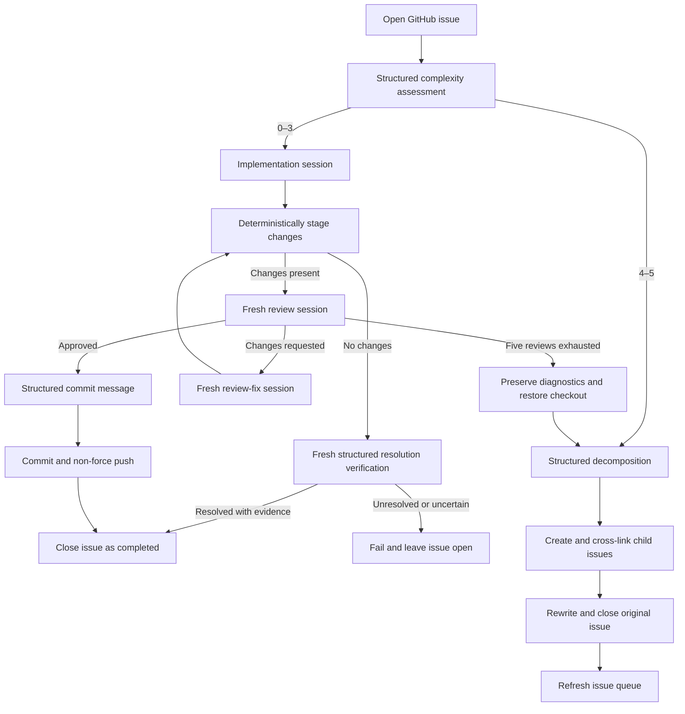
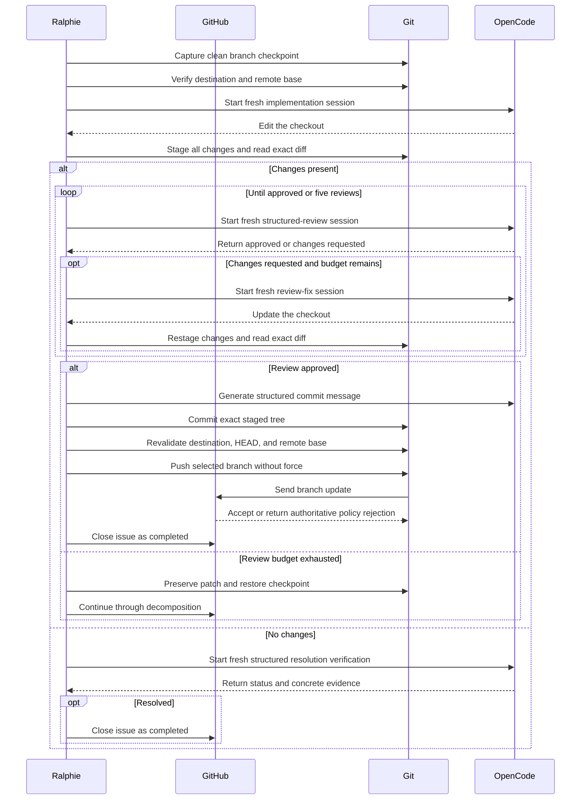
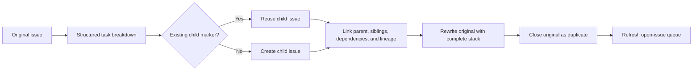
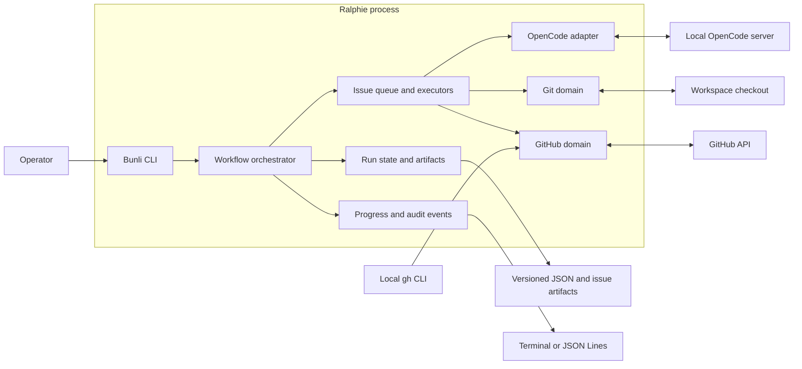

# Ralphie

**Turn a GitHub issue queue into reviewed commits with OpenCode.**

[](https://github.com/beremaran/ralphie/actions/workflows/ci.yml)

Ralphie is an opinionated, resumable CLI that reads open GitHub issues, asks
[OpenCode](https://opencode.ai/) for schema-validated decisions, and routes each
issue through one of two workflows:

- implement, review, revise, commit, and push focused work; or
- decompose complex work into linked, dependency-aware GitHub issues.

Agents handle reasoning and code changes. Ralphie keeps Git operations, GitHub
mutations, run state, recovery, and safety checks deterministic.

> [!CAUTION]
> Ralphie works directly on the branch selected by `--branch`. It does **not**
> create a worktree, feature branch, pull request, or merge queue. An approved
> implementation is committed and pushed directly to that branch.

> [!NOTE]
> Ralphie is pre-1.0 and currently installed from source. Start with a one-issue
> `--dry-run` against a repository you control before enabling mutations.

## Why Ralphie?

- **Issue-native automation** — the GitHub issue is the unit of planning,
  execution, recovery, and reporting.
- **Structured agent decisions** — complexity, reviews, decompositions, and
  commit messages are validated against explicit schemas.
- **Fresh-context review loops** — implementation, review, and review-fix work
  run in separate OpenCode sessions to reduce context bias.
- **Deterministic delivery** — Ralphie stages, inspects, commits, and pushes the
  resulting changes itself; agents do not own the delivery protocol.
- **Crash-safe recovery** — versioned run state, issue checkpoints, artifacts,
  and idempotent reconciliation make interrupted runs resumable.
- **Observable by default** — interactive progress, durable audit events,
  JSON Lines output, quiet mode, and credential redaction are built in.
- **Bounded autonomy** — review loops stop after five attempts, unsafe direct
  pushes are refused, and force pushes are never used.

## Quick start

### Prerequisites

Ralphie expects the following tools on `PATH`:

- [Bun](https://bun.sh/)
- [Git](https://git-scm.com/)
- [GitHub CLI](https://cli.github.com/), authenticated with `gh auth login`
- [OpenCode](https://opencode.ai/)

Your GitHub account must be able to read the target repository and its issues.
Non-dry runs also require permission to push to the selected branch and manage
issues when decomposition is needed.

### Install from source

```bash
git clone https://github.com/beremaran/ralphie.git
cd ralphie
bun install --frozen-lockfile
```

Optionally expose the `ralphie` command in your local Bun environment:

```bash
bun link
ralphie --version
```

You can always run the source entry point directly instead:

```bash
bun run index.ts --version
```

### Preview the first issue

This performs authentication and Git preflight, prepares a clean checkout,
discovers issues, and asks OpenCode for a complexity decision. It does not edit
files, create or close issues, commit, or push.

```bash
ralphie owner/repository --dry-run --max-issues 1
```

When running from source, replace `ralphie` with `bun run index.ts` in any
example:

```bash
bun run index.ts owner/repository --dry-run --max-issues 1
```

### Run the issue pipeline

```bash
ralphie owner/repository --max-issues 5
```

The default branch is `main`, the default OpenCode agent is `build`, and issues
are processed oldest-first. Without `--max-issues`, the issue budget is
unlimited.

## How it works

Every matching open issue receives a schema-validated complexity score from 0
through 5.

### Issue routing



### Implementation workflow: complexity 0–3

1. Capture the exact clean branch and commit as an issue checkpoint.
2. Ask a fresh OpenCode session to implement the issue.
3. Stage every change deterministically across the project and capture the exact
   per-repository staged diffs.
4. Ask a separate session for a schema-validated review.
5. If changes are requested, give the review to a fresh fix session and repeat
   staging and review.
6. Stop after approval or five review attempts.
7. Generate a validated commit message, commit each changed repository, recheck
   every remote before the first push, and push each commit without force.
8. Close the source GitHub issue only after every required push is verified.

When implementation produces no changes, a fresh read-only session must prove
that the current checkout already resolves the issue and return concrete
evidence. A proven resolution is completed and closed; an unresolved or
uncertain result fails safely and remains open. If the review budget is
exhausted, Ralphie preserves the patch and review diagnostics, restores the
clean checkpoint, and sends the issue through decomposition.

The boundary between agent work and deterministic operations stays explicit
throughout the loop:



### Decomposition workflow: complexity 4–5

1. Ask OpenCode to split the issue into the next set of independently actionable
   tasks and declare their dependencies.
2. Create child issues in deterministic order.
3. Add parent, sibling, dependency, and full-lineage links.
4. Rewrite the original issue with the complete issue stack.
5. Close the original as a duplicate and refresh the open-issue queue.

Stable markers and persisted child mappings make the workflow retry-safe: a
resumed run discovers previously created children instead of duplicating them.
Eligible children can enter the main implementation loop during the same run.



## Safety model

Direct-to-branch automation deserves explicit guardrails. Before agent work and
again before pushing, Ralphie verifies that:

- the checkout and `origin` match the requested GitHub repository;
- the local checkout is still on the selected branch and expected commit;
- the remote branch has not moved from the captured base;
- the result is exactly the expected local commit; and
- the push is non-force.

If any invariant fails, Ralphie halts instead of guessing or retrying a dangerous
operation.

Ralphie does not try to predict whether GitHub will accept the update by querying
branch protection, repository rulesets, or API-reported push permission. The
actual non-force `git push` is authoritative and enforces the repository's
current policy without plan-, permission-, or timing-dependent API guesses. If
GitHub rejects the push, Ralphie surfaces the complete Git response, retains the
created commit and run artifacts, and halts for inspection or resume.

There is one intentionally destructive local behavior: when reusing an existing
repository checkout, Ralphie aligns it to the requested branch with the
equivalent of `git reset --hard` and `git clean -fd`. Tracked modifications and
untracked files inside that checkout are discarded. Keep unrelated work outside
Ralphie's workspace.

For a mutation-free validation, use:

```bash
ralphie owner/repository --dry-run --max-issues 1
```

Dry-run mode still performs real preflight, cloning, issue discovery, and
OpenCode complexity assessment, but it cannot invoke implementation,
decomposition, commits, pushes, or GitHub mutations. A resumed dry run remains a
dry run.

## Common recipes

### Reusable JSON configuration

Put repeatable options in a JSON file and pass it explicitly:

```bash
ralphie --config ./ralphie.json
```

```json
{
  "git": { "branch": "main" },
  "issues": {
    "limit": 10,
    "sort": { "by": "created", "order": "asc" },
    "filter": { "labels": ["bug"] }
  },
  "workspace": {
    "path": "~/.ralphie",
    "cleanup": { "before": true, "after": true }
  },
  "output": { "verbose": false, "quiet": false, "json": false },
  "agent": {
    "model": { "id": "openai/gpt-5", "variant": "medium" },
    "mode": "build"
  },
  "projects": [
    {
      "name": "frontend",
      "repositories": [
        {
          "repo": "owner/frontend",
          "issues": { "filter": { "labels": ["frontend"] } }
        }
      ]
    },
    {
      "name": "backend",
      "repoPattern": "owner/backend-*",
      "git": { "branch": "develop" },
      "issues": { "limit": 5, "filter": { "labels": ["backend"] } }
    }
  ]
}
```

Projects are named groups of repositories. Each project must specify exactly one
of `repoPattern` or `repositories`: use a pattern to discover repositories, or
use an explicit list when the set is known. Patterns use
`owner/repository-glob` syntax with `*` and `?` in the repository name. Matches
include accessible public and private repositories, exclude archived
repositories, and are expanded in deterministic order. A pattern that matches no
repositories, duplicate project names, or duplicate repositories across projects
is rejected before repository work begins. Explicit repository entries use the
same nested domains as the rest of the file, so
branch, issue, agent, and dry-run settings can be overridden without switching
back to a second flat schema. Workspace lifecycle and output mode remain
batch-wide settings.

Each project is one execution boundary. Multi-repository projects clone into a
shared root such as `<workspace>/proj-b/frontend` and
`<workspace>/proj-b/backend`; OpenCode runs from `<workspace>/proj-b`, so an
issue from either source repository can inspect and modify both. Repository
issue queues within that project run serially to prevent agents from racing over
the shared checkout. Different projects run concurrently. For a project with one
repository, OpenCode runs directly from that repository clone without an extra
project container.

Ralphie authenticates GitHub, initializes Octokit, verifies Git, prepares every
project checkout, and starts one shared OpenCode server exactly once. For a
project-spanning change it checkpoints and stages every repository, reviews a
combined repository-labelled diff, commits only changed repositories, verifies
all remote destinations before pushing, and closes the source issue only after
every push succeeds. The configuration precedence is:

```text
built-in defaults < top-level config < project config < repository config < CLI options
```

Workspace preparation and cleanup are batch-wide: start cleanup runs once, and
the workspace is removed only after every project run succeeds. Human-readable progress is
attributed to both project and repository; JSON events and persisted run state
carry the project name alongside `repository` and `repositoryRunId`.

Resume paths belong to individual runs, so a multi-repository file places
`resume` on the corresponding repository entry. The global `--resume` flag is
accepted only when exactly one explicit repository is configured.

The file is optional and has no implicit discovery location. Unknown keys,
invalid enum values, malformed model identifiers, and incompatible output modes
are rejected before preflight begins with property-level diagnostics. Optional
settings may be omitted or set to `null` to use their normal default—for
example, `"issues": { "limit": null }` means unlimited and a `null`
`issues.filter.labels` means no label filter. Explicit command-line values
override the file, and omitted values fall back to Ralphie's normal defaults:

```bash
ralphie --config ./ralphie.json --branch main --max-issues 2
```

For a single repository, the positional `owner/name` form remains supported and
is treated as one implicit project. It cannot be combined with `projects`.
Boolean values can be explicitly disabled when overriding a file, for example
`--cleanup=false`. See [ralphie.example.json](./ralphie.example.json) for a
complete multi-project template.

Process bugs from oldest to newest on a non-default branch:

```bash
ralphie owner/repository \
  --branch develop \
  --issue-label bug \
  --issue-sort created \
  --issue-order asc \
  --max-issues 10
```

Require multiple labels and let OpenCode choose its configured model:

```bash
ralphie owner/repository \
  --issue-label bug \
  --issue-label backend
```

Select an OpenCode model, variant, and agent explicitly:

```bash
ralphie owner/repository \
  --model openai/gpt-5 \
  --model-variant high \
  --agent build
```

Write machine-readable progress to stdout:

```bash
ralphie owner/repository --max-issues 1 --json > ralphie.jsonl
```

Start from an empty disposable workspace and remove it after success:

```bash
ralphie owner/repository \
  --workspace /tmp/ralphie \
  --start-clean \
  --cleanup
```

> [!WARNING]
> Both workspace cleanup flags delete the selected workspace recursively after
> protected-path checks. Use a path dedicated to Ralphie.

Resume an interrupted run:

```bash
ralphie owner/repository \
  --branch main \
  --resume ~/.ralphie/.ralphie/runs/<run-id>/state.json
```

The repository and branch must match the saved run. Ralphie reconciles the
checkout, queue, active issue, decomposition artifacts, and any commit that may
already have reached the remote before continuing.

## CLI reference

```text
ralphie [repository] [options]
```

`[repository]` accepts an `owner/name` slug or a GitHub HTTPS/SSH clone URL. It
may be omitted when `projects` is present in `--config`.

| Option | Default | Description |
| --- | --- | --- |
| `--config <path>` | none | Load reusable options from a validated JSON file. |
| `-b, --branch <name>` | `main` | Branch to clean, edit, commit, and push directly. |
| `--max-issues <count>` | unlimited | Positive maximum number of issues charged to this run. |
| `--issue-label <label>` | none | Require a label; repeat the flag to require multiple labels. |
| `--issue-sort <field>` | `created` | Sort by `created`, `updated`, or `comments`. |
| `--issue-order <order>` | `asc` | Sort in `asc` or `desc` order. |
| `--agent <name>` | `build` | OpenCode agent used for task sessions. |
| `--model <provider/model>` | OpenCode default | Override OpenCode's model selection. |
| `--model-variant <variant>` | OpenCode default | Override the selected model variant. |
| `--workspace <path>` | `~/.ralphie` | Root directory for repository checkouts and run artifacts. |
| `--dry-run` | off | Assess and route issues without implementation or mutations. |
| `--resume <state.json>` | none | Continue a compatible saved run. |
| `--start-clean` | off | Remove the workspace before any other workflow step. |
| `--cleanup` | off | Remove the workspace after a successful run. |
| `--verbose` | off | Include detailed human-readable progress. |
| `--json` | off | Emit newline-delimited JSON progress to stdout. |
| `--quiet` | off | Emit failures only. Mutually exclusive with `--json`. |

Run `ralphie --help` for the help generated from the current command schema.

## Progress, state, and recovery

Ralphie adapts its progress renderer to its environment:

- interactive terminals receive one in-place status line for the active leaf
  stage, while completed milestones remain in the scrollback;
- multi-repository runs use repository-prefixed append-only lines so concurrent
  progress cannot corrupt one shared interactive status line;
- CI and redirected output receive durable, append-only lines;
- `--verbose` adds operational details;
- `--json` writes one JSON object per line to stdout; and
- `--quiet` suppresses everything except failures.

JSON events use a stable operational vocabulary and include `runId`,
`timestamp`, `stage`, `status`, and `message`. Multi-repository events also
include `repository` and `repositoryRunId`. Depending on the event, they may
also include issue position, review attempt, session ID, commit SHA, created
issue numbers, or diagnostic paths. Credentials and sensitive environment values
are redacted at the reporting boundary.

Run artifacts live under:

```text
<workspace>/.ralphie/runs/<run-id>/
├── state.json
├── events.jsonl
└── issues/
```

State is versioned, validated, and written atomically. Failed and interrupted
runs retain their state and diagnostics for inspection and `--resume`. On
cancellation, Ralphie restores the active issue's clean checkout when possible,
saves resumable state, closes the OpenCode server, and exits with status 130.
Ordinary failures exit with status 1.

One issue failure currently halts the run. This preserves the checkout and
diagnostics at the first uncertain boundary instead of allowing later issues to
continue on questionable state.


On resume, Ralphie compares persisted intent with both local Git and live GitHub
state before returning to `Active`. It can reconcile partially created child
issues, a commit created immediately before interruption, and an issue closure
whose response was lost without repeating the corresponding agent work.

`--cleanup` removes the entire workspace after success, including completed
state, events, diagnostics, and the repository checkout. Cleanup is skipped on
failure so recovery remains possible.

## Architecture

Ralphie uses [Bunli](https://bunli.dev/) for its command surface and
[Effect](https://effect.website/) for typed services, failures, resource scopes,
and dependency assembly.



The workflow orchestrator owns sequencing, while domain services own side
effects and validate their invariants at the boundary.

| Area | Responsibility |
| --- | --- |
| `src/github/` | GitHub CLI authentication, Octokit, issue discovery, mutations, and decomposition links. |
| `src/git/` | Checkout preparation, checkpoints, deterministic issue operations, invariants, and remote safety. |
| `src/issues/` | Queueing, complexity routing, implementation, review, recovery, and decomposition. |
| `src/opencode/` | Server lifecycle, isolated task sessions, prompts, schemas, and structured output. |
| `src/progress/` | Typed events, audit persistence, redaction, and terminal/JSON renderers. |
| `src/run/` | Versioned state, artifacts, reconciliation, and resume behavior. |
| `src/workspace/` | Path expansion and protected workspace removal. |
| `src/process/` | External command execution and process exit semantics. |

`src/workflow.ts` orchestrates the domain services. `src/runtime.ts` assembles
their live Effect layers.

## Development

Install dependencies and run the complete local gate:

```bash
bun install --frozen-lockfile
bun run check
```

Useful individual commands:

| Command | Purpose |
| --- | --- |
| `bun test` | Run the unit and disposable integration test suite. |
| `bun run typecheck` | Type-check without emitting JavaScript. |
| `bun run format` | Format the repository with Biome. |
| `bun run format:check` | Verify formatting without modifying files. |
| `bun run build` | Build the standalone executable at `dist/cli`. |
| `bun run probe:structured-output` | Exercise a real schema-validated OpenCode decision. |

Real network integrations are opt-in and skipped by the normal test suite:

```bash
RALPHIE_RUN_OPENCODE_COMPLEXITY_SMOKE=1 \
  bun test src/integration/network-smoke.test.ts

RALPHIE_RUN_OPENCODE_IMPLEMENTATION_SMOKE=1 \
  bun test src/integration/network-smoke.test.ts

RALPHIE_RUN_GITHUB_INTEGRATION=1 \
RALPHIE_GITHUB_TEST_REPOSITORY=owner/ralphie-smoke-test \
  bun test src/integration/network-smoke.test.ts
```

The GitHub smoke test is read-only and refuses repository names that do not look
like dedicated test, sandbox, fixture, integration, or smoke repositories.

## Contributing

Contributions are welcome. For substantial behavior or workflow changes, open
an issue first so the safety and recovery implications can be discussed before
implementation.

Before submitting a change:

1. Add or update tests for the behavior.
2. Run `bun run check`.
3. Keep Git and GitHub mutations inside their deterministic domain services.
4. Update this README and `CHANGELOG.md` when the command surface or recovery
   contract changes.

## Releases and compatibility

Ralphie follows [Semantic Versioning](https://semver.org/). Until 1.0, minor
releases may change the CLI or persisted state schema; patch releases should
remain backward compatible. Release candidates must pass `bun run check` and
document notable changes in [`CHANGELOG.md`](./CHANGELOG.md).
