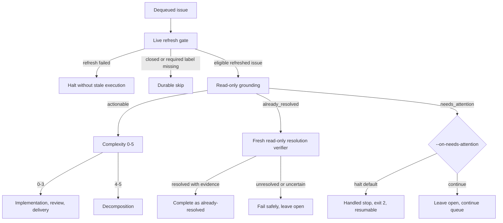

# Ralphie

**Turn a GitHub issue queue into reviewed commits with OpenCode.**

[](https://github.com/beremaran/ralphie/actions/workflows/ci.yml)

Ralphie is an opinionated, resumable CLI that reads open GitHub issues, asks
[OpenCode](https://opencode.ai/v2/docs/) for schema-validated decisions, and
routes each issue to either focused implementation or dependency-aware
decomposition. Agents handle reasoning and code changes; Ralphie keeps Git,
GitHub, run state, recovery, and safety checks deterministic.

> [!CAUTION]
> Ralphie defaults to the `lgtm` workflow: it works directly on the branch
> selected by `--branch`, commits approved work, and pushes directly to that
> branch. Use `--workflow pr` to deliver through an automatically merged feature
> branch and pull request instead. Ralphie is pre-1.0. Start with a one-issue
> `--dry-run` against a repository you control before enabling mutations.

The top-level `--mode` defaults to `issues`, which is the code-delivery queue
described below. `--mode maintain-issues` is a separate, bounded one-shot
backlog-reconciliation mode: it improves issue metadata and discussion but
never implements or delivers code. A scheduler can invoke that command
periodically; Ralphie does not run an in-process daemon or watch loop.

For task-oriented details, start with the [documentation index](./docs/README.md).

## What Ralphie provides

- **Issue-native automation** — each run focuses on one repository, with the
  issue as the unit of planning, execution, recovery, and reporting.
- **Structured agent decisions** — complexity, reviews, decompositions, and
  commit messages are validated against explicit schemas.
- **Fresh-context review loops** — implementation, review, and review-fix work
  run in separate OpenCode sessions to reduce context bias.
- **Deterministic delivery** — Ralphie stages, inspects, commits, and pushes the
  resulting changes itself; agents do not own the delivery protocol. In `pr`
  mode, merged delivery is a **check gate**: the pull request is merged only
  after the checks for its exact head SHA reach a stable green snapshot, the
  head is re-read immediately before merging, and a moved head invalidates the
  saved decision.
- **Crash-safe recovery** — versioned run state, issue checkpoints, artifacts,
  and idempotent reconciliation make interrupted runs resumable.
- **Issue maintenance** — `--mode maintain-issues` uses read-only OpenCode
  planning and deterministic GitHub services to add existing labels, ask or
  answer grounded questions, link related issues, and link likely duplicates.
  Duplicate closure is a separate explicit opt-in.
- **Observable, bounded autonomy** — transcripts, progress, JSON Lines output,
  a five-attempt review limit, and non-force pushes are
  built in.

## Install and try it

Ralphie is distributed as a single npm package; Bun is the only runtime
requirement. Run it without installing globally:

```bash
bunx @beremaran/ralphie --version
```

or install it globally (`bun add -g @beremaran/ralphie`) and use the `ralphie`
command. Contributing from source is the same: `bun install`, then
`bun run index.ts`.

Every repository workflow also needs GitHub CLI, Git, a shell, and an
OpenCode server with model credentials. The target repository's verification command is a
separate dependency boundary: install whatever that command uses (for example,
Bun, Node.js, or a project compiler) in the selected runtime. The default
`bun run check` is therefore a target-repository requirement, not a Ralphie
requirement. Ralphie discovers that command from `package.json`; use
one or more `--verify-command` options for a target-specific verification
command.

For an interactive GitHub setup, authenticate and verify the active account:

```bash
gh auth login
gh auth status
git --version
gh --version
```

For unattended runs, provide `GH_TOKEN` (preferred) or `GITHUB_TOKEN` to the
process instead; credentials are inputs and need not be printed or exposed.
Start an OpenCode server (`opencode2 serve`) before running Ralphie. By default Ralphie discovers the local background service; use `--opencode-url` (or `OPENCODE_URL`) for an explicit server and `--opencode-token` (or `OPENCODE_TOKEN`) when it requires a token. See [Getting started](./docs/getting-started.md) for
the complete installation, authentication, and source-checkout contract.

Preview one issue without implementation, commits, pushes, or GitHub mutations:

```bash
bunx @beremaran/ralphie owner/repository --dry-run --max-issues 1
```

Dry-run still performs preflight, issue discovery, read-only grounding, and
may prepare or reset the local workspace in the default `issues` mode. For a
maintenance-only preview, use:

```bash
bunx @beremaran/ralphie owner/repository \
  --mode maintain-issues --dry-run --max-issues 1 --output verbose
```

Maintenance dry-run reads GitHub, Git, and the existing checkout as needed for
observation and grounding, but does not call a GitHub mutation, prepare/reset
the workspace, write run state or an event log, or modify any persisted file.
Read the [safety model](./docs/safety.md) before using mutation-enabled
commands.

## Distribution

Ralphie's only distribution channel is the
[published npm package](https://www.npmjs.com/package/@beremaran/ralphie):
`bunx @beremaran/ralphie` downloads and runs the latest published version, and
`bun add -g @beremaran/ralphie` installs it globally. Release tags use the
strict `v<major>.<minor>.<patch>` form; pushing a tag runs the tag-triggered
publish workflow (validate tag/version, build, smoke-check the packed
tarball, `bun publish`). Public package contents require no GitHub
credentials. Operating on a private target repository still requires a GitHub
account or runtime token with the necessary permissions; OpenCode model
credentials are also required when Ralphie asks OpenCode to make a decision.
The [MIT license](https://github.com/beremaran/ralphie/blob/main/LICENSE)
applies.

## Output contract

`--output` selects `default`, `verbose`, `quiet`, or `json`. `--output
default` resolves to `interactive` only when stdin and stderr are both TTYs
and `CI` is neither `"true"` nor `"1"` (rechecked against `stderr.isTTY` at
mode resolution); otherwise it uses append-only `plain` output. In
interactive mode, the default streams the OpenCode transcript with one
replaceable interactive region below it: the sticky stage/status line plus
the bounded activity rows together occupy at most three physical terminal
rows (measured by the rows actually painted, not by newline counts),
repainted in place and clipped before wrap at the current width. The locked
interactive layout strategy is `durable-transcript-breadcrumbs`
(`INTERACTIVE_FOOTER_LAYOUT_STRATEGY`, with
`INTERACTIVE_FOOTER_USES_SCROLL_REGION=false` and
`INTERACTIVE_FOOTER_USES_RESERVED_ROW=false`): the status is an in-place
region below streamed content, never a reserved bottom row or DECSTBM scroll
region. Reserved-row/scroll-region cursor manipulation is disabled: the
controller never emits DECSTBM (`...r`), absolute cursor addressing (CUP
`H`/`f`), alternate-screen, or save/restore sequences — only in-place line
erase (`\r\x1b[2K`) and single-row step-up (`\x1b[1A`) plus SGR color repaint
the region, and every replacement repaint clears the visible region before
drawing. The footer is refreshed on a coalesced roughly 100–125 ms scheduler
(clamped, default 100 ms) and describes the active leaf stage and
activity—for example, `› Reviewing changes › Using bash`—rather than a global
step count. Transcript token deltas stream immediately without waiting for
that scheduler, so transcript order is independent of footer scheduling.
Repaints are deferred while a transcript fragment is open mid-line or a
control sequence is incomplete, durable progress lines wait for a safe line
boundary so they never merge with or falsely close the fragment, every row is
clipped at the width sampled for its own repaint, and resize clears and
repaints at the new width only at a safe boundary. On completion,
interruption (SIGINT/Ctrl-C), failure, or disposal the live region is erased
in place, the cursor settles on a fresh line below durable content, the
resize subscription and refresh timer are released, and no further bytes are
emitted; no live-only row (`◐`, `›`, started progress, activity) survives on
screen or scrollback. Completed progress milestones remain in scrollback. OpenCode sessions
start with contextual headers such as:

```text
╭─ OpenCode · Task · session-1 · owner/repo · issue 2/4 · #56 · Reviewing changes · attempt 1/3
```

Human-readable output also records lifecycle breadcrumbs for events such as
context compaction and OpenCode retries. Intermediate work stays in the compact
activity surface: tool-call deltas, tool execution updates, bash execution
updates, streamed thinking, compaction/retry lifecycle, and active progress
changes render as bounded rows in the replaceable interactive region rather
than scrollback, while assistant text deltas stream in the transcript with a
`140`-character rendered bound. Each tool completion emits at most one concise
`✓ <tool> done` line, and a failure emits one sanitized, bounded line with
enough error detail to act on. `--output verbose` never expands the live
region's three-row cap. These are not limits on the structured stream.

Outside an interactive terminal—including CI and any redirected output—plain
output is the deterministic, append-only noninteractive fallback: byte-identical
across identical runs, with no ANSI cursor controls (no `ESC`), no
carriage-return bytes, and no footer/status residue (no `◐`, no `\r\x1b[2K`),
so logs need no terminal repainting. `--output verbose` keeps the same mode
selection and only enriches durable progress rows with structured details; it
never expands the live region's three-row cap. Quiet output reports
failures and handled needs-attention stops only, suppressing routine progress
and transcript rows. JSON output is
JSON Lines on stdout with stderr empty: each line is a parseable progress
record or a lossless `opencode_event` record, without human headers, footers,
glyphs, or breadcrumb lines. The durable progress-event log remains at
`<workspace>/.ralphie/runs/<run-id>/events.jsonl` independently of the selected
renderer; supplied progress-event values are preserved as-is. Only terminal
control sequences are stripped from human-readable rows; transcripts and
progress values are never redacted.
See [Operations and recovery](./docs/operations-and-recovery.md) for output,
resume, and cleanup details; successful `--clean end` removes the workspace
and its log, while failed runs retain diagnostics for recovery.

PR delivery surfaces as `pr-gate` progress events: registration with the pull
request number and exact head SHA, poll progress only for meaningful check
transitions (registration, checked-in, disappeared, status changes), head
invalidation, and terminal success or failure with the check summary and
reason. Human and verbose output name the PR number, exact SHA, check summary,
and reason; JSON events carry the structured normalized check snapshot and
a timestamp; unchanged polls never emit, and quiet output suppresses the
routine gate milestones while still reporting gate failures.

## How issue routing works

Every dequeued issue passes a live refresh gate before issue work consumes the
budget: Ralphie refreshes the issue and bounded comments, halts rather than use
stale data if refresh fails, and durably skips an issue that is now closed or
missing a required label. The refreshed issue then receives a read-only
grounding decision; only an actionable decision reaches complexity routing:



- **Actionable** issues receive a complexity score: **0–3** enter
  implementation, review, deterministic verification, and delivery; **4–5**,
  and implementation that exhausts its review budget, enter decomposition into
  linked child issues.
- **Already-resolved** issues close only after a separate fresh verifier
  returns a nonblank summary and concrete evidence. Unresolved or uncertain
  verification is an ordinary non-completion failure—not an automatic closure,
  actionable fallback, or needs-attention decision—and leaves the issue open.
- **Needs attention** issues are never closed, marked complete, or delivered:
  Ralphie persists the decision with its reason, summary, evidence, questions,
  and an issue-freshness fingerprint (`updatedAt`, comment count, and comment
  version) in the per-issue artifact store, and progress events carry the same
  fields plus the artifact path, policy, and queue position. Complexity,
  difficulty, size, or uncertainty are never valid needs-attention reasons.
  The source issue always remains open; with `continue`, the queue may proceed,
  but neither `lgtm` closure nor feature-branch push or PR delivery occurs.
- Recursive splitting defaults to three levels and can be changed with
  `--max-decomposition-depth`. Reaching that ceiling leaves the issue open and
  continues independent queue work instead of aborting the run.

`--on-needs-attention halt` (the default) keeps the issue in the run state's
pending queue, emits a handled-stop summary, and exits with code `2`; the run
resumes later with `--resume`, reusing the persisted decision only while the
issue's fingerprint still matches. `continue` defers the issue, processes the
rest of the queue, and exits `0` when the queue drains. Both policies consume
the attempt against `--max-issues`. An explicit `--notify-needs-attention`
opt-in (with optional `--needs-attention-label`) publishes one idempotent
structured comment and label per issue, saved as resumable intent before any
GitHub mutation; dry runs never notify.

**Needs-attention recovery contract.** Every OpenCode session is a bounded
`request_needs_attention` signal channel for repository-backed blockers. The
signal is a schema-validated `{ reason, message }` object whose `reason` is one
of `outdated_premise`, `conflicting_requirements`, `missing_information`,
`external_dependency`, or `cannot_reproduce`, with an optional message capped
at 2,000 characters; it is a request to the caller, never a final
implementation or review decision, and the prompt guidance forbids it for work
that is merely hard, large, slow, or uncertain. Only structured decision and
task sessions (grounding, complexity, implementation, review-fix,
commit-message, review, and decomposition) can raise it, and only through
Ralphie's OpenCode task/decision gate. Each signal is confirmed by exactly one
fresh, read-only verifier session before any further artifact, Git, or GitHub
mutation. A confirmed `needs_attention` disposition persists the structured
decision with its summary, evidence, questions, and issue-freshness
fingerprint, leaves the source issue open, performs no GitHub mutation and no
commit or push, and restores the exact clean checkpoint (`git reset --hard`
plus `git clean -fd`), removing every staged, unstaged, and untracked agent
change before reporting. A verifier rejection (`actionable` or
`already_resolved`) clears the handoff and resumes the original attempt, so at
most one fresh verifier is consumed per signal; a persisted confirmed decision
is reused without a fresh verifier when recovery retries on resume. Recovery
writes a bounded binary-safe patch and decision metadata to
`<workspace>/.ralphie/runs/<run-id>/issues/<issue-number>/needs-attention-<id>/`
(`changes.patch` and `metadata.json`), keyed by fingerprint so a stale decision
can never reuse another issue's diagnostics. Diagnostic, restoration, or
repository-invariant failures are recoverable failures: the issue stays pending
with the handoff retained for resume, never reported as successfully handled.

`--dry-run` grounds every issue, reports all three routes, and performs no
implementation, checkout mutation, Git or GitHub mutation, issue closure, or PR
delivery. OpenCode sessions never close issues, create or merge pull requests, or
push: every Git and GitHub mutation is performed by Ralphie's deterministic
domain services, and agent sessions are denied mutating Git and GitHub
commands.

Maintenance output follows the same `default`, `verbose`, `quiet`, and `json`
surfaces. A maintenance pass reports changed, unchanged, skipped, and
replanned actions plus lossless evidence and skip reasons; JSON emits the
typed progress/audit records as JSON Lines, while quiet mode suppresses routine
output and retains terminal failures. Maintenance exits `0` when the selected
issues are reconciled, unchanged, intentionally skipped, or previewed, `1`
for a failed pass, and `130` when cancelled.

See [Workflows](./docs/workflows.md) for the full routing, implementation,
decomposition, and delivery contracts, and
[Operations and recovery](./docs/operations-and-recovery.md) for the exact
state, artifact, progress, and exit-code contracts.

## Maintenance mode

Run issue hygiene independently of code delivery:

```bash
bunx @beremaran/ralphie owner/repository --mode maintain-issues
bunx @beremaran/ralphie owner/repository --mode maintain-issues \
  --duplicate-action close --max-issues 10
```

The mode captures one bounded open-issue snapshot using the shared label,
sort, order, and `--max-issues` selectors, then processes the selected issues
sequentially and exits. Pi receives only read-only issue, repository, and
candidate context and returns a schema-validated plan. Independent policy
validation and deterministic GitHub services perform any allowed labels,
comments, related links, or duplicate actions after a fresh live revalidation
of the affected issue pair. The default duplicate policy is `link`, which
leaves both issues open. `--duplicate-action close` is a meaningful risk
expansion: it may close only a proven duplicate, after the link and existing
`duplicate` label are reconciled and the live pair is checked again; the
canonical issue is never closed.

Maintenance is additive-only in the first release. It never edits human issue
titles, bodies, or comments, removes labels, changes assignees, milestones, or
projects, creates labels, reopens or completes issues, or creates branches,
commits, pushes, pull requests, releases, or workflow runs. It does not
implement or decompose issues, follow arbitrary external links, operate across
repositories, make maintainer-policy or timeline commitments, or run as a
daemon. Uncertainty, unsupported requests, stale data, and insufficient
evidence become an explicit question, skip, or bounded re-plan—not an invented
answer or destructive guess.

Live maintenance requires GitHub repository metadata/issues read access and
Issues write access for labels/comments; duplicate closure additionally needs
permission to change issue state. It does not require Contents write, branch
push, pull-request, Projects, or Actions permission. `--dry-run` is useful for
checking read access and the complete proposed plan before granting write
access. A non-dry-run pass stores atomic, schema-validated state at
`<workspace>/.ralphie/runs/<run-id>/state.json` and checkpoints intent and
outcome around every action. Resume with `--resume <state.json>` to reconcile
the exact pending action; changed snapshots, comments, candidates, or
grounding HEADs invalidate stale plans, and an ambiguous response is resolved
from live state before any retry.

## Documentation

The [documentation index](./docs/README.md) has audience-based reading paths.
The main references are:

- [Getting started](./docs/getting-started.md) — prerequisites, installation,
  verification, and the first dry run.
- [Workflows](./docs/workflows.md) — routing, implementation, decomposition,
  delivery modes, and diagrams.
- [CLI reference](./docs/cli-reference.md) — invocation, options, environment
  variables, and recipes.
- [Safety](./docs/safety.md) — mutation boundaries, Git/GitHub invariants, and
  workspace risks.
- [Operations and recovery](./docs/operations-and-recovery.md) — output,
  artifacts, state, cancellation, resume, and cleanup.
- [Architecture](./docs/architecture.md) — runtime/domain boundaries and the
  component map.
- [Development](./docs/development.md) — local setup, tests, and contribution
  expectations.
- [End-to-end execution trace](./docs/end-to-end-execution.md) — the detailed
  source-level trigger-to-exit path.

## Version and build metadata

`ralphie --version` prints only the release version. For automation,
`ralphie --version --output json` prints a stable object containing `version`
and `commitSha`. Both forms work without a repository, GitHub credentials, or
OpenCode configuration. Release builds embed the immutable commit SHA supplied by
the build entry point; local builds use the documented `local` commit sentinel
when no release SHA is supplied. See the [CLI reference](./docs/cli-reference.md)
for the complete command surface.

## Contributing and releases

Contributions are welcome. For substantial behavior or workflow changes, open
an issue first so the safety and recovery implications can be discussed. Add or
update tests, run `bun run check`, keep Git and GitHub mutations in deterministic
domain services, and put future documentation changes in the appropriate page
under [`docs/`](./docs/README.md). See [Development](./docs/development.md) for
the contributor checklist.

Ralphie follows [Semantic Versioning](https://semver.org/). Release candidates
must pass `bun run check`; publishing follows the
[distribution contract](#distribution): push a `v<major>.<minor>.<patch>` tag
and the publish workflow validates, builds, smoke-checks, and runs
`bun publish`. Notable changes are recorded in
[`CHANGELOG.md`](./CHANGELOG.md).
