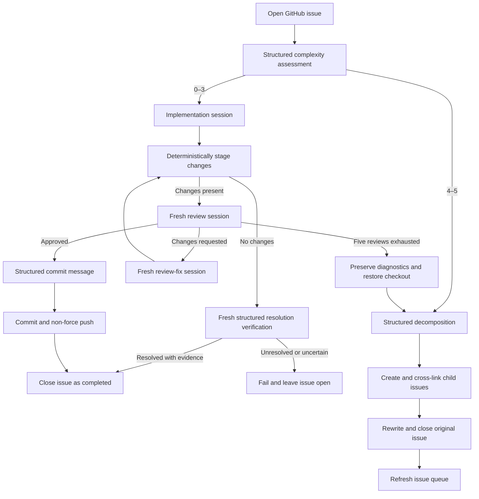
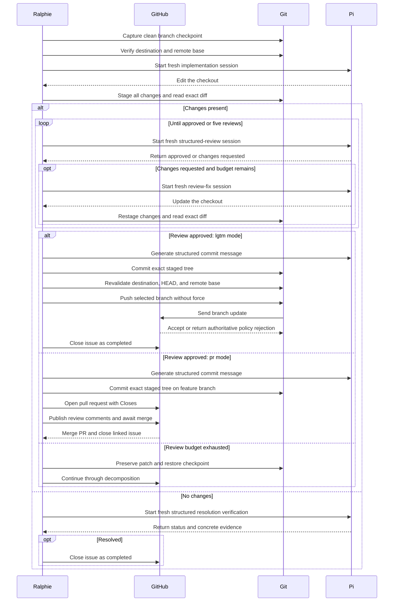
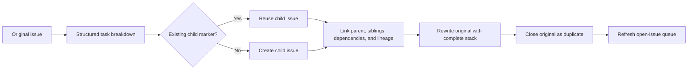
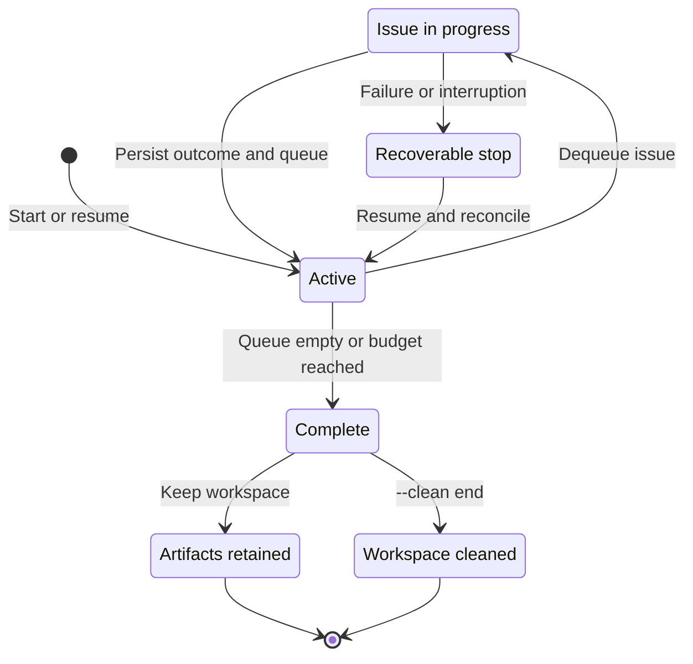
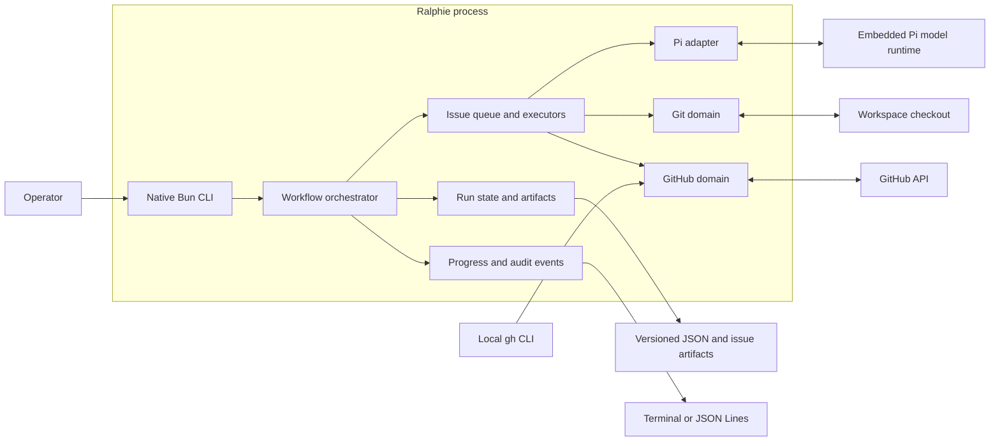

# Ralphie

**Turn a GitHub issue queue into reviewed commits with Pi.**

[](https://github.com/beremaran/ralphie/actions/workflows/ci.yml)

Ralphie is an opinionated, resumable CLI that reads open GitHub issues, asks
[Pi](https://github.com/earendil-works/pi) for schema-validated decisions, and routes each
issue through one of two workflows:

- implement, review, revise, commit, and push focused work; or
- decompose complex work into linked, dependency-aware GitHub issues.

Agents handle reasoning and code changes. Ralphie keeps Git operations, GitHub
mutations, run state, recovery, and safety checks deterministic.

> [!CAUTION]
> Ralphie defaults to the `lgtm` workflow: it works directly on the branch
> selected by `--branch`, commits approved work, and pushes directly to that
> branch. Use `--workflow pr` to create a feature branch and pull request
> instead.

> [!NOTE]
> Ralphie is pre-1.0 and currently installed from source. Start with a one-issue
> `--dry-run` against a repository you control before enabling mutations.

## Why Ralphie?

- **Issue-native automation** — the GitHub issue is the unit of planning,
  execution, recovery, and reporting.
- **Structured agent decisions** — complexity, reviews, decompositions, and
  commit messages are validated against explicit schemas.
- **Fresh-context review loops** — implementation, review, and review-fix work
  run in separate Pi sessions to reduce context bias.
- **Deterministic delivery** — Ralphie stages, inspects, commits, and pushes the
  resulting changes itself; agents do not own the delivery protocol.
- **Crash-safe recovery** — versioned run state, issue checkpoints, artifacts,
  and idempotent reconciliation make interrupted runs resumable.
- **Observable by default** — live token-level Pi transcripts, interactive
  progress, durable audit events, JSON Lines output, quiet mode, and credential
  redaction are built in.
- **Bounded autonomy** — review loops stop after five attempts, unsafe direct
  pushes are refused, and force pushes are never used.

## Installation

Ralphie ships through four channels. Choose whichever fits your environment.

### 1. `bunx` (no install)

Requires Bun on `PATH`; `bunx` installs it automatically.

```bash
bunx ralphie owner/repository --dry-run --max-issues 1
```

### 2. Standalone binary (curl script)

Installs a self-contained native executable for your platform
(`darwin-arm64`, `darwin-x64`, `linux-arm64`, `linux-x64`).

```bash
sh scripts/install.sh            # installs to ~/.local/bin (or ~/bin)
sh scripts/install.sh /usr/local/bin
RALPHIE_VERSION=0.1.0 sh scripts/install.sh   # pin a version
```

### 3. Homebrew

Install from a tap that downloads the matching release binary.

```bash
brew install beremaran/tap/ralphie
# or, from the formula in ./Formula:
brew install --formula Formula/ralphie.rb
```

### 4. Docker

A multi-stage image built from `oven/bun` and published to `ghcr.io/beremaran/ralphie`
(`linux/amd64` and `linux/arm64`).

```bash
docker run --rm \
  -e GITHUB_TOKEN=$GITHUB_TOKEN \
  -v "$HOME/.ralphie:/root/.ralphie" \
  ghcr.io/beremaran/ralphie owner/repository --max-issues 5
```

## Quick start

### Prerequisites

Ralphie expects the following tools on `PATH`:

- [Bun](https://bun.sh/)
- [Git](https://git-scm.com/)
- [GitHub CLI](https://cli.github.com/), authenticated with `gh auth login`
- model credentials supported by [Pi](https://github.com/earendil-works/pi), configured through
  environment variables or Pi's `~/.pi/agent/auth.json`

Your GitHub account must be able to read the target repository and its issues.
Non-dry runs also require permission to push to the selected branch and manage
issues when decomposition is needed.

### Install from source

```bash
git clone https://github.com/beremaran/ralphie.git
cd ralphie
bun install --frozen-lockfile
```

Optionally expose the `ralphie` command in your local Bun environment:

```bash
bun link
ralphie --version
```

You can always run the source entry point directly instead:

```bash
bun run index.ts --version
```

### Preview the first issue

This performs authentication and Git preflight, prepares a clean checkout,
discovers issues, and asks Pi for a complexity decision. It does not edit
files, create or close issues, commit, or push.

```bash
ralphie owner/repository --dry-run --max-issues 1
```

When running from source, replace `ralphie` with `bun run index.ts` in any
example:

```bash
bun run index.ts owner/repository --dry-run --max-issues 1
```

### Run the issue pipeline

```bash
ralphie owner/repository --max-issues 5
```

When no branch is configured, Ralphie uses `main` when it exists and otherwise
`master`. Issues are processed oldest-first. Without `--max-issues`, the issue budget is
unlimited.

The default `lgtm` workflow commits and pushes directly to the selected branch.
The `pr` workflow creates a branch, pushes it, and opens a pull request for
review. The pull request body links the source issue with `Closes #<issue>` so
GitHub closes the issue automatically when the pull request is merged. Select
the workflow on the command line:

```bash
ralphie owner/repository --workflow pr
```

## How it works

For a source-level trigger-to-exit trace, see the
[end-to-end execution trace](./docs/end-to-end-execution.md).

Every matching open issue receives a schema-validated complexity score from 0
through 5.

### Issue routing



### Implementation workflow: complexity 0–3

1. Capture the exact clean branch and commit as an issue checkpoint.
2. Ask a fresh Pi session to implement the issue.
3. Stage every change deterministically and capture the exact staged diff.
4. Ask a separate session for a schema-validated review.
5. If changes are requested, give the review to a fresh fix session and repeat
   staging and review.
6. Stop after approval or five review attempts.
7. Generate a validated commit message and commit the changes.
8. In `lgtm` mode, recheck the remote and push the commit without force, then
   close the source issue after the push is verified. In `pr` mode, create a
   feature branch, push it, and open a pull request linked with `Closes #<issue>`;
   review results are published on the pull request and the issue closes when
   GitHub merges it.

When implementation produces no changes, a fresh read-only session must prove
that the current checkout already resolves the issue and return concrete
evidence. A proven resolution is completed and closed; an unresolved or
uncertain result fails safely and remains open. If the review budget is
exhausted, Ralphie preserves the patch and review diagnostics, restores the
clean checkpoint, and sends the issue through decomposition.

The boundary between agent work and deterministic operations stays explicit
throughout the loop:



### Decomposition workflow: complexity 4–5

1. Ask Pi to split the issue into the next set of independently actionable
   tasks and declare their dependencies.
2. Create child issues in deterministic order.
3. Add parent, sibling, dependency, and full-lineage links.
4. Rewrite the original issue with the complete issue stack.
5. Close the original as a duplicate and refresh the open-issue queue.

Stable markers and persisted child mappings make the workflow retry-safe: a
resumed run discovers previously created children instead of duplicating them.
Eligible children can enter the main implementation loop during the same run.



## Safety model

Delivery automation deserves explicit guardrails. In `lgtm` mode, before agent
work and again before pushing, Ralphie verifies that:

- the checkout and `origin` match the requested GitHub repository;
- the local checkout is still on the selected branch and expected commit;
- the remote branch has not moved from the captured base;
- the result is exactly the expected local commit; and
- the push is non-force.

If any invariant fails, Ralphie halts instead of guessing or retrying a dangerous
operation.

In `pr` mode, the feature branch, pull request, review comments, and merge are
reconciled through GitHub before the linked issue is considered complete.

Ralphie does not try to predict whether GitHub will accept the update by querying
branch protection, repository rulesets, or API-reported push permission. The
actual non-force `git push` is authoritative and enforces the repository's
current policy without plan-, permission-, or timing-dependent API guesses. If
GitHub rejects the push, Ralphie surfaces the complete Git response, retains the
created commit and run artifacts, and halts for inspection or resume.

There is one intentionally destructive local behavior: when reusing an existing
repository checkout, Ralphie aligns it to the requested branch with the
equivalent of `git reset --hard` and `git clean -fd`. Tracked modifications and
untracked files inside that checkout are discarded. Keep unrelated work outside
Ralphie's workspace.

For a mutation-free validation, use:

```bash
ralphie owner/repository --dry-run --max-issues 1
```

Dry-run mode still performs real preflight, cloning, issue discovery, and
Pi complexity assessment, but it cannot invoke implementation,
decomposition, commits, pushes, or GitHub mutations. A resumed dry run remains a
dry run.

## Common recipes

### Configure a run with CLI flags

Ralphie has no configuration file. The repository is required and every setting
is supplied explicitly as an option:

```bash
ralphie owner/repository \
  --workflow pr \
  --branch main \
  --issue-label bug \
  --max-issues 10
```

Process bugs from oldest to newest on a non-default branch:

```bash
ralphie owner/repository \
  --branch develop \
  --issue-label bug \
  --issue-sort created:asc \
  --max-issues 10
```

Require multiple labels and let Pi choose its configured model:

```bash
ralphie owner/repository \
  --issue-label bug \
  --issue-label backend
```

Select a Pi model and thinking level explicitly:

```bash
ralphie owner/repository \
  --model openai/gpt-5 \
  --thinking high
```

Write machine-readable progress to stdout:

```bash
ralphie owner/repository --max-issues 1 --output json > ralphie.jsonl
```

Start from an empty disposable workspace and remove it after success:

```bash
ralphie owner/repository \
  --workspace /tmp/ralphie \
  --clean both
```

> [!WARNING]
> `--clean start` and `--clean end` delete the selected workspace recursively
> after protected-path checks. Use a path dedicated to Ralphie.

Resume an interrupted run:

```bash
ralphie owner/repository \
  --branch main \
  --resume ~/.ralphie/.ralphie/runs/<run-id>/state.json
```

The repository and branch must match the saved run. Ralphie reconciles the
checkout, queue, active issue, decomposition artifacts, and any commit that may
already have reached the remote before continuing.

## CLI reference

```text
ralphie <repository> [options]
```

`<repository>` is required and accepts an `owner/name` slug or a GitHub
HTTPS/SSH clone URL.

| Option | Default | Description |
| --- | --- | --- |
| `--workflow <mode>` | `lgtm` | Select sequential `lgtm` or `pr` delivery. |
| `-b, --branch <name>` | `main`, otherwise `master` | Base branch; `lgtm` pushes it directly, while PR workflows open against it. |
| `--max-issues <count>` | unlimited | Positive maximum number of issues charged to this run. |
| `--issue-label <label>` | none | Require a label; repeat the flag to require multiple labels. |
| `--issue-sort <sort>` | `created` | Sort by `created`, `updated`, or `comments`, optionally `:asc` or `:desc`. |
| `--model <provider/model>` | Pi default | Override Pi's model selection. |
| `--thinking <level>` | Pi default | Pi thinking level: `off`, `minimal`, `low`, `medium`, `high`, `xhigh`, or `max`. |
| `--pi-dir <path>` | Pi default | Existing Pi agent directory. |
| `--workspace <path>` | `~/.ralphie` | Root directory for repository checkouts and run artifacts. |
| `--dry-run` | off | Assess and route issues without implementation or mutations. |
| `--resume <state.json>` | none | Continue a compatible saved run. |
| `--clean <when>` | off | Remove the workspace at `start`, `end`, or `both` (before any step and/or after success). |
| `--output <mode>` | `default` | Output mode: live transcript and progress, `verbose`, `quiet`, or `json`. |

Model credentials are read from environment variables:

| Variable | Purpose |
| --- | --- |
| `RALPHIE_MODEL_BASE_URL` | OpenAI-compatible model base URL; enables the throwaway Pi configuration. |
| `RALPHIE_MODEL_API_KEY` | Model API key for the throwaway Pi configuration. |

Run `ralphie --help` for the help generated from the current command schema.

## Progress, state, and recovery

Ralphie streams the complete Pi transcript while each task runs, including
thinking deltas, assistant text, tool calls, and tool results. Tasks and issues
are intentionally processed sequentially so this output remains ordered.

Ralphie adapts its progress renderer to its environment:

- interactive terminals receive streamed Pi output plus one in-place status line
  for the active leaf stage, while completed milestones remain in the scrollback;
- CI and redirected output receive durable, append-only lines;
- `--output verbose` adds operational details;
- `--output json` writes progress and `pi_event` objects one per line to stdout; and
- `--output quiet` suppresses everything except failures.

JSON events use a stable operational vocabulary and include `runId`,
`timestamp`, `stage`, `status`, and `message`. Multi-repository events also
include `repository` and `repositoryRunId`. Depending on the event, they may
also include issue position, review attempt, session ID, commit SHA, created
issue numbers, or diagnostic paths. Credentials and sensitive environment values
are redacted at the reporting boundary.

Run artifacts live under:

```text
<workspace>/.ralphie/runs/<run-id>/
├── state.json
├── events.jsonl
└── issues/
```

State is versioned, validated, and written atomically. Failed and interrupted
runs retain their state and diagnostics for inspection and `--resume`. On
cancellation, Ralphie restores the active issue's clean checkout when possible,
saves resumable state, closes the Pi runtime, and exits with status 130.
Ordinary failures exit with status 1.

One issue failure currently halts the run. This preserves the checkout and
diagnostics at the first uncertain boundary instead of allowing later issues to
continue on questionable state.



On resume, Ralphie compares persisted intent with both local Git and live GitHub
state before returning to `Active`. It can reconcile partially created child
issues, a commit created immediately before interruption, and an issue closure
whose response was lost without repeating the corresponding agent work.

`--clean end` removes the entire workspace after success, including completed
state, events, diagnostics, and the repository checkout. Cleanup is skipped on
failure so recovery remains possible.

## Architecture

Ralphie uses Bun's built-in argument parser and native promises. Services are
assembled as an explicit dependency object, which keeps the runtime small and
makes tests straightforward without a framework-specific execution model.



The workflow orchestrator owns sequencing, while domain services own side
effects and validate their invariants at the boundary.

| Area | Responsibility |
| --- | --- |
| `src/github/` | GitHub CLI authentication, Octokit, issue discovery, mutations, and decomposition links. |
| `src/git/` | Checkout preparation, checkpoints, deterministic issue operations, invariants, and remote safety. |
| `src/issues/` | Queueing, complexity routing, implementation, review, recovery, and decomposition. |
| `src/agent/` | Ralphie's session, prompt, schema, diagnostics, and structured-output boundary. |
| `src/pi/` | Embedded upstream Pi client, model runtime, tools, and safety policy. |
| `src/progress/` | Typed events, audit persistence, redaction, and terminal/JSON renderers. |
| `src/run/` | Versioned state, artifacts, reconciliation, and resume behavior. |
| `src/workspace/` | Path expansion and protected workspace removal. |
| `src/process/` | External command execution and process exit semantics. |

`src/workflow.ts` orchestrates the domain services. `src/runtime.ts` assembles
their live implementations into one explicit runtime object.

## Development

Install dependencies and run the complete local gate:

```bash
bun install --frozen-lockfile
bun run check
```

Useful individual commands:

| Command | Purpose |
| --- | --- |
| `bun run test` | Run the unit and disposable integration test suite. |
| `bun run typecheck` | Type-check without emitting JavaScript. |
| `bun run format` | Format the repository with Biome. |
| `bun run format:check` | Verify formatting without modifying files. |
| `bun run lint` | Check TypeScript cognitive complexity (maximum 12). |
| `bun run build` | Build the standalone executable at `dist/cli`. |
| `bun run probe:structured-output` | Exercise a real schema-validated Pi decision. |

Real network integrations are opt-in and skipped by the normal test suite:

```bash
RALPHIE_RUN_PI_COMPLEXITY_SMOKE=1 \
  bun test tests/integration/network-smoke.test.ts

RALPHIE_RUN_PI_IMPLEMENTATION_SMOKE=1 \
  bun test tests/integration/network-smoke.test.ts

RALPHIE_RUN_GITHUB_INTEGRATION=1 \
RALPHIE_GITHUB_TEST_REPOSITORY=owner/ralphie-smoke-test \
  bun test tests/integration/network-smoke.test.ts
```

The GitHub smoke test is read-only and refuses repository names that do not look
like dedicated test, sandbox, fixture, integration, or smoke repositories.

## Contributing

Contributions are welcome. For substantial behavior or workflow changes, open
an issue first so the safety and recovery implications can be discussed before
implementation.

Before submitting a change:

1. Add or update tests for the behavior.
2. Run `bun run check`.
3. Keep Git and GitHub mutations inside their deterministic domain services.
4. Update this README and `CHANGELOG.md` when the command surface or recovery
   contract changes.

## Releases and compatibility

Ralphie follows [Semantic Versioning](https://semver.org/). Until 1.0, minor
releases may change the CLI or persisted state schema; patch releases should
remain backward compatible. Release candidates must pass `bun run check` and
document notable changes in [`CHANGELOG.md`](./CHANGELOG.md).
