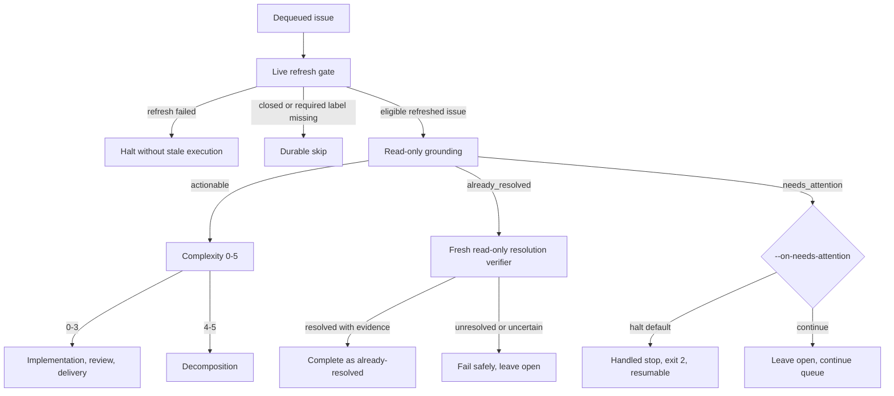

# Ralphie

**Turn a GitHub issue queue into reviewed commits with OpenCode.**

[](https://github.com/beremaran/ralphie/actions/workflows/ci.yml)

Ralphie is an opinionated, resumable CLI that reads open GitHub issues, asks
[OpenCode](https://opencode.ai/v2/docs/) for schema-validated decisions, and
routes each issue to either focused implementation or dependency-aware
decomposition. Agents handle reasoning and code changes; Ralphie keeps Git,
GitHub, run state, recovery, and safety checks deterministic.

> [!CAUTION]
> Ralphie defaults to the `lgtm` workflow: it works directly on the branch
> selected by `--branch`, commits approved work, and pushes directly to that
> branch. Use `--workflow pr` to deliver through an automatically merged feature
> branch and pull request instead. Ralphie is pre-1.0. Start with a one-issue
> `--dry-run` against a repository you control before enabling mutations.

For task-oriented details, start with the [documentation index](./docs/README.md).

## What Ralphie provides

- **Issue-native automation** — each run focuses on one repository, with the
  issue as the unit of planning, execution, recovery, and reporting.
- **Structured agent decisions** — complexity, reviews, decompositions, and
  commit messages are validated against explicit schemas.
- **Fresh-context review loops** — implementation, review, and review-fix work
  run in separate OpenCode sessions to reduce context bias.
- **Deterministic delivery** — Ralphie stages, inspects, commits, and pushes the
  resulting changes itself; agents do not own the delivery protocol. In `pr`
  mode, merged delivery is a **check gate**: the pull request is merged only
  after the checks for its exact head SHA reach a stable green snapshot, the
  head is re-read immediately before merging, and a moved head invalidates the
  saved decision.
- **Crash-safe recovery** — versioned run state, issue checkpoints, artifacts,
  and idempotent reconciliation make interrupted runs resumable.
- **Observable, bounded autonomy** — transcripts, progress, JSON Lines output,
  a five-attempt review limit, and non-force pushes are
  built in.

## Install and try it

Ralphie has three runtime forms with different local dependencies:

- **Verified standalone binary:** executing a release binary does not require
  [Bun](https://bun.sh/). The installer needs `curl`, the Sigstore CLI, and a
  SHA-256 utility (`sha256sum` or `shasum`); it supports macOS and Linux on
  `arm64` and `x64`.
- **Published JavaScript package or source checkout:** Bun is required to run
  `bunx @beremaran/ralphie` or `bun run index.ts`, and to build Ralphie from
  source.
- **Docker image:** the published image runs the native binary and does not
  include Bun at runtime. It includes the GitHub CLI, Git, a POSIX shell, and CA certificates.

Every repository workflow also needs GitHub CLI, Git, a shell, and model
an OpenCode server with model credentials. The target repository's verification command is a
separate dependency boundary: install whatever that command uses (for example,
Bun, Node.js, or a project compiler) in the selected runtime. The default
`bun run check` is therefore a target-repository requirement, not a standalone
Ralphie requirement. Ralphie discovers that command from `package.json`; use
one or more `--verify-command` options for a target-specific verification
command.

For an interactive GitHub setup, authenticate and verify the active account:

```bash
gh auth login
gh auth status
git --version
gh --version
```

For unattended runs, provide `GH_TOKEN` (preferred) or `GITHUB_TOKEN` to the
process instead; credentials are inputs and need not be printed or exposed.
Start an OpenCode server (`opencode2 serve`) before running Ralphie. By default Ralphie discovers the local background service; use `--opencode-url` (or `OPENCODE_URL`) for an explicit server and `--opencode-token` (or `OPENCODE_TOKEN`) when it requires a token. See [Getting started](./docs/getting-started.md) for
the complete installation, authentication, container, and source-checkout
contract.

Verify an installed standalone binary without contacting a repository:

```bash
ralphie --version
```

The shortest safe package smoke check is:

```bash
bunx @beremaran/ralphie --version
```

The standalone release installer is also available. Verification is mandatory;
install the Sigstore CLI and a SHA-256 utility before using it:

```bash
curl -fsSL https://raw.githubusercontent.com/beremaran/ralphie/main/scripts/install.sh | sh
ralphie --version
```

Preview one issue without implementation, commits, pushes, or GitHub mutations:

```bash
bunx @beremaran/ralphie owner/repository --dry-run --max-issues 1
```

Dry-run still performs preflight, issue discovery, read-only grounding, and
may prepare or reset the local workspace. Read the [safety model](./docs/safety.md)
before using mutation-enabled commands.

## Public distribution

The [latest release](https://github.com/beremaran/ralphie/releases/latest) and
its [release assets](https://github.com/beremaran/ralphie/releases) are public.
The supported standalone installer is
[install.sh](https://raw.githubusercontent.com/beremaran/ralphie/main/scripts/install.sh);
it supports macOS and Linux on `arm64` and `x64`. Release tags use the strict
`v<major>.<minor>.<patch>` form; the installer accepts either that tag or the
version without `v`.

Other canonical channels are the [Homebrew tap](https://github.com/beremaran/ralphie)
and [formula source](https://raw.githubusercontent.com/beremaran/ralphie/main/Formula/ralphie.rb),
the [OCI image](https://ghcr.io/beremaran/ralphie), the
[published npm package](https://www.npmjs.com/package/@beremaran/ralphie), and
the [MIT license](https://github.com/beremaran/ralphie/blob/main/LICENSE).
Public artifacts do not require GitHub credentials. Operating on a private target
repository still requires a GitHub account or runtime token with the necessary
permissions; OpenCode model credentials are also required when Ralphie asks OpenCode to make
a decision.

## Docker runtime

The published OCI image is a verified standalone runtime. It runs as
`65532:65532` with `HOME` and the working directory set to `/home/nonroot`.
The image contains no credentials or credential-bearing defaults. Supply all
credentials and configuration at runtime:

- `GH_TOKEN` (preferred) or `GITHUB_TOKEN` for noninteractive GitHub CLI access;
- `OPENCODE_URL` (or `--opencode-url`) for the external OpenCode server, and `OPENCODE_TOKEN` (or `--opencode-token`) when it requires a token;
- a writable `/home/nonroot/.ralphie` volume for checkouts, state, and recovery
  artifacts.

Use these safe image and authentication smoke checks:

```bash
docker run --rm ghcr.io/beremaran/ralphie:latest --version
docker run --rm --env GH_TOKEN --entrypoint gh \
  ghcr.io/beremaran/ralphie:latest auth status
```

A complete first-run preview:

```bash
docker run --rm \
  --env GH_TOKEN \
  --env OPENCODE_URL \
  --mount type=volume,source=ralphie-state,target=/home/nonroot/.ralphie \
  ghcr.io/beremaran/ralphie:latest owner/repository \
  --workspace /home/nonroot/.ralphie \
  --dry-run --max-issues 1
```

The Docker runtime does not include Bun. If the target repository's
verification command is `bun run check` or otherwise needs a tool not in the
image, use a target-specific image/runtime or supply a verification command
whose dependencies are available there. See [Getting started](./docs/getting-started.md)
for the full contract.

## Output contract

`--output` selects `default`, `verbose`, `quiet`, or `json`. In an interactive,
non-CI terminal, the default streams the OpenCode transcript with one replaceable
interactive region below it: the sticky stage/status line plus the bounded
activity rows together occupy at most three physical terminal rows (measured
by the rows actually painted, not by newline counts), repainted in place and
clipped before wrap at the current width. The footer is refreshed
periodically and describes the active leaf stage and
activity—for example, `› Reviewing changes › Using bash`—rather than a global
step count. Completed progress milestones remain in scrollback. OpenCode sessions
start with contextual headers such as:

```text
╭─ OpenCode · Task · session-1 · owner/repo · issue 2/4 · #56 · Reviewing changes · attempt 1/3
```

Human-readable output also records lifecycle breadcrumbs for events such as
context compaction and OpenCode retries. Intermediate work stays in the compact
activity surface: tool-call deltas, tool execution updates, bash execution
updates, streamed thinking, compaction/retry lifecycle, and active progress
changes render as bounded rows in the replaceable interactive region rather
than scrollback, while assistant text deltas stream in the transcript with a
`140`-character rendered bound. Each tool completion emits at most one concise
`✓ <tool> done` line, and a failure emits one sanitized, bounded line with
enough error detail to act on. `--output verbose` never expands the live
region's three-row cap. These are not limits on the structured stream.

Outside an interactive terminal—including CI and any redirected output—plain
output is the deterministic, append-only noninteractive fallback and uses no
ANSI cursor controls and no carriage-return bytes. Quiet output reports
failures and handled needs-attention stops only. JSON output is
JSON Lines on stdout: each line is a parseable progress record or a lossless
`opencode_event` record, without
human breadcrumb lines. The durable progress-event log remains at
`<workspace>/.ralphie/runs/<run-id>/events.jsonl` independently of the selected
renderer; supplied progress-event values are preserved as-is. Only terminal
control sequences are stripped from human-readable rows; transcripts and
progress values are never redacted.
See [Operations and recovery](./docs/operations-and-recovery.md) for output,
resume, and cleanup details; successful `--clean end` removes the workspace
and its log, while failed runs retain diagnostics for recovery.

PR delivery surfaces as `pr-gate` progress events: registration with the pull
request number and exact head SHA, poll progress only for meaningful check
transitions (registration, checked-in, disappeared, status changes), head
invalidation, and terminal success or failure with the check summary and
reason. Human and verbose output name the PR number, exact SHA, check summary,
and reason; JSON events carry the structured normalized check snapshot and
a timestamp; unchanged polls never emit, and quiet output suppresses the
routine gate milestones while still reporting gate failures.

## How issue routing works

Every dequeued issue passes a live refresh gate before issue work consumes the
budget: Ralphie refreshes the issue and bounded comments, halts rather than use
stale data if refresh fails, and durably skips an issue that is now closed or
missing a required label. The refreshed issue then receives a read-only
grounding decision; only an actionable decision reaches complexity routing:



- **Actionable** issues receive a complexity score: **0–3** enter
  implementation, review, deterministic verification, and delivery; **4–5**,
  and implementation that exhausts its review budget, enter decomposition into
  linked child issues.
- **Already-resolved** issues close only after a separate fresh verifier
  returns a nonblank summary and concrete evidence. Unresolved or uncertain
  verification is an ordinary non-completion failure—not an automatic closure,
  actionable fallback, or needs-attention decision—and leaves the issue open.
- **Needs attention** issues are never closed, marked complete, or delivered:
  Ralphie persists the decision with its reason, summary, evidence, questions,
  and an issue-freshness fingerprint (`updatedAt`, comment count, and comment
  version) in the per-issue artifact store, and progress events carry the same
  fields plus the artifact path, policy, and queue position. Complexity,
  difficulty, size, or uncertainty are never valid needs-attention reasons.
  The source issue always remains open; with `continue`, the queue may proceed,
  but neither `lgtm` closure nor feature-branch push or PR delivery occurs.
- Recursive splitting defaults to three levels and can be changed with
  `--max-decomposition-depth`. Reaching that ceiling leaves the issue open and
  continues independent queue work instead of aborting the run.

`--on-needs-attention halt` (the default) keeps the issue in the run state's
pending queue, emits a handled-stop summary, and exits with code `2`; the run
resumes later with `--resume`, reusing the persisted decision only while the
issue's fingerprint still matches. `continue` defers the issue, processes the
rest of the queue, and exits `0` when the queue drains. Both policies consume
the attempt against `--max-issues`. An explicit `--notify-needs-attention`
opt-in (with optional `--needs-attention-label`) publishes one idempotent
structured comment and label per issue, saved as resumable intent before any
GitHub mutation; dry runs never notify.

**Needs-attention recovery contract.** Every OpenCode session is a bounded
`request_needs_attention` signal channel for repository-backed blockers. The
signal is a schema-validated `{ reason, message }` object whose `reason` is one
of `outdated_premise`, `conflicting_requirements`, `missing_information`,
`external_dependency`, or `cannot_reproduce`, with an optional message capped
at 2,000 characters; it is a request to the caller, never a final
implementation or review decision, and the prompt guidance forbids it for work
that is merely hard, large, slow, or uncertain. Only structured decision and
task sessions (grounding, complexity, implementation, review-fix,
commit-message, review, and decomposition) can raise it, and only through
Ralphie's OpenCode task/decision gate. Each signal is confirmed by exactly one
fresh, read-only verifier session before any further artifact, Git, or GitHub
mutation. A confirmed `needs_attention` disposition persists the structured
decision with its summary, evidence, questions, and issue-freshness
fingerprint, leaves the source issue open, performs no GitHub mutation and no
commit or push, and restores the exact clean checkpoint (`git reset --hard`
plus `git clean -fd`), removing every staged, unstaged, and untracked agent
change before reporting. A verifier rejection (`actionable` or
`already_resolved`) clears the handoff and resumes the original attempt, so at
most one fresh verifier is consumed per signal; a persisted confirmed decision
is reused without a fresh verifier when recovery retries on resume. Recovery
writes a bounded binary-safe patch and decision metadata to
`<workspace>/.ralphie/runs/<run-id>/issues/<issue-number>/needs-attention-<id>/`
(`changes.patch` and `metadata.json`), keyed by fingerprint so a stale decision
can never reuse another issue's diagnostics. Diagnostic, restoration, or
repository-invariant failures are recoverable failures: the issue stays pending
with the handoff retained for resume, never reported as successfully handled.

`--dry-run` grounds every issue, reports all three routes, and performs no
implementation, checkout mutation, Git or GitHub mutation, issue closure, or PR
delivery. OpenCode sessions never close issues, create or merge pull requests, or
push: every Git and GitHub mutation is performed by Ralphie's deterministic
domain services, and agent sessions are denied mutating Git and GitHub
commands.

See [Workflows](./docs/workflows.md) for the full routing, implementation,
decomposition, and delivery contracts, and
[Operations and recovery](./docs/operations-and-recovery.md) for the exact
state, artifact, progress, and exit-code contracts.

## Documentation

The [documentation index](./docs/README.md) has audience-based reading paths.
The main references are:

- [Getting started](./docs/getting-started.md) — prerequisites, installation,
  verification, and the first dry run.
- [Workflows](./docs/workflows.md) — routing, implementation, decomposition,
  delivery modes, and diagrams.
- [CLI reference](./docs/cli-reference.md) — invocation, options, environment
  variables, and recipes.
- [Safety](./docs/safety.md) — mutation boundaries, Git/GitHub invariants, and
  workspace risks.
- [Operations and recovery](./docs/operations-and-recovery.md) — output,
  artifacts, state, cancellation, resume, and cleanup.
- [Architecture](./docs/architecture.md) — runtime/domain boundaries and the
  component map.
- [Development](./docs/development.md) — local setup, tests, and contribution
  expectations.
- [Public distribution topology](./docs/public-distribution.md) — canonical
  repository, public endpoints, publication setup, and privacy boundaries.
- [Releases](./docs/releases.md) — compatibility, publishing, and release
  verification.
- [End-to-end execution trace](./docs/end-to-end-execution.md) — the detailed
  source-level trigger-to-exit path.

## Version and build metadata

`ralphie --version` prints only the release version. For automation,
`ralphie --version --output json` prints a stable object containing `version`
and `commitSha`. Both forms work without a repository, GitHub credentials, or
OpenCode configuration. Release builds embed the immutable commit SHA supplied by
the build entry point; local builds use the documented `local` commit sentinel
when no release SHA is supplied. See the [CLI reference](./docs/cli-reference.md)
for the complete command surface.

## Contributing and releases

Contributions are welcome. For substantial behavior or workflow changes, open
an issue first so the safety and recovery implications can be discussed. Add or
update tests, run `bun run check`, keep Git and GitHub mutations in deterministic
domain services, and put future documentation changes in the appropriate page
under [`docs/`](./docs/README.md). See [Development](./docs/development.md) for
the contributor checklist.

Ralphie follows [Semantic Versioning](https://semver.org/). Release candidates
must pass `bun run check`; the full compatibility and publishing contract is in
[Releases](./docs/releases.md), with notable changes recorded in
[`CHANGELOG.md`](./CHANGELOG.md).

For a release checksum, the authoritative trust policy and explanation are in
[Releases](./docs/releases.md). This runnable verification command is kept as a
small landing-page quick reference:

```bash
TAG=v0.1.0
SOURCE_REF=<40-character commit SHA targeted by $TAG>
sigstore verify github SHA256SUMS \
  --bundle SHA256SUMS.sigstore.json \
  --repository beremaran/ralphie \
  --name Release \
  --cert-identity "https://github.com/beremaran/ralphie/.github/workflows/release.yml@refs/tags/$TAG" \
  --trigger push \
  --sha "$SOURCE_REF" \
  --ref "refs/tags/$TAG"
sha256sum --check SHA256SUMS
```
