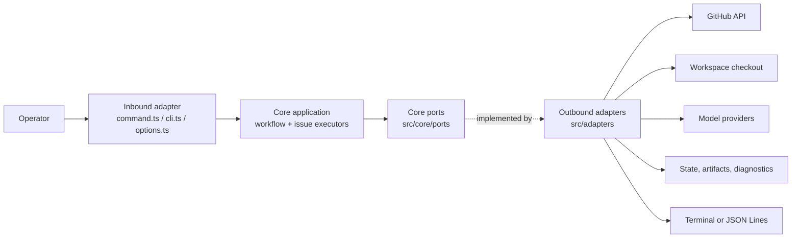

# Architecture

This page is for contributors and maintainers who need the runtime and domain
boundaries, component map, or source locations. It is the authoritative
architecture overview. Return to the [documentation index](README.md).

## Runtime boundaries

Ralphie uses Bun's built-in argument parser and native promises. Services are
assembled as an explicit dependency object, which keeps the runtime small and
makes tests straightforward without a framework-specific execution model.

The core owns sequencing and contracts; adapters own every side effect and
implement core ports. `src/runtime.ts` is the composition root that binds
concrete adapters into the runtime bundle.

| Layer | Location | Responsibility |
| --- | --- | --- |
| Core ports | `src/core/ports/` | Outbound contracts: GitHub, git, pi runtime, progress, run state/event log, workspace, process, and the workflow runtime bundle. |
| Core domain | `src/core/domain/` | Pure value objects and schemas: decisions, issue and queue types, decomposition markers, fingerprints, path expansion. |
| Core application | `src/core/app/` | Workflow orchestration, issue executors, agent sessions/prompts, verification, artifact logic, recovery, exit-code policy. |
| Inbound adapter | `src/command.ts`, `src/cli.ts`, `src/options.ts` | CLI parsing, terminal detection, composition, and the top-level error boundary. |
| Outbound adapters | `src/adapters/` | Octokit/GitHub, git and `gh` CLI, in-process pi SDK, node filesystem, child processes, terminal/JSON presentation. |
| Composition root | `src/runtime.ts` | Builds concrete adapters and exposes them as the core runtime bundle. |
| Shared kernel | `src/shared/` | Errors and terminal-control sanitization used by every layer. |

Dependency direction is one-way: inbound adapters and the composition root
depend on core; core depends only on its own ports, domain, application, and
the shared kernel. Core never imports `src/adapters/`, `command.ts`,
`runtime.ts`, or `options.ts`. The artifacts and recovery modules define their
own file-system ports (`IssueArtifactFileSystem`, `RecoveryFileSystem`) and the
adapters under `src/adapters/issues/` supply the node implementations, so the
core contains the atomic-write and diagnostic logic without touching `node:fs`.

The progress contract lives in `src/core/ports/progress.ts`; `src/adapters/progress/`
implements it and is imported only by the composition root. `src/command.ts`
owns the terminal decision and passes one shared `RunEventLog` to the
coordinator (for persistence) and the runtime (the run closes it before
removing the workspace). `tests/architecture.test.ts` enforces the layer
directions, the no-I/O rule for core, the vendor-type exception (the opaque
`GitHubApiClient` handle in `core/ports/github.ts` is the only Octokit
reference), and process-stream ownership.

## Dependency and side-effect rules

Agents own reasoning and edits within their permitted tool boundary. They do not
own commits, pushes, issue mutations, or delivery sequencing. Deterministic
services under `src/adapters/git/` and `src/adapters/github/` perform those side
effects and verify their invariants. The explicit runtime object makes these
boundaries testable without a framework-specific execution model.

Agent configuration is separate from persistent workspace state: the pi
provider catalog is static and in-process, `--model provider/model` selects a
model at runtime, and credentials resolve through `~/.pi/agent/auth.json`
(overridable with `PI_CODING_AGENT_DIR`) plus provider environment variables.
Ralphie never stores agent configuration under the
workspace; run state and recovery artifacts belong under the workspace's
`.ralphie` directory.

For workflow behavior and the agent/deterministic boundary, see [Workflows](workflows.md)
and [Safety](safety.md). For state transitions and retained diagnostics, see
[Operations and recovery](operations-and-recovery.md).

## Distribution boundary

Ralphie's only distribution channel is the published npm package (see
[Getting started](getting-started.md#published-package)); the former native
binary, installer, Homebrew, and container distribution machinery was removed.

The package boundary is the bundled `dist/ralphie.js` CLI reached from
`index.ts` through `src/cli.ts`, `src/command.ts`, and runtime assembly. Tests
and helper probes are verification-only consumers. In particular, a type-only
import can document or check a contract but does not make a module runtime
reachable. The deterministic source audit is described in
[Development](development.md#source-reachability-boundary) and runs as part of
the normal check gate.

## Source map

| Concern | Primary source |
| --- | --- |
| Public trigger and flags | `index.ts`, `src/cli.ts`, `src/command.ts`, `src/options.ts` |
| Runtime dependency assembly | `src/runtime.ts` |
| Run orchestration, queue, state transitions | `src/core/app/workflow.ts`, `src/core/app/issues/queue.ts` |
| Complexity routing | `src/core/app/issues/executor.ts`, `src/core/app/issues/complexity.ts` |
| Implementation/review/delivery | `src/core/app/issues/implementation-executor.ts`, `src/core/app/issues/verification.ts`, `src/adapters/git/issue-operations.ts`, `src/adapters/git/remote-safety.ts` |
| Decomposition and GitHub mutations | `src/core/app/issues/decomposition-executor.ts`, `src/adapters/github/issue-mutations.ts`, `src/adapters/github/issue-relationships.ts` |
| Pi model catalog, credentials, tools, sessions, and structured results | `src/adapters/pi/`, `src/core/app/agent/`, `src/core/domain/pi-models.ts` |
| Git checkpoints, safety, and branches | `src/adapters/git/` |
| Durable run state, artifacts, diagnostics, and event audit | `src/core/app/issues/artifacts.ts`, `src/core/app/issues/recovery.ts`, `src/adapters/run/`, `src/adapters/issues/` |
| Execution contracts, presentation, and exit semantics | `src/core/ports/`, `src/adapters/progress/`, `src/core/app/exit-code.ts` |
