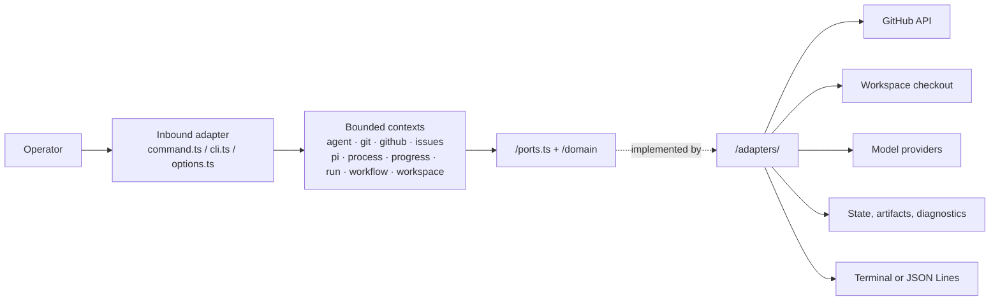

# Architecture

This page is for contributors and maintainers who need the runtime and domain
boundaries, component map, or source locations. It is the authoritative
architecture overview. Return to the [documentation index](README.md).

## Runtime boundaries

Ralphie uses Bun's built-in argument parser and native promises. Services are
assembled as an explicit dependency object, which keeps the runtime small and
makes tests straightforward without a framework-specific execution model.

Each bounded context owns its contract, domain model, and adapters together:
`<context>/ports.ts` (and `issues/domain/`) declares the core-owned types,
`<context>/adapters/` implements them, and application logic lives beside them
(`issues/app/`, `agent/`, `workflow/`). `src/runtime.ts` is the composition root
that binds concrete adapters into the runtime bundle.

| Context | Location | Responsibility |
| --- | --- | --- |
| `agent` | `src/agent/` | Agent session port and events, model/thinking types, prompts, structured output. |
| `pi` | `src/pi/` | In-process pi SDK runtime: port for startup plus auth, client, tools, model catalog adapters. |
| `github` | `src/github/` | Issue value objects, repository slug parsing, and the Octokit/`gh` adapters. |
| `git` | `src/git/` | Checkout preparation, checkpoints, issue operations, invariants, and remote-safety adapters. |
| `issues` | `src/issues/` | Domain (`domain/`), executors and artifact/recovery logic (`app/`), filesystem adapters (`adapters/`). |
| `progress` | `src/progress/` | `ports.ts` contract plus the terminal/JSON presentation adapters. |
| `run` | `src/run/` | Versioned run-state schemas, the state/event-log ports, and their adapters. |
| `process` | `src/process/` | Bounded command runner port, the helper, and its adapter. |
| `workspace` | `src/workspace/` | Path expansion, the workspace port, and the protected-removal adapter. |
| `workflow` | `src/workflow/` | Issue-workflow orchestration, the runtime bundle port, and exit-code policy. |
| Inbound adapter | `src/command.ts`, `src/cli.ts`, `src/options.ts` | CLI parsing, terminal detection, and the top-level error boundary. |
| Composition root | `src/runtime.ts` | Builds concrete adapters and exposes them as the workflow runtime bundle. |
| Shared kernel | `src/shared/` | Errors and terminal-control sanitization used by every context. |

Dependency direction is one-way. Contexts import each other's `ports.ts` and
domain modules, never another context's `adapters/`; only the composition root
(`runtime.ts`, `command.ts`) instantiates adapters. Non-adapter code imports no
`node:fs`, `node:child_process`, vendor SDK, or process stream. The `issues`
context defines its file-system ports (`IssueArtifactFileSystem`,
`RecoveryFileSystem`) in `issues/app/` and its node implementations live in
`issues/adapters/`, so the atomic-write and diagnostic logic never touches
`node:fs`. Git and GitHub adapters receive their command runner and Octokit
handle from the composition root instead of constructing them.

The progress contract lives in `src/progress/ports.ts`; `src/progress/adapters/`
implements it and is imported only by the composition root. `src/command.ts`
owns the terminal decision and passes one shared `RunEventLog` to the
coordinator (for persistence) and the runtime (the run closes it before
removing the workspace). `tests/architecture.test.ts` enforces the adapter
import rules, the no-I/O rule for non-adapter code, the Octokit confinement
(the `github` context is the only place the SDK appears), composition-root
isolation, and process-stream ownership.

## Dependency and side-effect rules

Agents own reasoning and edits within their permitted tool boundary. They do not
own commits, pushes, issue mutations, or delivery sequencing. Deterministic
services under `src/git/adapters/` and `src/github/adapters/` perform those side
effects and verify their invariants. The explicit runtime object makes these
boundaries testable without a framework-specific execution model.

Agent configuration is separate from persistent workspace state: the pi
provider catalog is static and in-process, `--model provider/model` selects a
model at runtime, and credentials resolve through `~/.pi/agent/auth.json`
(overridable with `PI_CODING_AGENT_DIR`) plus provider environment variables.
Ralphie never stores agent configuration under the
workspace; run state and recovery artifacts belong under the workspace's
`.ralphie` directory.

For workflow behavior and the agent/deterministic boundary, see [Workflows](workflows.md)
and [Safety](safety.md). For state transitions and retained diagnostics, see
[Operations and recovery](operations-and-recovery.md).

## Distribution boundary

Ralphie's only distribution channel is the published npm package (see
[Getting started](getting-started.md#published-package)); the former native
binary, installer, Homebrew, and container distribution machinery was removed.

The package boundary is the bundled `dist/ralphie.js` CLI reached from
`index.ts` through `src/cli.ts`, `src/command.ts`, and runtime assembly. Tests
and helper probes are verification-only consumers. In particular, a type-only
import can document or check a contract but does not make a module runtime
reachable. The deterministic source audit is described in
[Development](development.md#source-reachability-boundary) and runs as part of
the normal check gate.

## Source map

| Concern | Primary source |
| --- | --- |
| Public trigger and flags | `index.ts`, `src/cli.ts`, `src/command.ts`, `src/options.ts` |
| Runtime dependency assembly | `src/runtime.ts` |
| Run orchestration, queue, state transitions | `src/workflow/workflow.ts`, `src/issues/domain/queue.ts` |
| Complexity routing | `src/issues/app/executor.ts`, `src/issues/app/complexity.ts` |
| Implementation/review/delivery | `src/issues/app/implementation-executor.ts`, `src/issues/app/verification.ts`, `src/git/adapters/issue-operations.ts`, `src/git/adapters/remote-safety.ts` |
| Decomposition and GitHub mutations | `src/issues/app/decomposition-executor.ts`, `src/github/adapters/issue-mutations.ts`, `src/github/adapters/issue-relationships.ts` |
| Pi model catalog, credentials, tools, sessions, and structured results | `src/pi/`, `src/agent/` |
| Git checkpoints, safety, and branches | `src/git/` |
| Durable run state, artifacts, diagnostics, and event audit | `src/issues/app/artifacts.ts`, `src/issues/app/recovery.ts`, `src/run/`, `src/issues/adapters/` |
| Execution contracts, presentation, and exit semantics | `src/*/ports.ts`, `src/progress/adapters/`, `src/workflow/exit-code.ts` |
