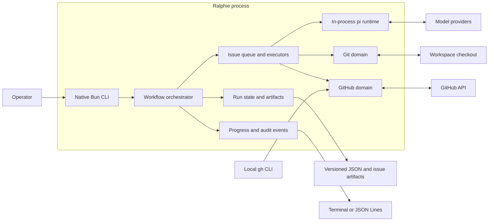

# Architecture

This page is for contributors and maintainers who need the runtime and domain
boundaries, component map, or source locations. It is the authoritative
architecture overview. Return to the [documentation index](README.md).

## Runtime boundaries

Ralphie uses Bun's built-in argument parser and native promises. Services are
assembled as an explicit dependency object, which keeps the runtime small and
makes tests straightforward without a framework-specific execution model.

The workflow orchestrator owns sequencing, while domain services own side
effects and validate their invariants at the boundary.

| Area | Responsibility |
| --- | --- |
| `src/github/` | GitHub CLI authentication, Octokit, issue discovery, mutations, native sub-issues/dependencies, and decomposition links. |
| `src/git/` | Checkout preparation, checkpoints, deterministic issue operations, invariants, and remote safety. |
| `src/issues/` | Queueing, complexity routing, implementation, review, recovery, and decomposition. |
| `src/agent/` | Ralphie's session, prompt, schema, diagnostics, and structured-output boundary. |
| `src/pi/` | In-process pi agent runtime: provider catalog, credential store, execution tools, session lifecycle, and safety policy. |
| `src/progress/` | Typed events, audit persistence, and terminal/JSON renderers. |
| `src/run/` | Versioned run state written for observability. |
| `src/workspace/` | Path expansion and protected workspace removal. |
| `src/process/` | External command execution and process exit semantics. |

`src/workflow.ts` orchestrates the issue modules. `src/runtime.ts` assembles
their live implementations into one explicit runtime object.

## Dependency and side-effect rules

Agents own reasoning and edits within their permitted tool boundary. They do not
own commits, pushes, issue mutations, or delivery sequencing. Deterministic
services under `src/git/` and `src/github/` perform those side effects and
verify their invariants. The explicit runtime object makes these boundaries
testable without a framework-specific execution model.

Agent configuration is separate from persistent workspace state: the pi
provider catalog is static and in-process, `--model provider/model` selects a
model at runtime, and credentials resolve through `~/.pi/agent/auth.json`
(overridable with `PI_CODING_AGENT_DIR`) plus provider environment variables.
Ralphie never stores agent configuration under the
workspace; run state and recovery artifacts belong under the workspace's
`.ralphie` directory.

For workflow behavior and the agent/deterministic boundary, see [Workflows](workflows.md)
and [Safety](safety.md). For state transitions and retained diagnostics, see
[Operations and recovery](operations-and-recovery.md).

## Distribution boundary

Ralphie's only distribution channel is the published npm package (see
[Getting started](getting-started.md#published-package)); the former native
binary, installer, Homebrew, and container distribution machinery was removed.

The package boundary is the bundled `dist/ralphie.js` CLI reached from
`index.ts` through `src/cli.ts`, `src/command.ts`, and runtime assembly. Tests
and helper probes are verification-only consumers. In particular, a type-only
import can document or check a contract but does not make a module runtime
reachable. The deterministic source audit is described in
[Development](development.md#source-reachability-boundary) and runs as part of
the normal check gate.

## Source map

| Concern | Primary source |
| --- | --- |
| Public trigger and flags | `index.ts`, `src/cli.ts`, `src/command.ts`, `src/options.ts` |
| Runtime dependency assembly | `src/runtime.ts` |
| Run orchestration, queue, state transitions | `src/workflow.ts`, `src/issues/queue.ts` |
| Complexity routing | `src/issues/executor.ts`, `src/issues/complexity.ts` |
| Implementation/review/delivery | `src/issues/implementation-executor.ts`, `src/issues/verification.ts`, `src/git/issue-operations.ts`, `src/git/remote-safety.ts` |
| Decomposition and GitHub mutations | `src/issues/decomposition-executor.ts`, `src/github/issue-mutations.ts`, `src/github/issue-relationships.ts` |
| Pi model catalog, credentials, tools, sessions, and structured results | `src/pi/`, `src/agent/` |
| Git checkpoints, safety, and branches | `src/git/` |
| Durable state and reconciliation | `src/run/`, `src/issues/artifacts.ts` |
| Progress and exit semantics | `src/progress/`, `src/process/exit-code.ts` |
