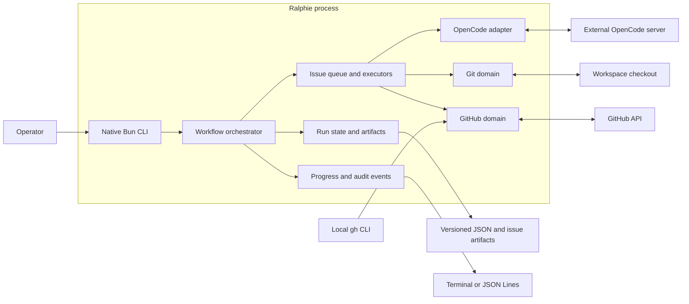

# Architecture

This page is for contributors and maintainers who need the runtime and domain
boundaries, component map, or source locations. It is the authoritative
architecture overview. Return to the [documentation index](README.md), and see
the [end-to-end execution trace](end-to-end-execution.md) for the detailed
source-level sequence.

## Runtime boundaries

Ralphie uses Bun's built-in argument parser and native promises. Services are
assembled as an explicit dependency object, which keeps the runtime small and
makes tests straightforward without a framework-specific execution model.

The workflow orchestrator owns sequencing, while domain services own side
effects and validate their invariants at the boundary.

| Area | Responsibility |
| --- | --- |
| `src/github/` | GitHub CLI authentication, Octokit, issue discovery, mutations, native sub-issues/dependencies, decomposition links, pipeline snapshot collection, and bounded pipeline observation. |
| `src/git/` | Checkout preparation, checkpoints, deterministic issue operations, invariants, and remote safety. |
| `src/issues/` | Queueing, complexity routing, implementation, review, recovery, and decomposition. |
| `src/agent/` | Ralphie's session, prompt, schema, diagnostics, and structured-output boundary. |
| `src/opencode/` | External OpenCode server client, session lifecycle, and safety policy. |
| `src/progress/` | Typed events, audit persistence, and terminal/JSON renderers. |
| `src/run/` | Versioned state, artifacts, reconciliation, and resume behavior. |
| `src/workspace/` | Path expansion and protected workspace removal. |
| `src/targets/` | Canonical standalone release target manifest, typed parser/loader, read-only target query API, deterministic catalog/GitHub Actions matrix JSON serializers, stable consumer renderers (POSIX installer, Homebrew, documentation), and the `scripts/standalone-targets.ts` command surface. |
| `src/process/` | External command execution and process exit semantics. |

`src/workflow.ts` orchestrates the domain services. `src/runtime.ts` assembles
their live implementations into one explicit runtime object.

## Read-only pipeline observation contract

The live runtime exposes `runtime.pipelineObservation.observe(...)` for a later
workflow gate. It observes one immutable 40- or 64-character commit SHA and is
read-only: with an Octokit client it uses paginated Check Run and legacy commit
status reads plus `repos.getBranch` for the final HEAD race check. Tests and
other read-only callers may provide `fetchSnapshot`, `readHead`, and injected
clock/sleep/request dependencies without importing the collector internals.

The canonical settings and defaults are:

| Setting | Default | Policy |
| --- | ---: | --- |
| `registrationGraceMs` | `0` | Keep polling an empty `no-checks` snapshot until grace expires, then return `no-pipelines-discovered`. |
| `quiescenceMs` | `0` | Require the terminal normalized set to remain unchanged for this window. |
| `deadlineMs` | `30,000` | Absolute bound from `observe` start; timeout wins over a late read or sleep. |
| `initialBackoffMs` / `maxBackoffMs` | `1,000` / `30,000` | Exponential polling backoff, capped at the maximum and remaining deadline. |
| `backoffFactor` | `2` | Multiplier for ordinary polling delays. |
| `rateLimitRetries` | `3` | Maximum retries per poll when a usable server hint is available. |
| `maxRateLimitDelayMs` | `30,000` | A larger `Retry-After` or reset delay fails closed instead of being silently capped. |
| `stableTerminalConfirmations` | `1` | Number of identical green terminal snapshots required. |

A green result requires at least one complete item, every item to be `passing`,
no source or completeness errors, the configured stability checks, and a final
branch HEAD equal to the observed SHA. Pending items continue polling until the
absolute deadline. Failing or cancelled items fail closed; neutral and skipped
items are retained as `acceptable` but are not green. Unknown API values,
malformed records, missing scope, collection failures, and no checks after grace
are non-green outcomes. Rate-limit hints are honored exactly only when the
hint fits both the configured cap and remaining deadline. Every request and
sleep receives an abortable derived signal; caller cancellation returns an
`aborted` outcome with its original reason, distinct from timeout or read
failure. Normalized items retain source/producer identity and raw diagnostic
fields for audit consumers.

## Dependency and side-effect rules

Agents own reasoning and edits within their permitted tool boundary. They do not
own commits, pushes, issue mutations, or delivery sequencing. Deterministic
services under `src/git/` and `src/github/` perform those side effects and
verify their invariants. The explicit runtime object makes these boundaries
testable without a framework-specific execution model.

OpenCode configuration is separate from persistent workspace state: it is read from
the default or explicitly supplied `--opencode-url`, or generated in a private
system-temporary directory when model environment variables are used. Run state
and recovery artifacts belong under the workspace's `.ralphie` directory.

For workflow behavior and the agent/deterministic boundary, see [Workflows](workflows.md)
and [Safety](safety.md). For state transitions and reconciliation, see
[Operations and recovery](operations-and-recovery.md).

## Standalone target consumer renderers

`src/targets/standalone-target-renderers.ts` exposes stable, typed consumer
projections on top of the target query API and serializers. Every renderer
accepts unknown manifest input, parses and exact-target-validates the whole
manifest through `createStandaloneTargetQueryClient` before deriving anything,
and throws before any output exists for malformed or non-canonical manifests.
The renderers never carry their own target list: the four-target catalog is
always read from the validated manifest, and the query API and serializers are
never edited. Output arrays and records are frozen, records stay sorted by
stable `id`, and every manifest field (`releaseAssetName`, `bunCompileTarget`,
`targetTriple`, `runner`, `binaryFormat`, `bunVersion`, `dockerPlatform`) is
passed through unmodified rather than reconstructed from an asset name.

Stable shapes and format names consumed by the release, installer, Homebrew,
and documentation follow-up work:

- `posix-installer-target` — `renderPosixInstallerTarget(value, os, arch)`
  normalizes the OS/architecture pair through the query API and returns the
  matching full `StandaloneTarget` record. The downloaded asset is exactly the
  returned record's `releaseAssetName`; it is never rebuilt from the pair.
- `posix-installer-mapping` — `renderPosixInstallerMapping(value)` returns the
  checked-in generated POSIX installer mapping document
  (`targets/posix-installer-targets.json`): the complete accepted alias
  tables (`osAliases`, `archAliases`, each canonical `os`/`arch` plus the
  query API's extra `uname` spellings) and the four full manifest records
  sorted by stable `id`. `scripts/install.sh` fetches the mapping at install
  time (no Bun required) and resolves a raw `uname` pair by case-folding it,
  resolving it through the alias tables, and reading exactly the matching
  record's `releaseAssetName`; unsupported values fail with a clear error
  and the asset name is never reconstructed from the pair.
- `homebrew-target-rows` — `renderHomebrewTargetRows(value, version)` returns
  rows sorted lexicographically by stable `id`. Each `HomebrewTargetRow`
  contains the complete manifest record nested under `target`, the explicit
  `version` input (plain `<major>.<minor>.<patch>`, validated; a leading `v`,
  leading zeros, prerelease, or build suffix is rejected with
  `InvalidHomebrewVersionError`), and a derived `downloadUrl` built from
  `target.releaseAssetName` at
  `https://github.com/beremaran/ralphie/releases/download/v<version>/<releaseAssetName>`.
- `target-documentation-catalog` — `renderDocumentationTargets(value)` returns
  the complete catalog sorted lexicographically by stable `id`, with every
  validated field preserved as typed values for documentation consumers.

For finished JSON documents (catalog or GitHub Actions matrix), pair the typed
projections with the document serializers in
`standalone-target-serializer.ts` (`serializeStandaloneTargets`,
`serializeStandaloneTargetMatrix`); the renderers themselves stay in memory.

## Standalone targets command

`scripts/standalone-targets.ts` (exposed as the package script `targets`,
`bun run targets -- ...`) is the standalone Bun-invokable surface over all of
the above. It loads, validates, and renders the whole manifest in memory
before writing anything, requires no credentials, and never touches Git or
GitHub. Modes and formats:

- `query --id <stable-id>` or `query --os <os> --arch <arch>` prints one
  complete target record as deterministic JSON;
- `generate --format <json|github-matrix|posix|posix-mapping|homebrew|documentation>
  [--version <version>] [--os <os> --arch <arch>] --output <file>` renders the
  complete catalog, the GitHub Actions matrix, the single `posix`-selected
  record, the POSIX installer mapping, the versioned Homebrew rows, or the
  documentation catalog — writing
  through a temporary file and renaming only after success, so an existing
  destination is preserved on any validation error;
- `check --format <...> [--version <version>] [--os <os> --arch <arch>]
  --file <file>` byte-compares the checked file against the rendered document
  (key order, LF endings, and the final newline included), succeeding only on
  an exact match and never rewriting the file; the checked-in
  `targets/posix-installer-targets.json` mapping is verified with
  `check --format posix-mapping --file targets/posix-installer-targets.json`;
- `--manifest <path>` overrides the canonical manifest for isolated tests.

All documents share the serializer encoding contract
(`serializeStandaloneJsonDocument` extends it to the consumer mappings).
Invalid arguments and validation errors go to stderr with a nonzero exit
status and no generated stdout. Invocation and examples are documented in
[Development](development.md).

## Source map

| Concern | Primary source |
| --- | --- |
| Public trigger and flags | `index.ts`, `src/cli.ts`, `src/command.ts`, `src/options.ts` |
| Runtime dependency assembly | `src/runtime.ts` |
| Run orchestration, queue, state transitions | `src/workflow.ts`, `src/issues/queue.ts` |
| Pipeline snapshot normalization and collection | `src/github/pipeline-snapshot.ts`, `src/github/pipeline-snapshot-collector.ts` |
| Bounded, deadline-aware pipeline observation, paginated exact-SHA reads, retries, and final HEAD check | `src/github/pipeline-observation.ts`, `src/github/pipeline-snapshot-collector.ts` |
| Complexity routing | `src/issues/executor.ts`, `src/issues/complexity.ts` |
| Implementation/review/delivery | `src/issues/implementation-executor.ts` |
| Decomposition and GitHub mutations | `src/issues/decomposition-executor.ts`, `src/github/issue-mutations.ts`, `src/github/issue-relationships.ts` |
| OpenCode sessions and structured results | `src/agent/`, `src/opencode/` |
| Git checkpoints, safety, and branches | `src/git/` |
| Durable state and reconciliation | `src/run/`, `src/issues/artifacts.ts` |
| Progress and exit semantics | `src/progress/`, `src/process/exit-code.ts` |
| Standalone release target manifest, read-only query API, deterministic catalog/matrix JSON serializers, consumer renderers (installer/Homebrew/documentation), and the `bun run targets` command | `src/targets/`, `targets/standalone-targets.json`, `scripts/standalone-targets.ts` |

The source-level trigger-to-exit path is maintained in the [end-to-end
execution trace](end-to-end-execution.md), which cross-references these
components by stage.
