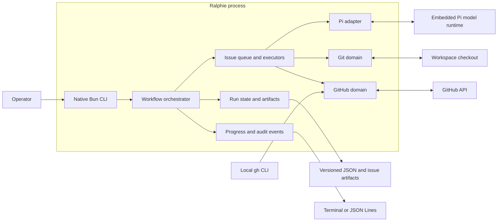

# Architecture

This page is for contributors and maintainers who need the runtime and domain
boundaries, component map, or source locations. It is the authoritative
architecture overview. Return to the [documentation index](README.md), and see
the [end-to-end execution trace](end-to-end-execution.md) for the detailed
source-level sequence.

## Runtime boundaries

Ralphie uses Bun's built-in argument parser and native promises. Services are
assembled as an explicit dependency object, which keeps the runtime small and
makes tests straightforward without a framework-specific execution model.

The workflow orchestrator owns sequencing, while domain services own side
effects and validate their invariants at the boundary.

| Area | Responsibility |
| --- | --- |
| `src/github/` | GitHub CLI authentication, Octokit, issue discovery, mutations, and decomposition links. |
| `src/git/` | Checkout preparation, checkpoints, deterministic issue operations, invariants, and remote safety. |
| `src/issues/` | Queueing, complexity routing, implementation, review, recovery, and decomposition. |
| `src/agent/` | Ralphie's session, prompt, schema, diagnostics, and structured-output boundary. |
| `src/pi/` | Embedded upstream Pi client, model runtime, tools, and safety policy. |
| `src/progress/` | Typed events, audit persistence, redaction, and terminal/JSON renderers. |
| `src/run/` | Versioned state, artifacts, reconciliation, and resume behavior. |
| `src/workspace/` | Path expansion and protected workspace removal. |
| `src/process/` | External command execution and process exit semantics. |

`src/workflow.ts` orchestrates the domain services. `src/runtime.ts` assembles
their live implementations into one explicit runtime object.

## Dependency and side-effect rules

Agents own reasoning and edits within their permitted tool boundary. They do not
own commits, pushes, issue mutations, or delivery sequencing. Deterministic
services under `src/git/` and `src/github/` perform those side effects and
verify their invariants. The explicit runtime object makes these boundaries
testable without a framework-specific execution model.

Pi configuration is separate from persistent workspace state: it is read from
the default or explicitly supplied `--pi-dir`, or generated in a private
system-temporary directory when model environment variables are used. Run state
and recovery artifacts belong under the workspace's `.ralphie` directory.

For workflow behavior and the agent/deterministic boundary, see [Workflows](workflows.md)
and [Safety](safety.md). For state transitions and reconciliation, see
[Operations and recovery](operations-and-recovery.md).

## Source map

| Concern | Primary source |
| --- | --- |
| Public trigger and flags | `index.ts`, `src/cli.ts`, `src/command.ts`, `src/options.ts` |
| Runtime dependency assembly | `src/runtime.ts` |
| Run orchestration, queue, state transitions | `src/workflow.ts`, `src/issues/queue.ts` |
| Complexity routing | `src/issues/executor.ts`, `src/issues/complexity.ts` |
| Implementation/review/delivery | `src/issues/implementation-executor.ts` |
| Decomposition and GitHub mutations | `src/issues/decomposition-executor.ts`, `src/github/` |
| Pi sessions and structured results | `src/agent/`, `src/pi/` |
| Git checkpoints, safety, and branches | `src/git/` |
| Durable state and reconciliation | `src/run/`, `src/issues/artifacts.ts` |
| Progress, redaction, and exit semantics | `src/progress/`, `src/shared/redaction.ts`, `src/process/exit-code.ts` |

The source-level trigger-to-exit path is maintained in the [end-to-end
execution trace](end-to-end-execution.md), which cross-references these
components by stage.
