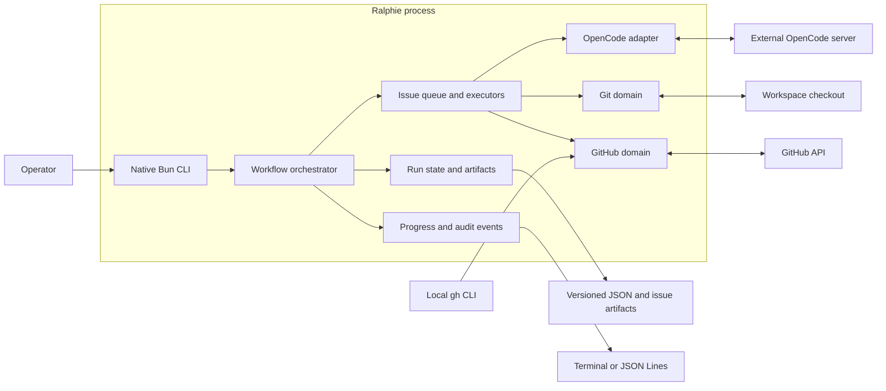

# Architecture

This page is for contributors and maintainers who need the runtime and domain
boundaries, component map, or source locations. It is the authoritative
architecture overview. Return to the [documentation index](README.md), and see
the [end-to-end execution trace](end-to-end-execution.md) for the detailed
source-level sequence.

## Runtime boundaries

Ralphie uses Bun's built-in argument parser and native promises. Services are
assembled as an explicit dependency object, which keeps the runtime small and
makes tests straightforward without a framework-specific execution model.

The workflow orchestrator owns sequencing, while domain services own side
effects and validate their invariants at the boundary.

| Area | Responsibility |
| --- | --- |
| `src/github/` | GitHub CLI authentication, Octokit, issue discovery, mutations, native sub-issues/dependencies, decomposition links, pipeline snapshot collection, bounded pipeline observation, and persisted pipeline diagnostics. |
| `src/git/` | Checkout preparation, checkpoints, deterministic issue operations, invariants, and remote safety. |
| `src/issues/` | Queueing, complexity routing, implementation, review, recovery, and decomposition. |
| `src/agent/` | Ralphie's session, prompt, schema, diagnostics, and structured-output boundary. |
| `src/opencode/` | External OpenCode server client, session lifecycle, and safety policy. |
| `src/progress/` | Typed events, audit persistence, and terminal/JSON renderers. |
| `src/run/` | Versioned state, artifacts, reconciliation, and resume behavior. |
| `src/workspace/` | Path expansion and protected workspace removal. |
| `src/process/` | External command execution and process exit semantics. |

`src/workflow.ts` orchestrates the issue modules. `src/runtime.ts` assembles
their live implementations into one explicit runtime object.

## Read-only pipeline observation contract

The live runtime exposes `runtime.pipelineObservation.observe(...)` for a later
workflow gate. It observes one immutable 40- or 64-character commit SHA and is
read-only: with an Octokit client it uses paginated Check Run and legacy commit
status reads plus `repos.getBranch` for the final HEAD race check. Tests and
other read-only callers may provide `fetchSnapshot`, `readHead`, and injected
clock/sleep/request dependencies without importing the collector internals.

The canonical settings and defaults are:

| Setting | Default | Policy |
| --- | ---: | --- |
| `registrationGraceMs` | `0` | Keep polling an empty `no-checks` snapshot until grace expires, then return `no-pipelines-discovered`. |
| `quiescenceMs` | `0` | Require the terminal normalized set to remain unchanged for this window. |
| `deadlineMs` | `30,000` | Absolute bound from `observe` start; timeout wins over a late read or sleep. |
| `initialBackoffMs` / `maxBackoffMs` | `1,000` / `30,000` | Exponential polling backoff, capped at the maximum and remaining deadline. |
| `backoffFactor` | `2` | Multiplier for ordinary polling delays. |
| `rateLimitRetries` | `3` | Maximum retries per poll when a usable server hint is available. |
| `maxRateLimitDelayMs` | `30,000` | A larger `Retry-After` or reset delay fails closed instead of being silently capped. |
| `stableTerminalConfirmations` | `1` | Number of identical green terminal snapshots required. |

A green result requires at least one complete item, every item to be `passing`,
no source or completeness errors, the configured stability checks, and a final
branch HEAD equal to the observed SHA. Pending items continue polling until the
absolute deadline. Failing or cancelled items fail closed; neutral and skipped
items are retained as `acceptable` but are not green. Unknown API values,
malformed records, missing scope, collection failures, and no checks after grace
are non-green outcomes. Rate-limit hints are honored exactly only when the
hint fits both the configured cap and remaining deadline. Every request and
sleep receives an abortable derived signal; caller cancellation returns an
`aborted` outcome with its original reason, distinct from timeout or read
failure. Normalized items retain source/producer identity and raw diagnostic
fields for audit consumers.

## Pipeline diagnostics collection

The live runtime exposes `runtime.pipelineDiagnostics.collectAndStore(...)` for
failure repair and recovery paths. The operation keeps the observed request
and exact commit SHA fixed while it collects bounded workflow-run and
check-run evidence, retrieves only allowlisted job-log redirects, writes a
versioned artifact, and returns the prompt-safe repair projection. GitHub
collection is read-only; the only local mutation is the atomic artifact write.

The artifact is stored at
`.ralphie/runs/<run-id>/pipeline/diagnostics.json`. It retains provider
identity, run/attempt/job/check IDs, raw status and conclusion values,
dispositions, unknown JSON fields, and byte accounting within the shared job,
step, excerpt, and total-evidence bounds. Terminal controls are stripped at
the persistence boundary without redacting supplied text. The repair-facing
text is generated from the same typed projection as the structured result and
is enclosed in `<untrusted-pipeline-diagnostics>` markers; provider content
cannot escape those markers or inject a second closing marker.

## Pipeline delivery orchestration and state

`--mode get-pipelines-green` is deliberately not a branch in the issue queue.
`src/get-pipelines-green.ts` is a thin command adapter for authentication,
workspace cleanup, OpenCode lifetime, and terminal exit semantics. The public
Pipeline module is `src/pipeline/delivery-lifecycle.ts`; its single
discriminated `execute` entry point accepts live, dry-run, or resume requests
and owns repository preparation, remote-head capture, deadline creation, state
reconciliation, observation, repair, commit delivery, and terminal outcomes.
`src/pipeline/delivery-types.ts` holds the lifecycle domain types and
evidence-bearing events, while `src/pipeline/snapshot-identity.ts` holds the
commit-independent identity used to detect a repeated normalized failure.

`RalphieRuntime` exposes `pipelineDeliveryLifecycle` as the lifecycle seam and
retains the lower-level Git, observation, diagnostics, repair, and remote-safety
modules for injection and reuse. The lifecycle fans each semantic
`PipelineDeliveryEvent` to the state session and progress reporter; neither
consumer reconstructs state from display updates. `src/run/pipeline-state.ts`
provides the state adapter that creates/loads a version-one pipeline state,
reconciles the remote before mutation, and atomically projects lifecycle events
to `.ralphie/runs/<run-id>/pipeline/state.json`.

The pipeline state store in `src/run/pipeline-state.ts` is a versioned adapter,
not a second issue queue. It persists a bounded projection of the current
remote SHA, normalized statuses, failure identity, checkpoint, attempt history,
diagnostic reference, and created/pushed commit evidence. Writes use a unique
temporary file followed by an atomic rename. Resume re-reads the remote before
any mutation, invalidates evidence for a changed SHA, reconciles a created
commit that already arrived, and retains the original absolute deadline. This
keeps the state seam small and makes failure, ambiguous-push, cancellation, and
stale-head cases directly testable without an OpenCode server or GitHub write.

The lifecycle exposes the same typed progress contract as the other modes.
Pipeline phase events carry the phase boundary, exact remote SHA when known,
pushed attempt count, external-movement count, failure identity, diagnostic
path, and terminal outcome details. The output renderer determines whether
those events are interactive, append-only, quiet, or JSON Lines; it does not
alter the underlying safety state machine. A green outcome is the only
successful terminal state.

## Dependency and side-effect rules

Agents own reasoning and edits within their permitted tool boundary. They do not
own commits, pushes, issue mutations, or delivery sequencing. Deterministic
services under `src/git/` and `src/github/` perform those side effects and
verify their invariants. The explicit runtime object makes these boundaries
testable without a framework-specific execution model.

OpenCode configuration is separate from persistent workspace state: Ralphie uses
the explicitly supplied `--opencode-url`/`OPENCODE_URL` and optional
`--opencode-token`/`OPENCODE_TOKEN`, or discovers the operator-run local
background service. Ralphie never stores the server configuration under the
workspace; run state and recovery artifacts belong under the workspace's
`.ralphie` directory.

For workflow behavior and the agent/deterministic boundary, see [Workflows](workflows.md)
and [Safety](safety.md). For state transitions and reconciliation, see
[Operations and recovery](operations-and-recovery.md).

## Distribution boundary

Ralphie's only distribution channel is the published npm package (see
[Getting started](getting-started.md#published-package)); the former native
binary, installer, Homebrew, and container distribution machinery was removed.

## Source map

| Concern | Primary source |
| --- | --- |
| Public trigger and flags | `index.ts`, `src/cli.ts`, `src/command.ts`, `src/options.ts` |
| Runtime dependency assembly | `src/runtime.ts` |
| Run orchestration, queue, state transitions | `src/workflow.ts`, `src/issues/queue.ts` |
| Pipeline snapshot normalization and collection | `src/github/pipeline-snapshot.ts`, `src/github/pipeline-snapshot-collector.ts` |
| Bounded, deadline-aware pipeline observation, paginated exact-SHA reads, retries, and final HEAD check | `src/github/pipeline-observation.ts`, `src/github/pipeline-snapshot-collector.ts` |
| Pipeline diagnostics collection, persistence, and repair boundary | `src/github/pipeline-diagnostics-collector.ts`, `src/github/pipeline-diagnostics-service.ts`, `src/github/pipeline-diagnostics-artifact.ts`, `src/github/pipeline-diagnostics-boundary.ts` |
| Pipeline delivery lifecycle and direct delivery | `src/pipeline/delivery-lifecycle.ts`, `src/pipeline/delivery-types.ts`, `src/pipeline/snapshot-identity.ts`, `src/git/pipeline-delivery.ts` |
| Pipeline state, bounded persistence, and resume reconciliation | `src/run/pipeline-state.ts` |
| Complexity routing | `src/issues/executor.ts`, `src/issues/complexity.ts` |
| Implementation/review/delivery | `src/issues/implementation-executor.ts`, `src/issues/pull-request-review.ts`, `src/issues/pull-request-review-coordinator.ts`, `src/github/pull-requests.ts` |
| Decomposition and GitHub mutations | `src/issues/decomposition-executor.ts`, `src/github/issue-mutations.ts`, `src/github/issue-relationships.ts` |
| OpenCode sessions and structured results | `src/agent/`, `src/opencode/` |
| Git checkpoints, safety, and branches | `src/git/` |
| Durable state and reconciliation | `src/run/`, `src/issues/artifacts.ts` |
| Progress and exit semantics | `src/progress/`, `src/process/exit-code.ts` |

The source-level trigger-to-exit path is maintained in the [end-to-end
execution trace](end-to-end-execution.md), which cross-references these
components by stage.
