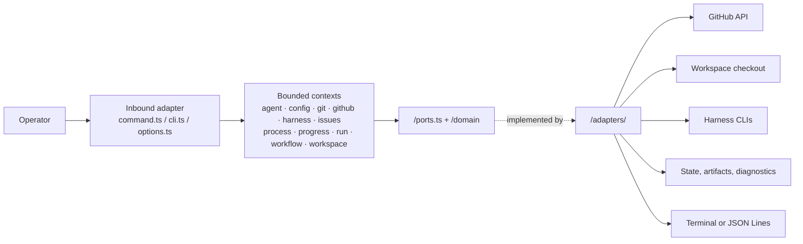

# Architecture

This page is for contributors and maintainers who need the runtime and domain
boundaries, component map, or source locations. It is the authoritative
architecture overview. Return to the [documentation index](README.md).

## Runtime boundaries

Ralphie uses Bun's built-in argument parser and native promises. Services are
assembled as an explicit dependency object, which keeps the runtime small and
makes tests straightforward without a framework-specific execution model.

```mermaid
flowchart LR
    U[Operator] --> CLI["Inbound adapter<br/>command.ts / cli.ts / options.ts"]
    CLI --> CTX["Bounded contexts<br/>agent · config · git · github · harness · issues<br/>process · progress · run · workflow · workspace"]
    CTX --> PORTS["<context>/ports.ts + /domain"]
    PORTS -. implemented by .-> AD["<context>/adapters/"]
    AD --> GH[GitHub API]
    AD --> REPO[Workspace checkout]
    AD --> LLM[Harness CLIs]
    AD --> DISK[State, artifacts, diagnostics]
    AD --> TERM[Terminal or JSON Lines]
```

Each bounded context owns its contract, domain model, and adapters together:
`<context>/ports.ts` (and `issues/domain/`) declares the core-owned types,
`<context>/adapters/` implements them, and application logic lives beside them
(`issues/app/`, `agent/`, `workflow/`). `src/runtime.ts` is the composition root
that binds concrete adapters into the runtime bundle.

| Context | Location | Responsibility |
| --- | --- | --- |
| `agent` | `src/agent/` | Prompts, structured-output and text-task helpers, and the role-to-session mapping (access mode, timeouts) over the harness port. |
| `config` | `src/config/` | YAML configuration: the zod schema (`settings.ts`), layering and `--set` overrides (`load.ts`, `overrides.ts`), and the file-reader port with its Bun YAML adapter. |
| `harness` | `src/harness/` | Provider-neutral harness port (session request, events, typed failures, structured results), the service that runs sessions and repairs invalid results, and one CLI adapter per harness (Claude Code, Codex, pi and OpenCode). Every workflow session runs through it, wrapped by session isolation, the read-only fingerprint guard and skill injection; `app/roles.ts` resolves the configured role assignments. The vendored skills live in `vendor/mattpocock-skills/` (see [Development](development.md#vendored-skills)). |
| `github` | `src/github/` | Issue value objects, repository slug parsing, and the Octokit/`gh` adapters. |
| `git` | `src/git/` | Checkout preparation, checkpoints, issue operations, invariants, and remote-safety adapters. |
| `issues` | `src/issues/` | Domain (`domain/`), executors and artifact/recovery logic (`app/`), filesystem adapters (`adapters/`). |
| `progress` | `src/progress/` | `ports.ts` contract plus the OpenTUI interactive adapter and the plain/JSON adapters. It renders only harness-neutral session events and imports nothing from `agent` or a harness adapter. |
| `run` | `src/run/` | Versioned run-state schemas, the state/event-log ports, and their adapters. |
| `process` | `src/process/` | Bounded command runner port (timeout, abort, stdin, streamed stdout lines), the helper, and its adapter. |
| `workspace` | `src/workspace/` | Path expansion, the workspace port, and the protected-removal adapter. |
| `workflow` | `src/workflow/` | Issue-workflow orchestration, the runtime bundle port, and exit-code policy. |
| Inbound adapter | `src/command.ts`, `src/cli.ts`, `src/options.ts` | CLI parsing, terminal detection, and the top-level error boundary. |
| Composition root | `src/runtime.ts` | Builds concrete adapters and exposes them as the workflow runtime bundle. |
| Shared kernel | `src/shared/` | Errors and terminal-control sanitization used by every context. |

Dependency direction is one-way. Contexts import each other's `ports.ts` and
domain modules, never another context's `adapters/`; only the composition root
(`runtime.ts`, `command.ts`) instantiates adapters. Non-adapter code imports no
`node:fs`, `node:child_process`, vendor SDK, or process stream. The `issues`
context defines its file-system ports (`IssueArtifactFileSystem`,
`RecoveryFileSystem`) in `issues/app/` and its node implementations live in
`issues/adapters/`, so the atomic-write and diagnostic logic never touches
`node:fs`. Adapters receive their dependencies instead of constructing them:
the GitHub capability adapters share one adapter-owned session, git adapters
receive the command runner, and the run receives a composition-resolved
`RunLayout` plus injected `Clock` and `IdGenerator`, so no application code
reads the clock, generates ids, or composes workspace paths itself.
Cross-cutting composed services such as parent completion and issue
preparation live in `issues/app/`, and `workflow/ports.ts` exposes the
driving `IssueWorkflow` port that the CLI invokes.

The progress contract lives in `src/progress/ports.ts`; `src/progress/adapters/`
implements it and is imported only by the composition root. `src/command.ts`
owns the terminal decision and passes one shared `RunEventLog` to the
coordinator (for persistence) and the runtime (the run closes it before
removing the workspace). `tests/architecture.test.ts` enforces the adapter
import rules, the no-I/O rule for non-adapter code, the Octokit confinement
(the `github` context is the only place the SDK appears), composition-root
isolation, and process-stream ownership. `tests/contracts/` holds the shared
behavioral suites that both the in-memory fakes and the live adapters pass for
`RunEventLog` and `IssueArtifactStore`.

## OpenCode adapter findings

Spike against OpenCode v2.0.22 (the published docs mostly describe v1). The recorded streams live in `tests/harness/fixtures/opencode/`.

- **Invocation**: `opencode run --standalone --format json`, prompt on stdin (with no message it prints an `error` event, "You must provide a message"). `--standalone` starts a private server, so the invocation's working directory and environment apply; the background service is shared and is never used.
- **Events**: one JSON object per line: `step_start`, `text` (whole block), `tool_use` (one event with input and output once the tool finished; `state.status` is `completed` or `error`, and a tool can report failure through `metadata.metadata.error` while `completed`), `step_finish` (`tokens` and `cost` per step) and `error` (`error.type` such as `provider.no-route` or `provider.quota`). There is no terminal result event, so a run succeeded when it exited 0, printed no `error` event and produced text. An error makes the process exit 1.
- **Usage**: the adapter sums every `step_finish` into one usage event per turn. `cost` is 0 for the recorded runs, so `costUsd` is omitted then. There is no budget cap flag.
- **Sessions**: `--session <id>` resumes, or creates the session when it does not exist. Session ids look like `ses_...`.
- **Model and effort**: `--model provider/model#variant`; the variant plays the part of effort and is only applied together with a model.
- **Access**: there is no sandbox. Read-only uses `--agent plan`, which denies edit tools but still allows shell commands, so it is not a hard guarantee. `--auto` approves every permission that is not denied and is the only editing mode; `safe` is refused with an `access` failure before anything runs. Without `--auto` a headless run cannot answer approval prompts.
- **Structured output**: none native. The service falls back to the fenced JSON block protocol.
- **Skills**: a skill under `.opencode/skills/<name>/` is loaded headlessly through the `skill` tool (recorded in `skill.jsonl`). Skills hidden from the model (user-only) were not tested.
- **Not verified live**: the spike had no usable model credits, so a successful read-only `--agent plan` run, resuming with `--session`, and user-only skills headlessly are untested against the real CLI. The recorded success streams come from earlier notes; only the error streams were recorded fresh. Run [the live smoke script](development.md#live-smoke-script) with `--harness opencode` before relying on it.

## Dependency and side-effect rules

Agents own reasoning and edits within their permitted tool boundary. They do not
own commits, pushes, issue mutations, or delivery sequencing. Deterministic
services under `src/git/adapters/` and `src/github/adapters/` perform those side
effects and verify their invariants. The explicit runtime object makes these
boundaries testable without a framework-specific execution model.

Agent configuration is separate from persistent workspace state: the
`harnesses` and `roles` configuration keys choose the harness, model, and
effort per role, and each harness CLI keeps its own login and credentials.
Ralphie never stores agent configuration under the
workspace; run state and recovery artifacts belong under the workspace's
`.ralphie` directory.

For workflow behavior and the agent/deterministic boundary, see [Workflows](workflows.md)
and [Safety](safety.md). For state transitions and retained diagnostics, see
[Operations and recovery](operations-and-recovery.md).

## Distribution boundary

Ralphie's only distribution channel is the published npm package (see
[Getting started](getting-started.md#published-package)); the former native
binary, installer, Homebrew, and container distribution machinery was removed.

The package boundary is the bundled `dist/ralphie.js` CLI reached from
`index.ts` through `src/cli.ts`, `src/command.ts`, and runtime assembly. Tests
and helper probes are verification-only consumers. In particular, a type-only
import can document or check a contract but does not make a module runtime
reachable. The deterministic source audit is described in
[Development](development.md#source-reachability-boundary) and runs as part of
the normal check gate.

## Source map

| Concern | Primary source |
| --- | --- |
| Configuration schema, layering, and file loading | `src/config/` |
| Public trigger and flags | `index.ts`, `src/cli.ts`, `src/command.ts`, `src/options.ts` |
| Runtime dependency assembly | `src/runtime.ts` |
| Run orchestration, queue, state transitions | `src/workflow/workflow.ts`, `src/issues/domain/queue.ts` |
| Pre-flight routing | `src/issues/app/executor.ts`, `src/issues/app/preflight.ts` |
| Hand-offs | `src/issues/domain/hand-off.ts`, `src/issues/app/hand-off.ts`, `src/github/adapters/hand-off.ts` |
| AFK triage | `src/workflow/triage-phase.ts`, `src/issues/app/triage.ts`, `src/github/adapters/triage.ts` |
| Implementation/review/delivery | `src/issues/app/implementation-executor.ts`, `src/issues/app/verification.ts`, `src/git/adapters/issue-operations.ts`, `src/git/adapters/remote-safety.ts` |
| Decomposition and GitHub mutations | `src/issues/app/decomposition-executor.ts`, `src/github/adapters/issue-mutations.ts`, `src/github/adapters/issue-relationships.ts` |
| Role assignments, session requests, and structured results | `src/harness/app/roles.ts`, `src/agent/` |
| Harness sessions, structured results, and the harness adapters | `src/harness/ports.ts`, `src/harness/app/`, `src/harness/adapters/` |
| Git checkpoints, safety, and branches | `src/git/` |
| Durable run state, artifacts, diagnostics, and event audit | `src/issues/app/artifacts.ts`, `src/issues/app/recovery.ts`, `src/run/`, `src/issues/adapters/` |
| Driving port and runtime bundle | `src/workflow/ports.ts`, `src/runtime.ts` |
| Execution contracts, presentation, and exit semantics | `src/*/ports.ts`, `src/progress/adapters/` (OpenTUI, plain, JSON), `src/workflow/exit-code.ts` |
