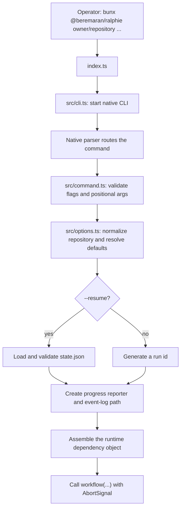
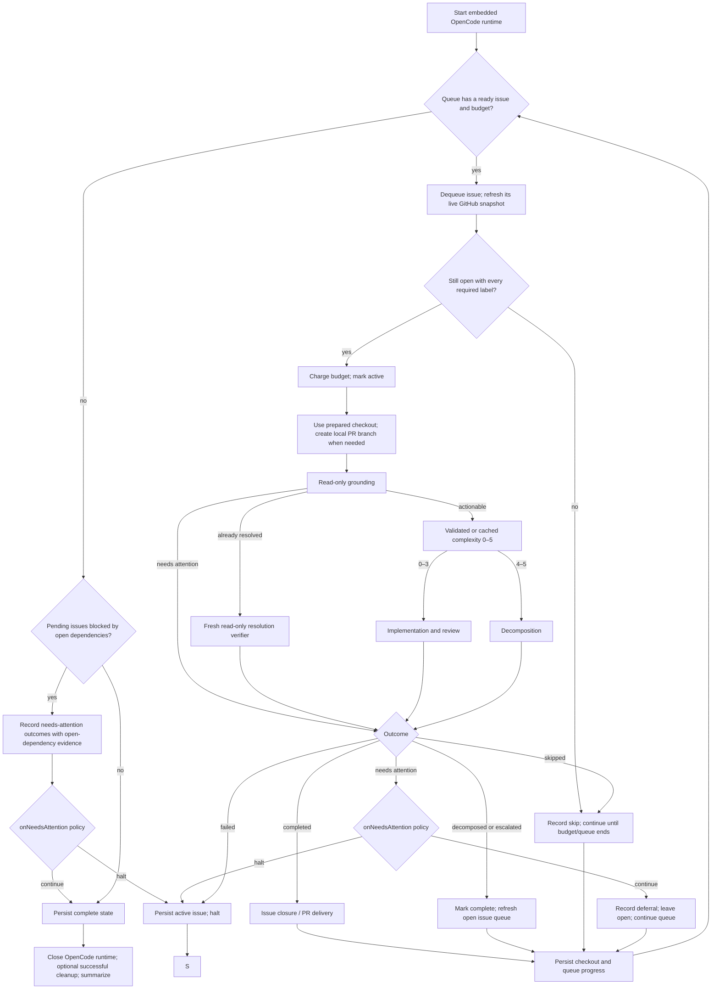
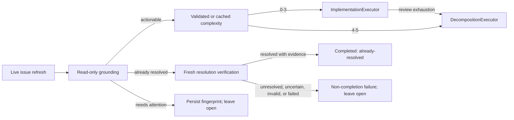
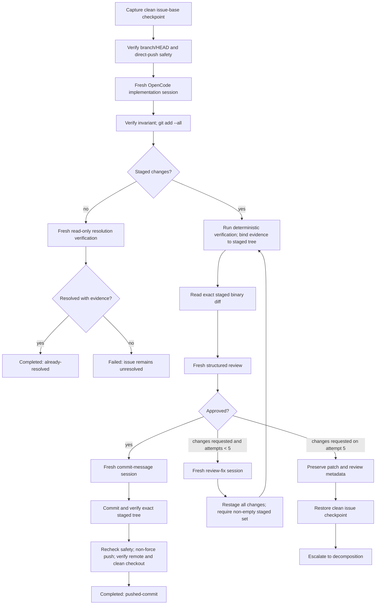
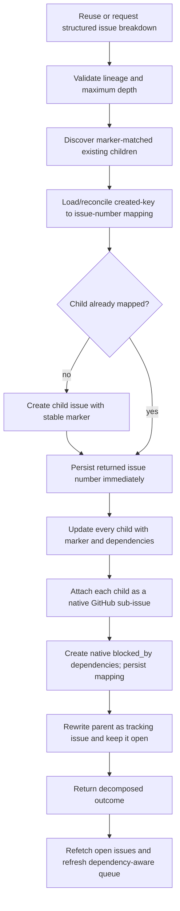
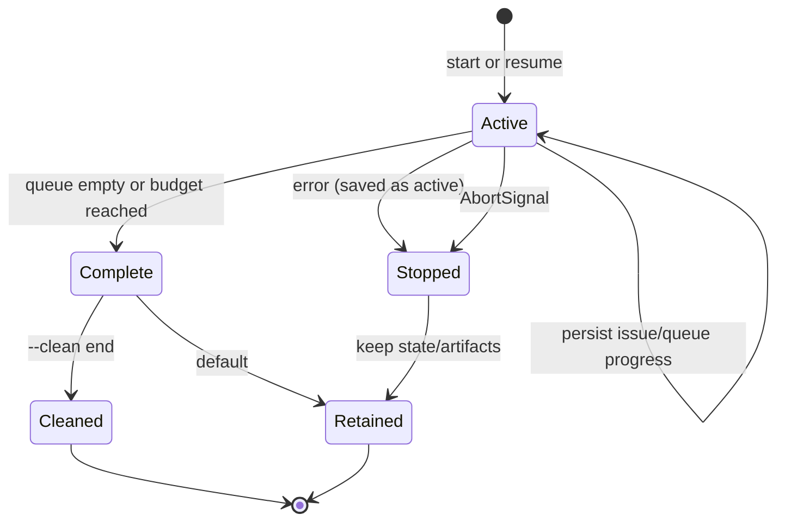

# Ralphie end-to-end execution trace

This is the detailed source-level trace for a command-triggered run. It is for
contributors and maintainers validating sequencing and recovery boundaries.
Return to the [documentation index](README.md), or read the [workflow
overview](workflows.md) and [architecture](architecture.md) first.

This is the source-level trace for a command-triggered run. Ralphie is not
triggered by a GitHub webhook; the trigger is the public CLI invocation:

```text
bunx @beremaran/ralphie owner/repository [options]
```

The default delivery mode is `lgtm`. `pr`, `--dry-run`, and `--resume` change
the path at the points called out below.

## 1. Trigger and bootstrap



1. `index.ts` starts `src/cli.ts`, preserving the public
   `bunx @beremaran/ralphie <repository> [options]` interface.
2. `node:util`'s built-in `parseArgs` validates option shapes and rejects extra
   positional arguments; configuration validation remains in Zod and
   `resolveRalphieConfig`.
3. `resolveRalphieConfig` parses an `owner/repository` slug or GitHub clone URL
   and resolves defaults:
   `lgtm`, one issue at a time, created/ascending issue sort, the `build` OpenCode
   agent, `~/.ralphie`, and no clean, dry-run, or alternate output mode.
   For `github.com`, interactively authenticate with `gh auth login` and verify
   with `gh auth status`; unattended runs may provide `GH_TOKEN` (preferred) or
   `GITHUB_TOKEN` (fallback) as environment inputs. The OpenCode server is
   discovered from the local background service or an explicitly supplied
   `--opencode-url` (with `OPENCODE_TOKEN` when auth is required); it is not
   part of workspace state. One `--output` flag selects `default`, `verbose`,
   `quiet`, or `json`, so `json` and `quiet` cannot be combined.
4. With `--resume`, the command loads and Zod-validates the requested state
   file before starting the workflow. A supplied branch/repository must be
   compatible with that state. A resumed run reuses its saved run id.
5. The command selects interactive, plain, JSON Lines, or quiet progress
   rendering. New runs write the durable event log to
   `<workspace>/.ralphie/runs/<run-id>/events.jsonl`; resumed runs use the
   directory containing the supplied state file.
6. The command assembles the live services in `src/runtime.ts`, configures the
   OpenCode service from the model flags, connects its event stream to the transcript
   renderer, and then executes `workflow` with the explicit runtime object.

## 2. Workflow preflight

`src/workflow.ts` emits the run-start event and performs these operations in
order:

| Order | Stage | Operation and boundary |
| --- | --- | --- |
| 0 | Cancellation | Refuse to begin if the signal is already aborted. |
| 1 | Optional cleanup | `--clean start` removes the selected workspace after protected-path checks. |
| 2 | Workspace | Create the workspace directory. |
| 3 | GitHub authentication | Pass the `GH_TOKEN`/`GITHUB_TOKEN` environment contract to `gh`; validate the configured account with `gh auth status`, then initialize an authenticated Octokit client without exposing the credential to the operator. |
| 4 | Git | Verify `git --version`. |
| 5 | Repository | Clone with `gh repo clone` when absent; otherwise verify the checkout and `origin`, fetch existing repositories, select the requested branch or `main`/`master`, and prepare the checkout. |
| 6 | Issue discovery | Paginate open GitHub issues, apply labels/sort/order, and exclude pull requests. |
| 7 | Resume reconciliation | On resume, compare saved repository, branch, checkout HEAD, and pending issues with live Git/GitHub state. |
| 8 | Run state | Build the refreshable queue and atomically persist an `active` state before OpenCode starts. |

Every tracked stage emits started, succeeded, or failed progress; grounding
may also emit a skipped or needs-attention terminal status. The repository path
is normally `<workspace>/<owner>/<repository>`.

Existing checkout preparation deliberately has one destructive behavior: a
dirty reused checkout is aligned with the selected remote branch using the
equivalent of `git reset --hard` and `git clean -fd`. Ralphie expects the
workspace to be dedicated to it.

The queue is built from the discovered issues (or the pending issue snapshots
from `state.queue.pending`, replaced with fresh live snapshots on resume).
Generated child bodies contribute open issue-number dependencies.
`--max-issues` is charged when an eligible issue is dequeued, not when it
succeeds. A live-reconciliation skip does not consume that budget. A refresh
after decomposition adds newly discovered issues without duplicating known or
completed numbers.

## 3. OpenCode runtime and issue loop

After the initial state save, Ralphie connects to one external OpenCode server
and keeps it for the queue. `makeOpenCodeService` resolves the endpoint as:

- an explicitly supplied `--opencode-url` (or `OPENCODE_URL`), with
  `--opencode-token` (or `OPENCODE_TOKEN`) when the server requires auth; or
- the local OpenCode background service discovered automatically
  (`opencode2 serve` must already be running; Ralphie never starts it).

Ralphie performs a health check on connect and fails fast with a clear error
when no server is reachable. OpenCode sessions and issues are processed
sequentially, which keeps the live transcript ordered.



The per-issue stages execute in this order:

| Order | Stage | Operation and boundary |
| --- | --- | --- |
| 1 | Live refresh gate | Refresh the issue and bounded comments. A refresh failure halts without stale execution; a closed issue or one missing a required label is durably skipped without consuming the issue budget. |
| 2 | Active checkout | Replace the queued snapshot, charge the budget, save the active issue and checkout invariant, and, in non-dry-run `pr` mode, create or resume the local `ralphie/issue-<number>` branch. This branch is not pushed merely because it was prepared. |
| 3 | Read-only grounding | Assess the refreshed issue before consulting cached complexity or invoking an implementation/decomposition workflow. A matching fingerprinted needs-attention decision may be reused; stale decisions are invalidated. The grounding prompt pins the exact checked-out commit so evidence is never mistaken for a newer revision. |
| 4 | Disposition route | `actionable` alone proceeds to the 0–5 complexity decision (**0–3** implementation, **4–5** decomposition). `already_resolved` runs a separate fresh read-only verifier. `needs_attention` records the fingerprinted deferral and never enters complexity. |
| 5 | Outcome finalization | Delivery or closure is reachable only from a completed outcome. Decomposition refreshes the queue; needs-attention leaves the source issue pending and may continue the queue by policy; failed verification retains recoverable state as a non-completion failure. |

When the queue drains to issues that depend on open or decomposed-but-open
prerequisites, those issues are never handed to the executor. Instead of
failing the run with a bare "blocked by open dependencies" error, Ralphie
records one needs-attention outcome per blocked issue with evidence naming
each open dependency, emits progress events, and (with the opt-in notifier)
publishes an idempotent notification. The `--on-needs-attention` policy then
applies: `halt` stops with the handled stops contract, `continue` completes
the run with the blocked issues preserved pending for a later run. Open
dependencies on decomposed tracking parents resolve transitively to their
open leaf children, so a child can never deadlock on a container issue that
is never queued.

The issue executor receives the refreshed issue, concrete repository path,
target branch, Octokit client, shared OpenCode client, model selection, diagnostics,
invariant service, and `AbortSignal`. The worker persists its outcome and the
resulting checkout/queue transition before moving to another item.

The workspace `.ralphie` tree contains repositories plus Ralphie's run state,
events, and recovery artifacts only. OpenCode configuration is kept in the default
or explicitly supplied `--opencode-url`, or in a private temporary credential
directory outside the workspace.

Dry-run issue execution uses a read-only view of existing per-issue artifacts.
New complexity and needs-attention decisions remain in memory; the dry-run
path never writes an issue artifact or changes the issue checkout.

A normal issue execution obtains a durable per-issue artifact store at:

```text
<workspace>/.ralphie/runs/<run-id>/issues/<issue-number>/artifacts.json
```

The store prevents accidental overwrites and records readiness deferrals,
complexity decisions, checkpoints, review attempts, commit messages, created
commits, resolution proof, decomposition decisions, and created child-number
mappings. Grounding/needs-attention, complexity, and resolution decisions carry
the live issue timestamp, comment count, and comment version. Only matching
fingerprints are reused; stale or legacy un-fingerprinted decisions are removed
without disturbing other recovery artifacts.

## 4. Readiness, complexity assessment, and routing

After the per-issue live refresh and before reading even a cached complexity
decision, `IssueExecutor` starts a read-only structured
grounding session. In dry-run mode, `DryRunIssueExecutor` uses the same
read-only grounding contract and stops after reporting its route. It returns
one of three dispositions:

- `actionable`: proceed normally;
- `already_resolved`: start a distinct fresh, read-only resolution verifier;
  complete only when it returns `resolved` with a nonblank summary and at least
  one concrete evidence item; or
- `needs_attention`: persist a summary, evidence, questions, and issue freshness
  fingerprint, then defer the issue without closing it or marking its dependency
  complete. A matching durable fingerprint is reused without agent work; a
  changed or invalid fingerprint is atomically invalidated before grounding is
  rerun.

An unfinished prerequisite uses the `external_dependency` reason. Complexity,
difficulty, size, slowness, or uncertainty are never valid needs-attention
reasons; the source issue always remains open across every deferral. A deferred
outcome follows the `--on-needs-attention` policy: `halt` (the default) keeps
the issue pending and exits `2`, while `continue` advances the current queue.
An ordinary failed outcome still halts the run. Progress emits the grounding
decision with its policy and complete evidence, questions, and artifact path; a
matching persisted decision is reported as reused with agent work skipped. A
new run discovers the still-open issue and assesses it again.

A verifier decision other than `resolved` is a non-completion failure. An
`unresolved` decision is recorded with its freshness fingerprint for audit but
does not fall through to complexity or implementation. Verifier uncertainty,
a needs-attention signal, malformed output, or a verifier error also returns a
failed outcome. Every such path leaves the source issue open under the normal
failure policy; none automatically closes it or converts it into a
needs-attention deferral.

The needs-attention recovery contract bounds the agent side channel. Every
structured task/decision session provides the `request_needs_attention` tool;
the signal is a schema-validated `{ reason, message }` object whose `reason`
is one of `outdated_premise`, `conflicting_requirements`,
`missing_information`, `external_dependency`, or `cannot_reproduce`, with an
optional message capped at 2,000 characters. It is a bounded request to the
caller — never a final implementation, review, or decision verdict — and the
prompt guidance forbids it for work that is merely hard, large, slow, or
uncertain. Grounding, complexity, implementation, review-fix,
commit-message, review, and decomposition sessions may raise it; the OpenCode task
gate parses and Zod-validates the side channel, so an invalid value is
ignored rather than trusted, and no session can raise it outside Ralphie's
own gate.

A raised signal is confirmed by exactly one fresh, read-only verifier session
before the next artifact, Git, or GitHub mutation. The verifier re-reads the
original bounded request against the pinned clean checkpoint; a
`needs_attention` disposition persists the confirmed structured decision
(reason, summary, evidence, questions) with its issue-freshness fingerprint,
then recovery writes a bounded binary-safe patch plus decision metadata under
the fingerprinted `needs-attention-<id>/` directory (`changes.patch` and
`metadata.json`) and restores the exact clean checkpoint — `git reset --hard`
followed by `git clean -fd`, removing every staged, unstaged, and untracked
agent change — and verifies branch and HEAD before reporting the recovered
outcome. A verifier rejection (`actionable` or `already_resolved`) discards
the handoff and resumes the original attempt, so at most one fresh verifier is
consumed per signal; a persisted confirmed decision is reused without a fresh
verifier when recovery retries on resume. Matching fingerprint diagnostics are
reused atomically; a stale fingerprint invalidates both the decision and
handoff before routing continues. Diagnostic capture, checkout restoration, or
repository-invariant failures are recoverable failures: the issue stays open
and pending with the handoff retained so resume can retry, rather than
reporting the issue as successfully handled.

For an actionable disposition, `IssueExecutor` reuses a persisted complexity
decision when its freshness fingerprint matches the live issue. Otherwise
`ComplexityAssessment`:

1. captures the repository invariant and confirms the expected branch;
2. creates a fresh read-only OpenCode session;
3. sends the issue and repository context with the 0–5 complexity rubric;
4. requires a `complexityDecisionSchema` result through the terminating
   `submit_result` tool; and
5. verifies that branch and `HEAD` did not change, records the session id, and
   persists the decision.

The result selects the workflow for a normal run. In dry-run mode, the
selected workflow is reported but never invoked; implementation, decomposition,
delivery, issue closure, and all per-issue Git/GitHub mutations remain
unreachable:



Structured decision sessions deny edits/writes and mutating Git/GitHub
commands, and OpenCode sessions cannot close issues, create or merge pull requests,
or push: Ralphie's deterministic domain services perform every Git and GitHub
mutation. PR reviews use an explicit immutable session profile whose only active
tools are `submit_result` and the non-repository `request_needs_attention`
side channel; the reviewer receives the exact staged patch and verification
evidence in its prompt and cannot inspect the checkout or run shell/Git/GitHub
commands. Every decision task is schema-validated at both the tool and response
boundaries; invalid output or OpenCode failure becomes a failed issue outcome without
proceeding to the next operation.

Decision schemas that are discriminated unions (issue grounding and its
needs-attention route) are flattened into a single object schema for the
`submit_result` tool contract: the disposition literal becomes an enum, the
branch-specific fields stay declared but optional, and the authoritative Zod
validation still enforces each branch exactly. Some models and providers
silently drop tool-call arguments for root-level `oneOf` schemas, and the
flattened shape keeps those providers compliant. The flattened branch-only
properties are declared explicitly nullable where the schema language allows
it (scalar fields as `anyOf` unions with a null variant, object/array fields
with a widened `type`) because strict constrained samplers materialize every
declared property; the literal string `"null"` that such samplers can emit for
enum-typed fields is normalized back to a real null before tool validation,
and explicit `null` argument values are treated as absent before validation.
Calls that still never produce a schema-valid result are bounded by a circuit
breaker: after five consecutive failed `submit_result` attempts, the session
is aborted and the decision fails fast with a diagnostic naming the likely
cause instead of letting the model retry until the prompt-attempt budget is
exhausted.

## 5. Implementation path: complexity 0–3



Detailed behavior:

- `GitIssuePreparation` captures a clean branch/commit checkpoint before the
  first mutating OpenCode session and persists it. A dirty checkout or branch mismatch
  stops the issue before agent work.
- `GitRemoteSafety` checks the repository origin, selected branch, local HEAD,
  remote base, ahead/behind counts, and non-force policy before implementation
  and again before the push.
- The implementation agent gets edit/write/read/bash tools but is denied
  commits, pushes, branch/reset/clean operations, and `gh` commands.
  A fresh session is used for implementation and for every review fix.
- Staging is deterministic (`git add --all`). Ralphie reads the exact staged
  binary diff, runs every configured verification command, and records bounded
  stdout/stderr plus the exact staged-tree hash. The reviewer receives that
  trusted evidence with the issue and diff in a fresh immutable review session;
  it cannot inspect the checkout or run shell/Git/GitHub commands. A non-zero
  command exit starts a fresh, bounded verification-fix session with the failed
  command evidence and staged diff; Ralphie restages and retries before review.
  Verification is repeated after every fix and immediately before commit; a
  repaired or otherwise changed tree invalidates approval and is reviewed again.
  An approved review cannot contain blocking findings; a
  `changes_requested` review must contain one. Identical blocking findings
  repeated after a verified fix stop early rather than consuming the full loop.
- Verification commands come from repeated `--verify-command` flags or a
  discovered `package.json` `check` script. Non-zero exits receive up to five
  repair attempts. Exhausted repairs, missing commands, staged-tree mutation,
  and verification infrastructure faults fail closed. Review attempts persist
  their verification evidence for resume diagnostics.
- Protected maintainer choices such as selecting a project license require the
  exact choice to be authorized by the issue; otherwise execution halts before
  review or delivery rather than silently establishing policy.
- A no-change implementation is not silently accepted. A fresh read-only
  resolution session must return `resolved` plus concrete evidence. An
  unresolved decision starts a fresh bounded implementation retry with that
  evidence; the issue fails only after the configured attempts are exhausted.
- After approval, OpenCode generates a schema-valid subject (maximum 72 characters)
  and optional body. Git commits the staged tree, verifies the resulting tree
  and clean checkout, then pushes and verifies the expected remote SHA.
- The review budget is five attempts. On the fifth rejection, Ralphie writes
  `changes.patch` and `metadata.json` under the issue's
  `review-exhaustion/` directory, restores the exact clean checkpoint, and
  invokes decomposition with the failed review decisions. If diagnostics or
  restoration cannot be verified, it halts without guessing.

A successful implementation returns either `completed/pushed-commit` or
`completed/already-resolved`. A failed Git, OpenCode, review, commit, or push step
returns a failed outcome and leaves the active issue pending for recovery.

## 6. Decomposition path: complexity 4–5 or escalation



The decomposition OpenCode session is read-only and returns an
`issueBreakdownDecisionSchema` result containing at least two independently
actionable 0–3 children, stable keys, and an acyclic dependency graph. The
breakdown is persisted before the first GitHub mutation.

Each child receives a stable marker containing root, parent, key, and depth.
Recursive splitting is bounded by `--max-decomposition-depth` (default `3`),
which is saved with resumable run state. A prospective child beyond the limit
becomes a deterministic `decomposition_limit_reached` needs-attention outcome:
the source issue stays open, independent queue items continue even under the
default needs-attention halt policy, and dependent issues stay blocked.
Ralphie discovers those markers and reconciles them with the persisted mapping
before creating anything. Thus a lost create response, a restart, or a partial
linking failure can resume without blindly duplicating children. Creation,
number recording, linking, native sub-issue attachment, dependency creation,
and the parent rewrite are separate recoverable mutations. Native relationships
are reconciled with GitHub's reported hierarchy on every run: a child already
attached to the intended parent is left alone, a child attached to a different
parent fails closed, and a marker-matched child attached natively but absent
from the persisted mapping halts with a recovery diagnostic.

The decomposed parent remains open as the native tracking issue and exposes
GitHub completion progress for its sub-issues; it is never closed as a
duplicate merely because it was decomposed, and it is not queued again. Parent
completion is reconciled deterministically: finishing the final child checks
its tracking parent, and every non-dry-run run reconciles discovered or
refreshed decomposed parents, closing one as `completed` only when all of its
native sub-issues are closed. The open-issue queue is then refreshed; newly
eligible children can run during the same invocation. If dependencies remain
open after the queue is exhausted, the run persists active state and fails
instead of processing blocked work.

A direct complexity 4–5 route returns `decomposed`. Review exhaustion returns an
`escalated` outcome containing the recovery diagnostic path and, after
successful decomposition, the created child numbers. Both transitions refresh
the queue.

## 7. Delivery and closure modes

| Mode | Issue checkout | Delivery | Source issue closure |
| --- | --- | --- | --- |
| `lgtm` | Selected base branch | Commit and non-force push directly to that branch; verify remote SHA and clean checkout | Close directly as `completed` after verified delivery. |
| `pr` | `ralphie/issue-<number>` in the main checkout | Push feature branch, create/find matching PR, persist its number and head SHA, publish stored review attempts as marked comments, and gate merged delivery on the exact-head check observer: 30-second registration grace, 5s-to-60s bounded exponential backoff, a 30-minute deadline, and two stable green confirmations, with a re-read of the PR immediately before the expected-head merge | PR body contains `Closes #<issue>`; GitHub closes the issue on merge. A failed, cancelled, timed-out, absent, no-pipelines, unknown, changed-head, closed, or unmergeable gate retains the feature branch and PR, leaves the issue open, and persists recoverable run state. The serial run restores the base checkout afterward. |
| `--dry-run` | Prepared normal checkout | Ground the issue, then assess complexity and report implementation or decomposition when actionable; report already-resolved and needs-attention routes otherwise. A decomposition dry run also performs the read-only breakdown session and reports the intended native sub-issue hierarchy, children to create or reuse, and dependency edges. No implementation, decomposition, delivery, commit, push, checkout, issue, or PR mutation | No issue is closed. The result is `skipped` except needs-attention, which remains a needs-attention outcome. |

Only a `completed` outcome enters delivery or source-issue closure. A
needs-attention outcome is retained in run state, and its fingerprinted decision
is retained in the per-issue artifacts, but the issue is not added to completed
numbers: `lgtm` does not close it, and `pr` does not push its feature branch,
create or review a pull request, merge, or close it. The source issue stays open, the base
checkout is restored, and the queue continues only when policy permits. A
verifier-proven `already-resolved` completion may close directly in either
delivery mode because it has no commit to deliver. Unresolved, uncertain,
malformed, or failed verification is a failed outcome, so it never reaches
this delivery/closure boundary.

In `pr` mode the merged delivery is gated: after the feature branch is pushed
and the matching pull request is created or found, its number and head SHA are
persisted, review attempts are published idempotently, and the read-only
observer polls normalized snapshots for that exact SHA until it reaches its
documented green state. The observer tolerates a 30-second registration grace
period while no checks are visible, keeps polling while any check is pending,
uses bounded exponential backoff from 5 seconds doubling to a 60-second cap,
fails closed after a 30-minute deadline, and requires two consecutive identical
green snapshots (stable terminal confirmations) plus a race-safe final remote
HEAD read before reporting green. Neutral and skipped terminal states fail
closed by policy: an absent no-checks set past the grace period, unknown
states, cancelled checks, and failing checks never count as green, and the
observation every time re-checks that the remote branch HEAD still points at
the exact SHA being observed.

The PR is re-read immediately before merging; a green decision is only acted
on when the head is unchanged. Failed, cancelled, timed-out, no-pipelines,
unknown, changed-head, closed, or unmergeable gates never merge and never
close the source issue: the feature branch and PR are retained and an active,
recoverable closure gate is persisted in run state. The persisted `prClosure`
record is the audit trail for that gate: pull-request number, observed head
SHA, the latest normalized check snapshot, observation start and last-update
timestamps, the gate status (`pending`, `green`, `failed`, `cancelled`,
`unknown`, `no-pipelines`, `timeout`, `aborted`, `stale`, `unmergeable`,
`closed`, or `merged`), and the terminal reason; a merged record keeps the
green snapshot as merge evidence. On resume the existing matching PR is
located instead of duplicated, pending gates continue polling, saved green
evidence is re-verified against the current head (a changed head invalidates
it), failed gates can be re-observed on a later rerun, and an already-merged PR
is reconciled without another merge call.

Gate activity streams as `pr-gate` progress events: registration with the PR
number and exact head SHA, poll progress for meaningful check transitions
only (registration, checks registering, items appearing or disappearing, and
status changes — unchanged polls never emit), head invalidation, and terminal
success or failure with the check summary and reason. Human and verbose output
explain the PR number, exact SHA, check summary (for example `success
(passing)`) and reason; JSON events carry the structured normalized snapshot
and a timestamp; quiet output suppresses the routine gate milestones while
still reporting gate failures. Caller cancellation aborts the observation,
records `aborted` in run state, and surfaces the safe "Run cancelled" stop
that saves resumable state and exits `130`; every recoverable failure retains
the open PR and source issue for a later rerun.

The direct-push path never uses force. A push rejection is authoritative: the
created commit and artifacts are retained, the run halts, and resume can
reconcile a commit that may already have reached the remote.

## 8. State, progress, and resume

### Cross-mode display contract

The command resolves `--output default` to `interactive` only when both stdin
and stderr are TTYs and `CI` is not set. Otherwise it uses append-only `plain`
output. `--output verbose` keeps the same mode selection and never expands the
live interactive region's row cap (always at most three terminal rows); it only
enriches durable progress rows with structured details.

Interactive output has two coordinated surfaces: OpenCode transcript rows remain in
scrollback, and one replaceable region holds the sticky stage/status line plus
the bounded activity view rows (running tools, reads/searches, thinking, and
lifecycle work) for the active leaf stage. The whole region is at most three
terminal rows including the stage/status line, every row is clipped before it
can wrap, and replacements repaint the region in place — intermediate activity
never goes to scrollback. Repaints are coalesced at roughly 100–125 ms and are
deferred while a transcript fragment is open mid-line or a control sequence is
incomplete, so activity updates never create rows or corrupt streamed text. A
representative region is:

```text
◐ [owner/repo] [2/4] #56 Context Review 1/3 › Reviewing changes › Using bash · 3s
```

The footer's stage is the current leaf operation (`Reviewing changes` in this
example), not a global workflow step count. The `[2/4]` value is the issue's
queue position and `Review 1/3` is the review-attempt context. Each OpenCode session
opens with the same contextual snapshot, for example:

```text
╭─ OpenCode · Task · session-1 · owner/repo · issue 2/4 · #56 · Reviewing changes · attempt 1/3
```

Human transcript output also emits lifecycle breadcrumbs, such as:

```text
│  ↻ compacting context · threshold
│  ↻ retrying OpenCode request · attempt 1/3
│  • thinking level · high
```

The human transcript keeps assistant text deltas, session headers, and durable
breadcrumbs readable, but routes intermediate work into the compact activity
surface instead of scrollback: tool-call start/delta/end, tool execution
start/update/end, bash execution updates, streamed thinking, compaction/retry
lifecycle, and active progress changes all become bounded activity rows in the
replaceable region. The transcript shows each tool call as a readable command
and, on completion, exactly one concise line: `✓ <tool> done`, or a single
sanitized, bounded failure line with enough error detail to act on (for
example `✗ grep failed — error: no matches for …`). Streamed assistant text
remains bounded to the same 140-character stream limit used before, and the
structured OpenCode records stay complete (only terminal control sequences
are stripped at the reporting boundary). The compact activity area only ever
paints the replaceable region
through the stream-boundary tracker, so it can never clear or corrupt
assistant response bytes. The three-row cap is a cap on physical terminal
rows — regression coverage locks it down with a terminal emulator that
measures painted rows across repeated tool calls, long commands and paths,
narrow terminals and resize, interleaved streamed assistant text,
ANSI/control-sequence boundaries, completion, failure, and cleanup
(`tests/progress/` plus the end-to-end command-runtime suite in
`tests/integration/command-runtime-display.test.ts`).

The cross-mode guarantees are:

| Mode or sink | Contract |
| --- | --- |
| Interactive | OpenCode transcript scrollback plus one replaceable region of at most three terminal rows (stage/status line plus bounded activity rows), repainted in place; completed milestones and lifecycle breadcrumbs remain durable rows. |
| Plain and CI | Append-only human-readable lines. No ANSI cursor controls are emitted, so logs do not require terminal repainting. |
| `--output quiet` | Failures and handled needs-attention stops only; routine progress and OpenCode transcript rows are suppressed. |
| `--output json` | One parseable JSON object per line on stdout: progress records and lossless `opencode_event` records; values are preserved as supplied. Human headers, footers, and breadcrumb lines are not emitted. |
| Durable event log | Progress events are written independently to `events.jsonl` in the run directory, preserving supplied values, regardless of the renderer. |

For example, a JSON Lines consumer sees structured records rather than the
human footer or `↻` lines:

```jsonl
{"runId":"run-1","timestamp":"2026-08-24T01:02:03.000Z","stage":"review","status":"succeeded","message":"Review approved."}
{"type":"opencode_event","sessionID":"session-1","directory":"/workspace/repository","event":{"type":"turn_start"}}
```

OpenCode records are never redacted before reporting; progress events preserve
supplied values. Credentials and other sensitive values pass through verbatim
into OpenCode transcript, breadcrumb, JSON, and durable-log output; only
terminal control sequences are stripped from human text so no control can
repaint or corrupt an append-only sink. JSON and the durable log preserve
structured fields and raw OpenCode event shape losslessly.
The durable log is at
`<workspace>/.ralphie/runs/<run-id>/events.jsonl` for new runs; a resumed run
uses the directory containing its supplied state file. `--clean end` removes
the successful run's workspace, including this log, while failed runs skip
cleanup so their state and diagnostics remain available.

A successful or interrupted run uses this layout (OpenCode configuration is not
stored in this tree):

```text
<workspace>/.ralphie/runs/<run-id>/
├── state.json
├── events.jsonl
└── issues/
    └── <issue-number>/
        ├── artifacts.json
        ├── needs-attention-<id>/
        │   ├── changes.patch
        │   └── metadata.json
        └── review-exhaustion/
            ├── changes.patch
            └── metadata.json
```

`state.json` is versioned, schema-validated, and atomically replaced. It
contains the repository/branch/workflow, selected `onNeedsAttention` policy,
notification settings and any pending notification intent, OpenCode selection, budget,
pending and completed queue numbers, processed count, outcomes, active
issue/stage, checkout invariant, and update time. State is
saved before the queue starts, when an issue becomes active, after outcomes and
queue refreshes, and at final completion.

On `--resume`:

1. the command loads and validates the saved state;
2. workflow preflight prepares the workspace and checkout and refetches issues;
3. reconciliation compares saved intent with current Git and GitHub state;
4. the saved pending queue, completed numbers, outcomes, and artifacts are
   restored; and
5. the next safe deterministic step continues without unnecessarily rerunning
   OpenCode work.

Examples of resumable boundaries:

- after fresh grounding returns actionable, a saved complexity decision is
  reused;
- a saved needs-attention decision is reused only while its issue-update and
  comment fingerprint still matches the refreshed issue;
- an unresolved resolution decision remains audit evidence rather than cached
  completion; retry starts from live refresh and requires fresh grounding and
  verification before any already-resolved closure;
- a checkpoint plus created commit can finish a push without rerunning the
  implementation/review loop;
- an active `issue-closure` with a completed outcome resumes closure without
  rerunning implementation;
- an active `notification-recovery` retries the saved structured outcome and
  stable GitHub marker without rerunning agent work; and
- a partially created decomposition reuses marker-discovered children and the
  saved key mapping.

Progress events include `runId`, timestamp, stage, status, and message. An
active PR closure additionally streams `pr-gate` events with the pull-request
number, exact observed head SHA, transition details, and terminal events whose
verbose/JSON payloads carry the structured check snapshot, elapsed time, poll
count, and terminal reason. The normal output also streams OpenCode text, tool-call, and
tool-result events as they arrive. Human-readable OpenCode transcript output groups
each session into a compact block: assistant text streams immediately, tool
calls are shown as readable commands, and live/final tool output plus streamed
thinking stay in the compact activity surface rather than scrollback — each
tool completion or failure is summarized as a single line, so `--output
verbose` cannot expand the live row count. Terminal control sequences are
stripped before terminal rendering; OpenCode transcript and progress values
are preserved as supplied.
JSON mode emits progress and `opencode_event` JSON Lines to stdout, preserving
supplied progress values; normal modes render to stderr, and quiet mode
renders failures only.
Grounding events identify skipped agent work, while needs-attention details
retain the reason, summary, evidence, questions, path, and policy. Event
details can include issue positions, review attempts, session ids, commit SHAs,
created issue numbers, and diagnostic paths without exposing credentials.

## 9. Completion, failure, and cancellation



- One issue failure uses the current halt policy: Ralphie persists the active
  issue, releases OpenCode, retains artifacts, and stops before later issues.
- A needs-attention outcome uses `--on-needs-attention halt` by default. Ralphie
  persists the active run, emits a handled-stop summary with all outcome counts,
  releases OpenCode, and handles the stop with exit code `2` rather than reporting an
  ordinary issue failure. Notifications require the explicit
  `--notify-needs-attention` opt-in; `--needs-attention-label` is rejected
  without it, and dry runs never notify. When enabled, the outcome and label
  intent are persisted before GitHub mutation; a failed notification stops at
  `notification-recovery` and retains the original needs-attention outcome for
  resume. `continue` drains the queue; a drained run completes with exit code
  `0`.
- OpenCode is closed on success, failure, cancellation, and scoped defects. Ordinary
  failures set process exit code `1`.
- Cancellation is checked before long-running boundaries and passed into OpenCode.
  Ralphie attempts to restore the clean issue checkpoint, saves resumable state,
  skips cleanup, and exits `130`. An in-flight PR gate aborts its observation,
  records `aborted` (or the observer's caller-cancellation outcome) in the
  persisted closure gate, and leaves the PR and source issue open for resume.
- Successful completion persists `complete` before optional `--clean end`
  removes the entire workspace. Cleanup is skipped on failure so state and
  diagnostics remain available.

## Source map

| Concern | Primary source |
| --- | --- |
| Public trigger and flags | `index.ts`, `src/cli.ts`, `src/command.ts`, `src/options.ts` |
| Runtime dependency assembly | `src/runtime.ts` |
| Run orchestration, queue, state transitions | `src/workflow.ts`, `src/issues/queue.ts` |
| Complexity routing | `src/issues/executor.ts`, `src/issues/complexity.ts` |
| Implementation/review/delivery | `src/issues/implementation-executor.ts` |
| Decomposition and GitHub mutations | `src/issues/decomposition-executor.ts`, `src/github/` |
| OpenCode sessions and structured results | `src/agent/`, `src/opencode/` |
| Git checkpoints, safety, and branches | `src/git/` |
| Durable state and reconciliation | `src/run/`, `src/issues/artifacts.ts` |
| Progress and exit semantics | `src/progress/`, `src/process/exit-code.ts` |
