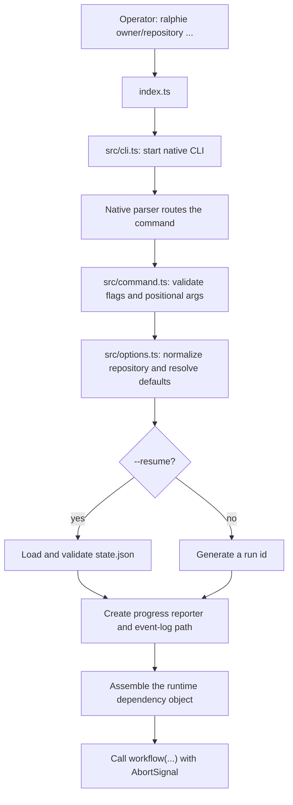
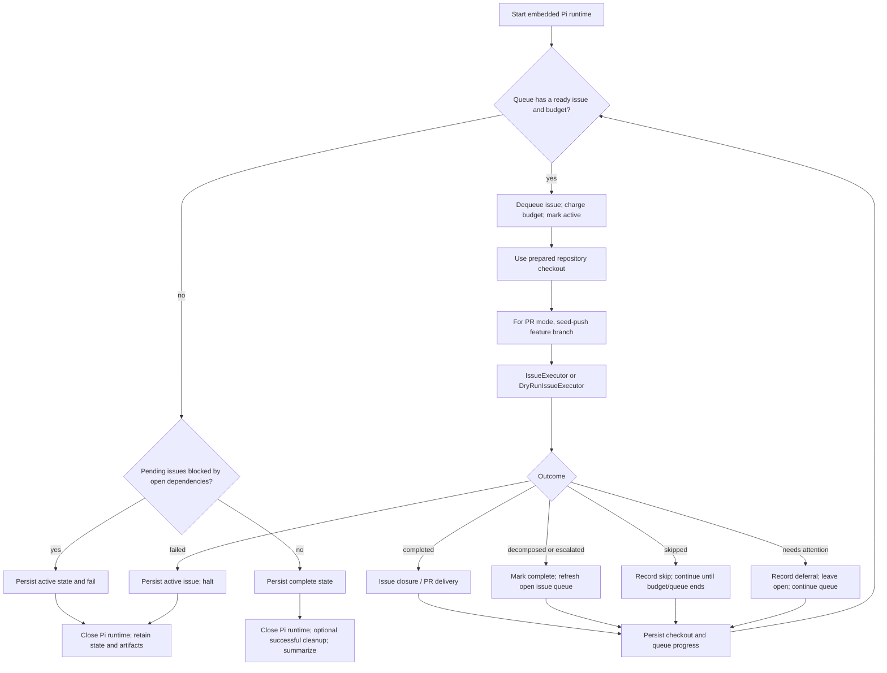
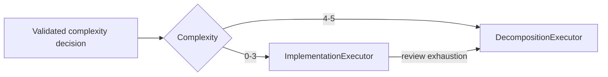
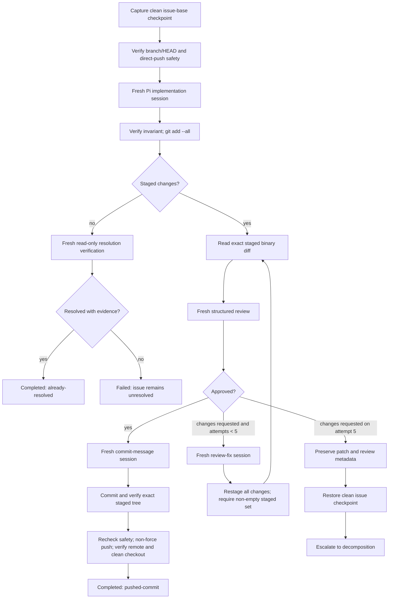
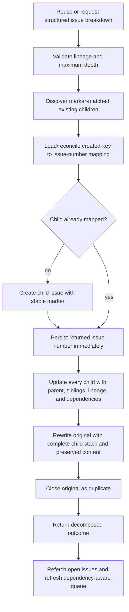
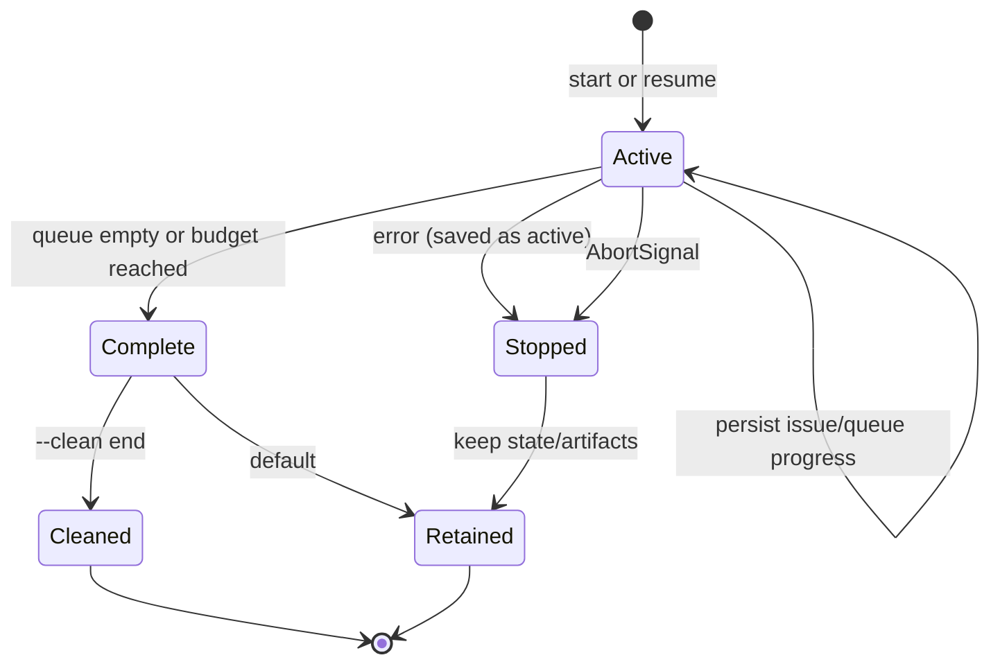

# Ralphie end-to-end execution trace

This is the source-level trace for a command-triggered run. Ralphie is not
triggered by a GitHub webhook; the trigger is the public CLI invocation:

```text
ralphie owner/repository [options]
```

The default delivery mode is `lgtm`. `pr`, `--dry-run`, and `--resume` change
the path at the points called out below.

## 1. Trigger and bootstrap



1. `index.ts` starts `src/cli.ts`, preserving the public
   `ralphie <repository> [options]` interface.
2. `node:util`'s built-in `parseArgs` validates option shapes and rejects extra
   positional arguments; configuration validation remains in Zod and
   `resolveRalphieConfig`.
3. `resolveRalphieConfig` parses an `owner/repository` slug or GitHub clone URL
   and resolves defaults:
   `lgtm`, one issue at a time, created/ascending issue sort, the `build` Pi
   agent, `~/.ralphie`, and no clean, dry-run, or alternate output mode.
   Model credentials come from the `RALPHIE_MODEL_BASE_URL` and
   `RALPHIE_MODEL_API_KEY` environment variables. One `--output` flag selects
   `default`, `verbose`, `quiet`, or `json`, so `json` and `quiet` cannot be
   combined.
4. With `--resume`, the command loads and Zod-validates the requested state
   file before starting the workflow. A supplied branch/repository must be
   compatible with that state. A resumed run reuses its saved run id.
5. The command selects interactive, plain, JSON Lines, or quiet progress
   rendering. New runs write the durable event log to
   `<workspace>/.ralphie/runs/<run-id>/events.jsonl`; resumed runs use the
   directory containing the supplied state file.
6. The command assembles the live services in `src/runtime.ts`, configures the
   Pi service from the model flags, connects its event stream to the transcript
   renderer, and then executes `workflow` with the explicit runtime object.

## 2. Workflow preflight

`src/workflow.ts` emits the run-start event and performs these operations in
order:

| Order | Stage | Operation and boundary |
| --- | --- | --- |
| 0 | Cancellation | Refuse to begin if the signal is already aborted. |
| 1 | Optional cleanup | `--clean start` removes the selected workspace after protected-path checks. |
| 2 | Workspace | Create the workspace directory. |
| 3 | GitHub authentication | Run `gh auth status`, read `gh auth token`, and initialize an authenticated Octokit client. |
| 4 | Git | Verify `git --version`. |
| 5 | Repository | Clone with `gh repo clone` when absent; otherwise verify the checkout and `origin`, fetch existing repositories, select the requested branch or `main`/`master`, and prepare the checkout. |
| 6 | Issue discovery | Paginate open GitHub issues, apply labels/sort/order, and exclude pull requests. |
| 7 | Resume reconciliation | On resume, compare saved repository, branch, checkout HEAD, and pending issues with live Git/GitHub state. |
| 8 | Run state | Build the refreshable queue and atomically persist an `active` state before Pi starts. |

Every tracked stage emits started, succeeded, or failed progress. The
repository path is normally `<workspace>/<owner>/<repository>`.

Existing checkout preparation deliberately has one destructive behavior: a
dirty reused checkout is aligned with the selected remote branch using the
equivalent of `git reset --hard` and `git clean -fd`. Ralphie expects the
workspace to be dedicated to it.

The queue is built from the discovered issues (or `state.queue.pending` on a
resume). Generated child bodies contribute open issue-number dependencies.
`--max-issues` is charged when an issue is dequeued, not when it succeeds. A
refresh after decomposition adds newly discovered issues without duplicating
known or completed numbers.

## 3. Pi runtime and issue loop

After the initial state save, Ralphie starts one embedded Pi runtime and keeps
it alive for the queue. `makePiService` chooses one of three agent configurations:

- an explicitly supplied `--pi-dir`;
- a temporary `0600` directory containing generated `models.json` and
  `auth.json` when `RALPHIE_MODEL_BASE_URL` is used; or
- Pi's default agent directory.

The temporary directory is removed when the runtime is closed. Pi sessions and
issues are processed sequentially, which keeps the live transcript ordered.



For each dequeued issue, the worker:

1. Saves the current checkout invariant (`branch` and `HEAD`) and active issue
   in run state.
2. In `pr` (but not dry-run), creates or resumes
   `ralphie/issue-<number>` and pushes that branch non-force before agent work.
3. Passes the issue, concrete repository path, target branch, Octokit client,
   shared Pi client, model selection, diagnostics, invariant service, and
   AbortSignal to the selected issue executor.
4. Persists the outcome, performs delivery/closure, marks successful transitions
   in the queue, refreshes after decomposition, and continues.

A normal issue execution obtains a durable per-issue artifact store at:

```text
<workspace>/.ralphie/runs/<run-id>/issues/<issue-number>/artifacts.json
```

The store prevents accidental overwrites and records readiness deferrals,
complexity decisions, checkpoints, review attempts, commit messages, created
commits, resolution proof, decomposition decisions, and created child-number
mappings.

## 4. Readiness, complexity assessment, and routing

Before complexity routing, `IssueExecutor` starts a read-only structured
grounding session. It returns one of three dispositions:

- `actionable`: proceed normally;
- `already_resolved`: proceed to the existing implementation/no-change proof
  path; or
- `needs_attention`: persist a summary, evidence, questions, and issue freshness
  fingerprint, then defer the issue without closing it or marking its dependency
  complete.

An unfinished prerequisite uses the `external_dependency` reason. A deferred
outcome advances the current queue, while an ordinary failed outcome still
halts the run. A new run discovers the still-open issue and assesses it again.

`IssueExecutor` first reuses a persisted complexity decision when one exists.
Otherwise `ComplexityAssessment`:

1. captures the repository invariant and confirms the expected branch;
2. creates a fresh read-only Pi session;
3. sends the issue and repository context with the 0–5 complexity rubric;
4. requires a `complexityDecisionSchema` result through the terminating
   `submit_result` tool; and
5. verifies that branch and `HEAD` did not change, records the session id, and
   persists the decision.

The result selects the workflow:



Structured decision sessions deny edits/writes and mutating Git/GitHub
commands. Every decision task is schema-validated; invalid output or Pi
failure becomes a failed issue outcome without proceeding to the next
operation.

## 5. Implementation path: complexity 0–3



Detailed behavior:

- `GitIssuePreparation` captures a clean branch/commit checkpoint before the
  first mutating Pi session and persists it. A dirty checkout or branch mismatch
  stops the issue before agent work.
- `GitRemoteSafety` checks the repository origin, selected branch, local HEAD,
  remote base, ahead/behind counts, and non-force policy before implementation
  and again before the push.
- The implementation agent gets edit/write/read/bash tools but is denied
  commits, pushes, branch/reset/clean operations, and `gh` commands.
  A fresh session is used for implementation and for every review fix.
- Staging is deterministic (`git add --all`). Ralphie reads the exact staged
  binary diff; the review prompt receives only the issue and that diff, bounded
  by the prompt-size safeguard. An approved review cannot contain blocking
  findings; a `changes_requested` review must contain one.
- A no-change implementation is not silently accepted. A fresh read-only
  resolution session must return `resolved` plus concrete evidence. Otherwise
  the issue fails and remains open.
- After approval, Pi generates a schema-valid subject (maximum 72 characters)
  and optional body. Git commits the staged tree, verifies the resulting tree
  and clean checkout, then pushes and verifies the expected remote SHA.
- The review budget is five attempts. On the fifth rejection, Ralphie writes
  `changes.patch` and `metadata.json` under the issue's
  `review-exhaustion/` directory, restores the exact clean checkpoint, and
  invokes decomposition with the failed review decisions. If diagnostics or
  restoration cannot be verified, it halts without guessing.

A successful implementation returns either `completed/pushed-commit` or
`completed/already-resolved`. A failed Git, Pi, review, commit, or push step
returns a failed outcome and leaves the active issue pending for recovery.

## 6. Decomposition path: complexity 4–5 or escalation



The decomposition Pi session is read-only and returns an
`issueBreakdownDecisionSchema` result containing at least two independently
actionable 0–3 children, stable keys, and an acyclic dependency graph. The
breakdown is persisted before the first GitHub mutation.

Each child receives a stable marker containing root, parent, key, and depth.
Ralphie discovers those markers and reconciles them with the persisted mapping
before creating anything. Thus a lost create response, a restart, or a partial
linking failure can resume without blindly duplicating children. Creation,
number recording, linking, original rewrite, and closure are separate
recoverable mutations.

The original is closed with GitHub's `duplicate` reason only after all children
are created and linked. The open-issue queue is then refreshed; newly eligible
children can run during the same invocation. If dependencies remain open after
the queue is exhausted, the run persists active state and fails instead of
processing blocked work.

A direct complexity 4–5 route returns `decomposed`. Review exhaustion returns an
`escalated` outcome containing the recovery diagnostic path and, after
successful decomposition, the created child numbers. Both transitions refresh
the queue.

## 7. Delivery and closure modes

| Mode | Issue checkout | Delivery | Source issue closure |
| --- | --- | --- | --- |
| `lgtm` | Selected base branch | Commit and non-force push directly to that branch; verify remote SHA and clean checkout | Close directly as `completed` after verified delivery. |
| `pr` | `ralphie/issue-<number>` in the main checkout | Push feature branch, create/find matching PR, publish stored review attempts as marked comments, merge, and verify merged state | PR body contains `Closes #<issue>`; GitHub closes the issue on merge. The serial run restores the base checkout afterward. |
| `--dry-run` | Prepared normal checkout | Assess complexity and report the route only; no implementation, decomposition, commit, push, issue mutation, or PR mutation | No issue is closed. The result is `skipped`. |

The direct-push path never uses force. A push rejection is authoritative: the
created commit and artifacts are retained, the run halts, and resume can
reconcile a commit that may already have reached the remote.

## 8. State, progress, and resume

A successful or interrupted run uses this layout:

```text
<workspace>/.ralphie/runs/<run-id>/
├── state.json
├── events.jsonl
└── issues/
    └── <issue-number>/
        ├── artifacts.json
        └── review-exhaustion/
            ├── changes.patch
            └── metadata.json
```

`state.json` is versioned, schema-validated, and atomically replaced. It
contains the repository/branch/workflow, Pi selection, budget, pending and
completed queue numbers, processed count, outcomes, active issue/stage,
checkout invariant, and update time. State is saved before the queue starts,
when an issue becomes active, after outcomes and queue refreshes, and at final
completion.

On `--resume`:

1. the command loads and validates the saved state;
2. workflow preflight prepares the workspace and checkout and refetches issues;
3. reconciliation compares saved intent with current Git and GitHub state;
4. the saved pending queue, completed numbers, outcomes, and artifacts are
   restored; and
5. the next safe deterministic step continues without unnecessarily rerunning
   Pi work.

Examples of resumable boundaries:

- a saved complexity decision is reused;
- a checkpoint plus created commit can finish a push without rerunning the
  implementation/review loop;
- an active `issue-closure` with a completed outcome resumes closure without
  rerunning implementation; and
- a partially created decomposition reuses marker-discovered children and the
  saved key mapping.

Progress events include `runId`, timestamp, stage, status, and message. The
normal output also streams Pi `thinking_delta`, `text_delta`, tool-call, and
tool-result events as they arrive. Human-readable Pi transcript output groups
each session into a compact block: thinking and assistant text stream
immediately, tool calls are shown as readable commands, and tool output is
indented, de-duplicated, and bounded. Use `--output verbose` for a larger
tool-output preview. Terminal control sequences are sanitized and sensitive
values are redacted before terminal rendering. JSON mode emits redacted
progress and `pi_event` JSON Lines to stdout; normal modes render to stderr,
and quiet mode renders failures only. Event details can include issue
positions, review attempts, session ids, commit SHAs, created issue numbers,
and diagnostic paths without exposing credentials.

## 9. Completion, failure, and cancellation



- One issue failure uses the current halt policy: Ralphie persists the active
  issue, releases Pi, retains artifacts, and stops before later issues.
- Pi is closed on success, failure, cancellation, and scoped defects. Ordinary
  failures set process exit code `1`.
- Cancellation is checked before long-running boundaries and passed into Pi.
  Ralphie attempts to restore the clean issue checkpoint, saves resumable state,
  skips cleanup, and exits `130`.
- Successful completion persists `complete` before optional `--clean end`
  removes the entire workspace. Cleanup is skipped on failure so state and
  diagnostics remain available.

## Source map

| Concern | Primary source |
| --- | --- |
| Public trigger and flags | `index.ts`, `src/cli.ts`, `src/command.ts`, `src/options.ts` |
| Runtime dependency assembly | `src/runtime.ts` |
| Run orchestration, queue, state transitions | `src/workflow.ts`, `src/issues/queue.ts` |
| Complexity routing | `src/issues/executor.ts`, `src/issues/complexity.ts` |
| Implementation/review/delivery | `src/issues/implementation-executor.ts` |
| Decomposition and GitHub mutations | `src/issues/decomposition-executor.ts`, `src/github/` |
| Pi sessions and structured results | `src/agent/`, `src/pi/` |
| Git checkpoints, safety, and branches | `src/git/` |
| Durable state and reconciliation | `src/run/`, `src/issues/artifacts.ts` |
| Progress, redaction, and exit semantics | `src/progress/`, `src/shared/redaction.ts`, `src/process/exit-code.ts` |
