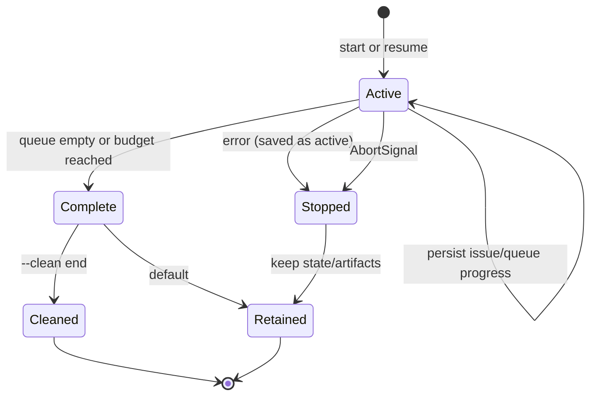
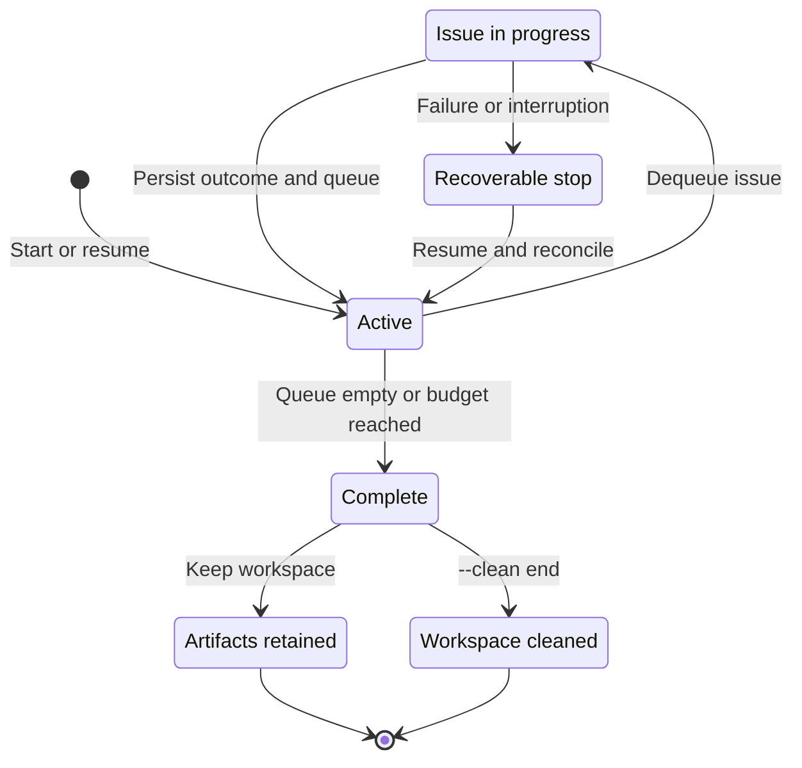

# Operations and recovery

This page is for operators inspecting a run, integrating Ralphie's output,
or recovering after interruption or failure. It is the authoritative reference
for progress output, artifacts, state, cancellation, resume, and cleanup. Start
at the [documentation index](README.md) for other audience paths.

## Progress output

Ralphie streams the complete Pi transcript while each task runs, including
thinking deltas, assistant text, tool calls, and tool results. Tasks and issues
are intentionally processed sequentially so this output remains ordered.

Human-readable transcript output groups each Pi session into a compact block:
thinking and assistant text stream immediately, tool calls are shown as readable
commands, and tool output is indented, de-duplicated, and bounded. Use
`--output verbose` for a larger tool-output preview. JSON output remains the
lossless event stream for integrations.

Ralphie adapts its progress renderer to its environment:

- interactive terminals receive streamed Pi output plus one in-place status line
  for the active leaf stage, while completed milestones remain in the scrollback;
- CI and redirected output receive durable, append-only lines;
- `--output verbose` adds operational details;
- `--output json` writes progress and `pi_event` objects one per line to stdout;
  and
- `--output quiet` suppresses routine progress but retains failures,
  needs-attention decisions, and handled stops.

JSON events use a stable operational vocabulary and include `runId`,
`timestamp`, `stage`, `status`, and `message`. Grounding events identify
whether agent work was skipped. A `needs-attention` event includes its reason,
summary, evidence, questions, diagnostic or artifact path, and selected policy;
verbose and JSON output retain those complete details. Depending on the event,
they may also include the repository, issue position, review attempt, session
ID, commit SHA, created issue numbers, or diagnostic paths. Credentials and
sensitive environment values are redacted at the reporting boundary.

## State and artifacts

The workspace's `.ralphie` directory contains only repository checkouts and
Ralphie's run state, events, and recovery artifacts. Pi configuration is kept
in the default or explicitly supplied `--pi-dir`, or in a private temporary
credential directory, never under this path.

Run artifacts live under:

```text
<workspace>/.ralphie/runs/<run-id>/
├── state.json
├── events.jsonl
└── issues/
```

A normal issue execution obtains a durable per-issue artifact store at:

```text
<workspace>/.ralphie/runs/<run-id>/issues/<issue-number>/artifacts.json
```

The store prevents accidental overwrites and records readiness deferrals,
complexity decisions, checkpoints, review attempts, commit messages, created
commits, resolution proof, decomposition decisions, and created child-number
mappings.

A successful or interrupted run uses this more detailed layout (Pi
configuration is not stored in this tree):

```text
<workspace>/.ralphie/runs/<run-id>/
├── state.json
├── events.jsonl
└── issues/
    └── <issue-number>/
        ├── artifacts.json
        └── review-exhaustion/
            ├── changes.patch
            └── metadata.json
```

`state.json` is versioned, schema-validated, and atomically replaced. It
contains the repository/branch/workflow, selected `onNeedsAttention` policy,
notification settings and any pending notification intent, Pi selection,
budget, pending and completed queue numbers, processed count, outcomes, active
issue/stage, checkout invariant, and update time. State is saved before the
queue starts, when an issue becomes active, after outcomes and queue refreshes,
and at final completion.

## Failure, cancellation, and exit status



- One issue failure uses the current halt policy: Ralphie persists the active
  issue, releases Pi, retains artifacts, and stops before later issues.
- Pi is closed on success, failure, cancellation, and scoped defects. Ordinary
  failures set process exit code `1`.
- Cancellation is checked before long-running boundaries and passed into Pi.
  Ralphie attempts to restore the clean issue checkpoint, saves resumable state,
  skips cleanup, and exits `130`.
- Successful completion persists `complete` before optional `--clean end`
  removes the entire workspace. Cleanup is skipped on failure so state and
  diagnostics remain available.

A needs-attention stop is handled separately and exits with status `2` by
default. `--on-needs-attention continue` drains later work and completes with
status `0` when the queue is drained. The issue remains open in either policy.

## Needs-attention handling

A validated needs-attention decision is not an ordinary failure. Ralphie
persists its explicit policy plus the summary, evidence, questions, and issue
freshness metadata in the run artifacts. With the default `halt` policy, the
handled stop leaves the issue open and the run resumable with exit status 2.
Notifications are disabled unless `--notify-needs-attention` is supplied; a
label by itself is rejected. When opted in, Ralphie first persists the
structured outcome and notification label intent, then publishes through the
GitHub notification service. A failed or uncertain notification remains at an
explicit notification-recovery boundary; resume preserves the saved
notification intent and label, reconciles the stable marker, and retries
without rerunning agent work or closing the issue. Dry runs report
needs-attention outcomes but never publish notifications. With
`--on-needs-attention continue`, the issue remains open while later work is
drained; a drained run completes with exit status 0.

When any executor session requests needs attention, Ralphie first persists the
bounded request, clean checkpoint, and issue freshness fingerprint. Exactly one
fresh read-only grounding session verifies that request before the next artifact,
Git, or GitHub mutation. Only a `needs_attention` verifier disposition confirms
it; actionable and already-resolved dispositions continue the original flow.
The confirmed decision is persisted before recovery writes a bounded binary-safe
patch and decision diagnostic, then restores and verifies the exact clean
checkpoint. A verifier or recovery interruption retains the handoff so resume
can retry verification or recovery without rerunning completed agent work.
The saved decision and handoff are reused only when live `updatedAt` and comment
freshness metadata exactly match; a changed or invalid fingerprint removes both
atomically before routing continues.



Needs-attention recovery diagnostics use the same issue directory and contain
`changes.patch` plus `metadata.json` under a fingerprint-bound
`needs-attention-<id>/` directory. The patch includes tracked staged and unstaged
changes as well as untracked files. Matching diagnostics are reused on resume;
a fresh fingerprint receives a distinct directory. Diagnostics are published
atomically before the exact checkpoint is restored and verified.

## Resume and reconciliation

On resume, Ralphie compares persisted intent with both local Git and live GitHub
state before returning to `Active`. Pending issues use the freshly discovered
GitHub snapshots, including issue update and comment freshness metadata. It can
reconcile partially created child issues, a commit created immediately before
interruption, an issue closure whose response was lost, and a needs-attention
notification whose response or label mutation was uncertain without repeating
the corresponding agent work.To resume an interrupted run, provide its saved state file:

```bash
bunx @beremaran/ralphie owner/repository \
  --branch main \
  --resume ~/.ralphie/.ralphie/runs/<run-id>/state.json
```

The repository and branch must match the saved run. On `--resume`:

1. the command loads and validates the saved state;
2. workflow preflight prepares the workspace and checkout and refetches issues;
3. reconciliation compares saved intent with current Git and GitHub state;
4. the saved pending queue, completed numbers, outcomes, and artifacts are
   restored; and
5. the next safe deterministic step continues without unnecessarily rerunning
   Pi work.

Examples of resumable boundaries:

- a saved complexity decision is reused;
- a checkpoint plus created commit can finish a push without rerunning the
  implementation/review loop;
- an active `issue-closure` with a completed outcome resumes closure without
  rerunning implementation;
- an active `notification-recovery` retries the saved structured outcome and
  stable GitHub marker without rerunning agent work; and
- a partially created decomposition reuses marker-discovered children and the
  saved key mapping; native sub-issue attachments and `blocked_by` dependencies
  are reconciled idempotently, and a child attached to the wrong parent or a
  native relationship that disagrees with a child's marker halts with a
  recovery diagnostic instead of silently reparenting or duplicating issues.

One issue failure currently halts the run. This preserves the checkout and
diagnostics at the first uncertain boundary instead of allowing later issues to
continue on questionable state.

## Cleanup

`--clean end` removes the entire workspace after success, including completed
state, events, diagnostics, and the repository checkout. Cleanup is skipped on
failure so recovery remains possible. `--clean start` removes the workspace
before any step, after protected-path checks. `--clean both` does both. Use
these options only with a path dedicated to Ralphie; see [Safety](safety.md)
for the destructive workspace contract.
