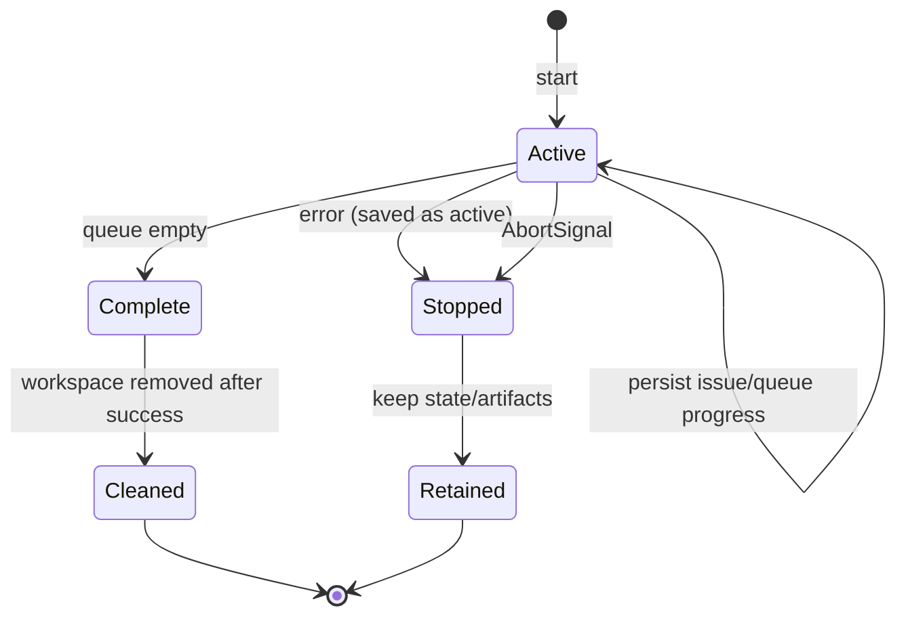
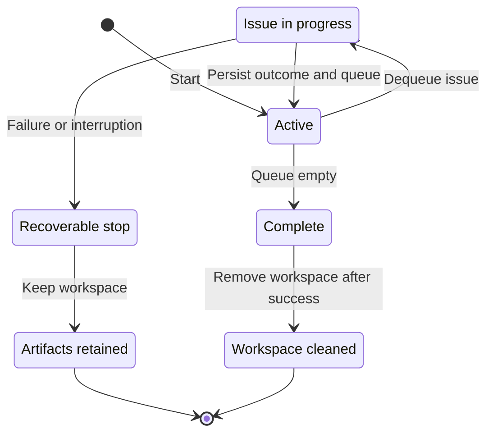

# Operations and recovery

This page is for operators inspecting a run, integrating Ralphie's output,
or understanding what remains after interruption or failure. It is the
authoritative reference for progress output, artifacts, state, cancellation,
and cleanup. Start at the [documentation index](README.md) for other audience
paths.

## Progress output

Ralphie receives the complete pi event stream while each task runs,
including thinking deltas, assistant text, tool calls, and tool results. Tasks
and issues are intentionally processed sequentially so this event stream remains
ordered. JSON output exposes it losslessly for integrations.

Ralphie adapts its presentation to its environment. `--output default`
resolves to the full-screen TUI only when stdin and stderr are both TTYs and
`CI` is neither `"true"` nor `"1"`; otherwise it uses append-only `plain`
lines.

- Interactive terminals get an OpenTUI application (the same rendering core
  OpenCode 1.0 uses): a borderless layout with a background header line
  (repository, active model, pause state), an issue sidebar, a scrollable
  transcript that streams assistant text as it arrives, and a footer status
  line (stage, activity, elapsed time). Transcript turns start with a colored
  `● pi · <title>` role label and blank-line separation; assistant text is
  indented and plain, thinking is dim, and each tool call is one row
  (`✓ $ <command> · 1.2s`, `✓ read <path>`, `✗ <tool> <path> · failed:
  <detail>`). The sidebar lists every issue discovered in the run with its
  outcome (`○` queued, `▶` active, `✓` completed, `✗` failed, `⚠`
  needs-attention, `−` skipped) and follows the active issue until you navigate
  away with `[`/`]` or Ctrl+Left/Right; each issue keeps its own transcript, so
  processed issues stay browsable while the run continues. The queue starts
  paused so the discovered plan can be inspected before work begins; `p`
  resumes or pauses it between issues, `s` stops the queue after the active
  issue and drains the run normally, and `q` (like Ctrl-C) cancels immediately.
  `m` opens the model picker: the pi catalog with the selected model's thinking
  levels, `Tab` switches panes, `Enter` applies the pick to every later issue
  (the session in flight keeps its model), and `Esc` cancels. The header shows
  the active model and level; the footer and sidebar hints show the pending
  pause or stop. Tool output, long commands, and deep paths stay inside the
  transcript panel; resize is handled by the renderer; Ctrl-C is forwarded as
  SIGINT so cancellation still restores the checkout and saves state; disposal
  destroys the renderer and restores the terminal.
- CI and redirected output are the deterministic noninteractive fallback:
  append-only, byte-identical across identical runs, with neither ANSI cursor
  controls (`ESC`) nor carriage-return bytes; `stripTerminalControls` is an
  identity no-op on these streams. Assistant and thinking text are buffered per
  part and printed as complete `│  ` lines; each tool completion gets one
  summary line.
- `--output json` writes progress and `agent_event` objects one per line to
  stdout with stderr empty: every non-empty line parses as one complete JSON
  record, human headers/glyphs never appear, and values are preserved as
  supplied.

JSON events use a stable operational vocabulary and include `runId`,
`timestamp`, `stage`, `status`, and `message`. Grounding events identify
whether agent work was skipped. Human-readable needs-attention decisions name
the issue number and title and show the current/total queue position. JSON
output retains the complete event payload, including the structured details
field; human-readable output never renders that field. A
`needs-attention` event includes its reason, summary, evidence, questions,
diagnostic or artifact path, and queue position.
Depending on the event, it may also include the repository, review attempt,
session ID, commit SHA, created issue numbers, or diagnostic paths. Supplied
progress-event values are preserved as-is; pi transcripts are never
redacted, and terminal control sequences are stripped at the
reporting boundary.

## State and artifacts

The workspace's `.ralphie` directory contains only repository checkouts and
Ralphie's run state, events, and recovery artifacts. Pi credentials and
default-model settings live in `~/.pi/agent` (or `PI_CODING_AGENT_DIR`) and
are never written under this path.

Run artifacts live under:

```text
<workspace>/.ralphie/runs/<run-id>/
├── state.json
├── events.jsonl
└── issues/
```

New runs write the durable event log to
`<workspace>/.ralphie/runs/<run-id>/events.jsonl`. The run closes the log
immediately before removing the workspace, so post-cleanup progress still
renders but is not persisted.

A normal issue execution obtains a durable per-issue artifact store at:

```text
<workspace>/.ralphie/runs/<run-id>/issues/<issue-number>/artifacts.json
```

The store prevents accidental overwrites and records readiness deferrals,
complexity decisions, checkpoints, review attempts, commit messages, created
commits, resolution proof, decomposition decisions, and created child-number
mappings. Stale or legacy un-fingerprinted decisions are removed on load
without disturbing the other artifacts for the issue.

A successful or interrupted run uses this more detailed layout (pi
configuration is not stored in this tree):

```text
<workspace>/.ralphie/runs/<run-id>/
├── state.json
├── events.jsonl
└── issues/
    └── <issue-number>/
        ├── artifacts.json
        └── review-exhaustion/
            ├── changes.patch
            └── metadata.json
```

`state.json` is versioned, schema-validated, and atomically replaced. It
contains the repository/branch, notification settings, pi model selection,
pending and completed queue numbers, processed count, outcomes, active
issue/stage, checkout invariant, and update time. State is saved before the
queue starts, when an issue becomes active, after each issue outcome, after
queue refreshes, and at final completion. State is written for observability
only: Ralphie never loads a previous run's state.

## Failure, cancellation, and exit status



- One issue failure restores its checkout, persists the failed outcome, retains
  artifacts, and continues to later issues.
- The agent runtime is closed on success, failure, cancellation, and scoped defects. Ordinary
  failures set process exit code `1`.
- Cancellation is checked before long-running boundaries and passed into the agent runtime.
  Ralphie attempts to restore the clean issue checkpoint, saves state with the
  active issue, skips cleanup, and exits `130`.
- Successful completion persists `complete`, then removes the entire workspace
  (after protected-path checks). Cleanup is skipped when the run drains with
  issue failures, fails, or is cancelled, so state and diagnostics remain
  available.

An ordinary issue failure never stops the queue. Ralphie restores the failed
issue checkout, records its outcome, and continues independent issues. Failed
prerequisites are not marked complete, so dependent issues remain blocked.
After draining all reachable work, the run exits with status `1` and an
aggregate partial-failure summary.

Needs-attention outcomes also continue the queue. A drained run completes with
status `0`, and the deferred issue remains open. The deterministic
`decomposition_limit_reached` boundary behaves the same way: raise the
persisted `--max-decomposition-depth`, narrow the issue, or resolve its review
findings manually before a later run. It never closes or marks the capped
issue complete, so dependent work remains blocked.

## Needs-attention handling

A validated needs-attention decision is not an ordinary failure. Ralphie
persists the summary, evidence, questions, and issue
freshness metadata in the run artifacts, keeps the issue open, and continues
with later work.
Notifications are disabled unless `--notify-needs-attention` is supplied; a
label by itself is rejected. When opted in, Ralphie publishes through the
GitHub notification service after recording the outcome and before moving to
the next issue. Notification applies only to agent-reported
needs-attention blockers: issues held back by open queue dependencies are
recorded as needs-attention outcomes but never notified or labeled, because
their blocker resolves by queue completion rather than by a human decision.
A notification failure fails the run; the issue remains open and a later run
re-evaluates it from scratch.

When any executor session requests needs attention, Ralphie first persists the
bounded request, clean checkpoint, and issue freshness fingerprint. Exactly one
fresh read-only grounding session verifies that request before the next artifact,
Git, or GitHub mutation. Only a `needs_attention` verifier disposition confirms
it; actionable and already-resolved dispositions continue the original flow.
The confirmed decision is persisted before recovery writes a bounded binary-safe
patch and decision diagnostic, then restores and verifies the exact clean
checkpoint. A verifier or recovery interruption retains the handoff so a later
attempt can retry verification or recovery without rerunning completed agent
work. The saved decision and handoff are reused only when live `updatedAt` and
comment freshness metadata exactly match; a changed or invalid fingerprint
removes both atomically before routing continues.



Needs-attention recovery diagnostics use the same issue directory and contain
`changes.patch` plus `metadata.json` under a fingerprint-bound
`needs-attention-<id>/` directory. The patch includes tracked staged and unstaged
changes as well as untracked files. Matching diagnostics are reused within the
run; a fresh fingerprint receives a distinct directory. Diagnostics are
published atomically before the exact checkpoint is restored and verified.

## Interruption and recovery

There is no resume command. When a run fails or is interrupted:

1. the agent runtime is closed and the process exits `1` (or `130` on
   cancellation);
2. the workspace retains `state.json`, `events.jsonl`, and per-issue artifacts
   for diagnosis;
3. issues that were not closed remain open and are selected again on the next
   run; and
4. the next run removes the workspace, prepares a fresh checkout, and
   re-evaluates every matching open issue from scratch.

Because each run starts clean, recovery is a new run rather than a continuation:
completed issues are already closed and no longer selected, while interrupted
issues repeat grounding, implementation, and review. Inspect the retained
`state.json` and artifacts before deleting them if the failure needs
investigation.

Native sub-issue and dependency endpoints require `github.com`; GitHub
Enterprise Server is not supported by the current client. With an unavailable
endpoint or a token lacking issue write permission, live decomposition fails with
an actionable error naming the missing capability; there is no body-link fallback.
See [Workflows](workflows.md#platform-support-for-native-sub-issues-and-dependencies).

An ordinary issue failure never stops the queue. Ralphie restores the failed
issue checkout, records its outcome, and continues independent work; the
drained run exits `1` if any issue failed.

A configured deterministic verification command returning non-zero is handled
before it becomes an issue failure. Ralphie gives the bounded command output and
staged diff to a fresh verification-fix session, restages its changes, and
retries up to five times. Only repair exhaustion or a non-repairable
verification fault (for example a command changing the staged tree) reaches the
ordinary failure boundary. When no `--verify-command` is configured, the gate
is skipped.

## Cleanup

Ralphie removes the entire workspace before preparing a run, after
protected-path checks, and again after a successful run. This deletes completed
state, events, diagnostics, and the repository checkout. Cleanup is skipped
when the run drains with issue failures, fails, or is cancelled, so state and
diagnostics remain available. Use a path dedicated to Ralphie; see
[Safety](safety.md) for the destructive workspace contract.
