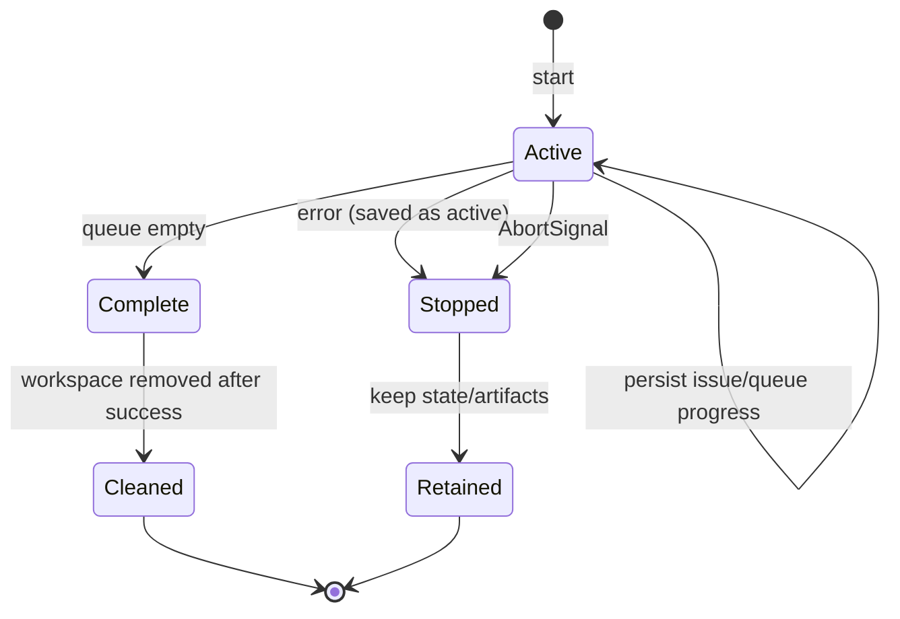
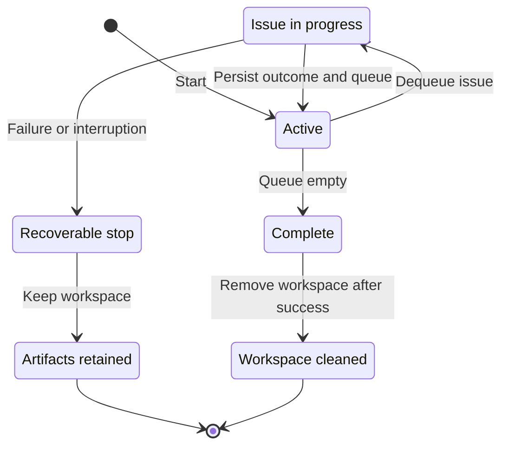

# Operations and recovery

This page is for operators inspecting a run, integrating Ralphie's output,
or understanding what remains after interruption or failure. It is the
authoritative reference for progress output, artifacts, state, cancellation,
and cleanup. Start at the [documentation index](README.md) for other audience
paths.

## Progress output

While each session runs, Ralphie translates its harness's native event stream
into one harness-neutral set of session events: assistant text and thinking,
tool calls, tool results, errors, and token usage. Every output mode renders
only these events, so output looks the same whichever harness ran the session.
Tasks and issues are intentionally processed sequentially so the event stream
remains ordered. JSON output carries every session event for integrations; see
[Session events](#session-events).

Ralphie adapts its presentation to its environment. `--output default`
resolves to the full-screen TUI only when stdin and stderr are both TTYs and
`CI` is neither `"true"` nor `"1"`; otherwise it uses append-only `plain`
lines.

- Interactive terminals get an OpenTUI application (the same rendering core
  OpenCode 1.0 uses): a borderless layout with a background header line
  (repository, pause state), an issue sidebar, a scrollable
  transcript that streams assistant text as it arrives, and a footer status
  line (stage, activity, elapsed time). Transcript turns start with a colored
  `● <harness> · <title>` role label and blank-line separation; assistant text
  is indented and plain, thinking is dim, each tool call is one row
  (`✓ $ <command> · 1.2s`, `✓ read <path>`, `✗ <tool> <path> · failed:
  <detail>`), and a session error is a red `✗ <message>` row. The sidebar
  lists every issue discovered in the run with its outcome (`○` queued, `▶`
  active, `✓` completed, `✗` failed, `⚠` hand-off, `−` skipped) and
  follows the active issue until you navigate away with `[`/`]` or
  Ctrl+Left/Right; each issue keeps its own transcript, so processed issues
  stay browsable while the run continues. The queue starts
  paused so the discovered plan can be inspected before work begins; `p`
  resumes or pauses it between issues, `s` stops the queue after the active
  issue and drains the run normally, and `q` (like Ctrl-C) cancels immediately.
  The footer and sidebar hints show the pending pause or stop. Tool output, long commands, and deep paths stay inside the
  transcript panel; resize is handled by the renderer; Ctrl-C is forwarded as
  SIGINT so cancellation still restores the checkout and saves state; disposal
  destroys the renderer and restores the terminal.
- CI and redirected output are the deterministic noninteractive fallback:
  append-only, byte-identical across identical runs, with neither ANSI cursor
  controls (`ESC`) nor carriage-return bytes; `stripTerminalControls` is an
  identity no-op on these streams. Each session is a block that opens with
  `╭─ <harness> · <title>` and closes with `╰─ done`. Assistant and thinking
  text are buffered per block and printed as complete `│  ` lines; each tool
  call gets one line, each tool completion one summary line
  (`│  ✓ <tool> done` or `│  ✗ <tool> failed: <output>`), and each session
  error one `│  ✗ <message>` line. Usage is not printed.
- `--output json` writes progress records and `session_event` records one per
  line to stdout with stderr empty: every non-empty line parses as one
  complete JSON record, human headers/glyphs never appear, and values are
  preserved as supplied.

JSON events use a stable operational vocabulary and include `runId`,
`timestamp`, `stage`, `status`, and `message`. Pre-flight and hand-off events identify
whether agent work was skipped. Human-readable hand-off decisions name
the issue number and title and show the current/total queue position. JSON
output retains the complete event payload, including the structured details
field; human-readable output never renders that field. A
`hand-off` event includes its reason, summary, evidence, questions,
diagnostic or artifact path, and queue position.
Depending on the event, it may also include the repository, review attempt,
session ID, commit SHA, created issue numbers, or diagnostic paths. Supplied
progress-event values are preserved as-is; session transcripts are never
redacted, and terminal control sequences are stripped at the
reporting boundary.

### Session events

Each `session_event` record wraps one session event with the session it
belongs to:

```json
{"type":"session_event","sessionID":"claude-7d3e2a1b","directory":"/work/owner/repo","harness":"claude","title":"Implement #42","event":{"type":"tool_call","callId":"call-1","name":"Bash","input":{"command":"bun test"}}}
```

| Field       | Meaning                                                   |
| ----------- | --------------------------------------------------------- |
| `sessionID` | Ralphie's id for the session.                             |
| `directory` | Working directory of the session.                         |
| `harness`   | Name of the harness that ran the session, such as `claude`. |
| `title`     | Human-readable session label; omitted when there is none. |
| `event`     | One of the event shapes below, discriminated by `type`.   |

`event` is one of:

- `{"type":"session_started"}`: the session began producing work.
- `{"type":"assistant_text","kind":"text"|"thinking","text":…,"done":…}`: a
  fragment of assistant output. Fragments of one `kind` concatenate into a
  block until one arrives with `done: true`. `text` is only the fragment: a
  closing fragment may be empty, and a whole block may arrive as a single
  fragment with `done: true`.
- `{"type":"tool_call","callId":…,"name":…,"input":{…}}`: the assistant
  started a tool. `callId` pairs the call with its result.
- `{"type":"tool_result","callId":…,"name":…,"output":…,"isError":…}`: the
  tool finished. `output` is its text output, empty when it has none.
- `{"type":"error","message":…}`: the harness or model reported a failure.
- `{"type":"usage","inputTokens":…,"outputTokens":…}`, optionally with
  `cacheReadTokens`, `cacheWriteTokens`, and `costUsd`: tokens, and cost where
  the harness reports it, consumed since the session's previous `usage` event.
  Sum the events for a session total.
- `{"type":"session_finished"}`: the session stopped producing work. Failures
  are reported by `error` events, not here.

Tool names and `input` fields are the harness's own (for example Claude Code's
`Bash` tool takes `command`), so consumers that need tool-specific detail should key
on `harness` as well as `name`.

## State and artifacts

The workspace's `.ralphie` directory contains only repository checkouts and
Ralphie's run state, events, and recovery artifacts. Harness credentials and
settings belong to each harness CLI and are never written under this path.

Run artifacts live under:

```text
<workspace>/.ralphie/runs/<run-id>/
├── state.json
├── events.jsonl
└── issues/
```

New runs write the durable event log to
`<workspace>/.ralphie/runs/<run-id>/events.jsonl`. The run closes the log
immediately before removing the workspace, so post-cleanup progress still
renders but is not persisted.

A normal issue execution obtains a durable per-issue artifact store at:

```text
<workspace>/.ralphie/runs/<run-id>/issues/<issue-number>/artifacts.json
```

The store prevents accidental overwrites and records readiness deferrals,
pre-flight decisions, checkpoints, review attempts, commit messages, created
commits, resolution proof, decomposition decisions, and created child-number
mappings. Stale or legacy un-fingerprinted decisions are removed on load
without disturbing the other artifacts for the issue.

A successful or interrupted run uses this more detailed layout (harness
configuration is not stored in this tree):

```text
<workspace>/.ralphie/runs/<run-id>/
├── state.json
├── events.jsonl
└── issues/
    └── <issue-number>/
        ├── artifacts.json
        └── review-exhaustion/
            ├── changes.patch
            └── metadata.json
```

`state.json` is versioned, schema-validated, and atomically replaced. It
contains the repository/branch, the role assignments
(harness, model, effort),
pending and completed queue numbers, processed count, outcomes, active
issue/stage, checkout invariant, and update time. State is saved before the
queue starts, when an issue becomes active, after each issue outcome, after
queue refreshes, and at final completion. State is written for observability
only: Ralphie never loads a previous run's state.

## Failure, cancellation, and exit status


```mermaid
stateDiagram-v2
    [*] --> Active: start
    Active --> Active: persist issue/queue progress
    Active --> Complete: queue empty
    Active --> Stopped: error (saved as active)
    Active --> Stopped: AbortSignal
    Complete --> Cleaned: workspace removed after success
    Stopped --> Retained: keep state/artifacts
    Cleaned --> [*]
    Retained --> [*]
```

- One issue failure restores its checkout, persists the failed outcome, retains
  artifacts, and continues to later issues.
- Ordinary failures set process exit code `1`.
- Cancellation is checked before long-running boundaries and passed to the running session, which is killed.
  Ralphie attempts to restore the clean issue checkpoint, saves state with the
  active issue, skips cleanup, and exits `130`.
- Successful completion persists `complete`, then removes the entire workspace
  (after protected-path checks). Cleanup is skipped when the run drains with
  issue failures, fails, or is cancelled, so state and diagnostics remain
  available.

An ordinary issue failure never stops the queue. Ralphie restores the failed
issue checkout, records its outcome, and continues independent issues. Failed
prerequisites are not marked complete, so dependent issues remain blocked.
After draining all reachable work, the run exits with status `1` and an
aggregate partial-failure summary.

Hand-off outcomes also continue the queue. A drained run completes with
status `0`, and the handed-off issue remains open but leaves the intake queue
because it no longer carries the agent-ready label. The deterministic
`decomposition_limit_reached` boundary behaves the same way: raise the
persisted `limits.maxDecompositionDepth`, narrow the issue, or resolve its review
findings manually, then relabel the issue `ready-for-agent` for a later run.
It never closes or marks the capped issue complete, so dependent work remains
blocked.

## Hand-off handling

A validated hand-off decision is not an ordinary failure. Ralphie
persists the summary, evidence, questions, and issue
freshness metadata in the run artifacts, keeps the issue open, and continues
with later work.

Hand-offs are always on. After recording the outcome and before moving to the
next issue, Ralphie replaces the issue's triage state label (it ends with
exactly one) and posts one comment that starts with the AI disclaimer. The
comment carries a hidden `ralphie:hand-off` marker, so a retry updates it
instead of posting another. `needs-info` hand-offs (missing information,
conflicting requirements, cannot reproduce, outdated premise) use the Triage
Notes template; `ready-for-human` hand-offs (exhausted implementation
attempts, the decomposition depth limit, an external dependency) use an
Agent-Brief-style write-up under a `## Hand-off` heading, listing what was
tried and the local path of the diagnostics. The label names follow the
`labels` mapping in the configuration file. Issues held back by open
blockers, whether reported by pre-flight or by queue order, are recorded as
skipped and change nothing on GitHub. A hand-off publishing failure fails the
run; the issue keeps its labels and a later run re-evaluates it from scratch.

When an executor session or pre-flight asks for a hand-off, Ralphie first persists the
bounded request, clean checkpoint, and issue freshness fingerprint. Exactly one
fresh read-only hand-off verification session verifies that request before the next artifact,
Git, or GitHub mutation. Only a `hand_off` verifier disposition confirms
it; actionable and already-resolved dispositions continue the original flow.
The confirmed decision is persisted before recovery writes a bounded binary-safe
patch and decision diagnostic, then restores and verifies the exact clean
checkpoint. A verifier or recovery interruption retains the pending hand-off so a later
attempt can retry verification or recovery without rerunning completed agent
work. The saved decision and pending hand-off are reused only when live `updatedAt` and
comment freshness metadata exactly match; a changed or invalid fingerprint
removes both atomically before routing continues.


```mermaid
stateDiagram-v2
    state "Issue in progress" as IssueInProgress
    state "Recoverable stop" as RecoverableStop
    state "Artifacts retained" as Retained
    state "Workspace cleaned" as Cleaned

    [*] --> Active: Start
    Active --> IssueInProgress: Dequeue issue
    IssueInProgress --> Active: Persist outcome and queue
    IssueInProgress --> RecoverableStop: Failure or interruption
    Active --> Complete: Queue empty
    Complete --> Cleaned: Remove workspace after success
    RecoverableStop --> Retained: Keep workspace
    Retained --> [*]
    Cleaned --> [*]
```

Hand-off recovery diagnostics use the same issue directory and contain
`changes.patch` plus `metadata.json` under a fingerprint-bound
`hand-off-<id>/` directory. The patch includes tracked staged and unstaged
changes as well as untracked files. Matching diagnostics are reused within the
run; a fresh fingerprint receives a distinct directory. Diagnostics are
published atomically before the exact checkpoint is restored and verified.

## Interruption and recovery

There is no resume command. When a run fails or is interrupted:

1. the process exits `1` (or `130` on cancellation);
2. the workspace retains `state.json`, `events.jsonl`, and per-issue artifacts
   for diagnosis;
3. issues that were not closed remain open and are selected again on the next
   run; and
4. the next run removes the workspace, prepares a fresh checkout, and
   re-evaluates every matching open issue from scratch.

A hard crash (a killed process, a power loss) in the middle of the review gate
is the one case that leaves the retained checkout unclean: Ralphie creates
local candidate commits while review is in progress, so HEAD may sit at a
candidate commit. Candidate commits are never pushed, and the next run
discards the whole workspace; inspect the retained checkout before starting
it if you need the work. Ordinary failures and cancellation restore the
checkpoint first.

Because each run starts clean, recovery is a new run rather than a continuation:
completed issues are already closed and no longer selected, while interrupted
issues repeat pre-flight, implementation, and review. Inspect the retained
`state.json` and artifacts before deleting them if the failure needs
investigation.

Native sub-issue and dependency endpoints require `github.com`; GitHub
Enterprise Server is not supported by the current client. With an unavailable
endpoint or a token lacking issue write permission, live decomposition fails with
an actionable error naming the missing capability; there is no body-link fallback.
See [Workflows](workflows.md#platform-support-for-native-sub-issues-and-dependencies).

An ordinary issue failure never stops the queue. Ralphie restores the failed
issue checkout, records its outcome, and continues independent work; the
drained run exits `1` if any issue failed.

A configured deterministic verification command returning non-zero is handled
before it becomes an issue failure. Ralphie gives the bounded command output and
staged diff to the implementer's session (resumed with `/diagnosing-bugs`, or a
fresh fixer session when it cannot be resumed), restages its changes, and
retries up to `limits.verificationFixes` times. Only repair exhaustion or a non-repairable
verification fault (for example a command changing the staged tree) reaches the
ordinary failure boundary. When no `verify` commands are configured, the gate
is skipped.

## Cleanup

Ralphie removes the entire workspace before preparing a run, after
protected-path checks, and again after a successful run. This deletes completed
state, events, diagnostics, and the repository checkout. Cleanup is skipped
when the run drains with issue failures, fails, or is cancelled, so state and
diagnostics remain available. Use a path dedicated to Ralphie; see
[Safety](safety.md) for the destructive workspace contract.
