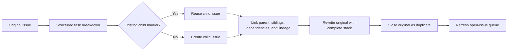

# Workflows

This page is for operators and contributors who need to understand how Ralphie
routes issues, performs implementation and decomposition, and delivers the
result. It is the authoritative description of workflow semantics and diagrams;
see the [documentation index](README.md) for setup, CLI, safety, and recovery
references. For the source-level trigger-to-exit sequence, see the
[end-to-end execution trace](end-to-end-execution.md).

> [!CAUTION]
> The default `lgtm` workflow commits and pushes directly to the selected
> branch. The `pr` workflow also mutates GitHub by creating and merging a pull
> request. Use [dry-run](safety.md#dry-run-validation) for mutation-free
> validation before running either delivery mode.

## Routing overview

Before normal execution, every matching open issue is checked by a read-only,
schema-validated grounding session. Actionable issues then receive a complexity
score from 0 through 5. An issue whose prerequisite is still open, or which
otherwise needs human attention, is left open and recorded with its reason. The
`halt` policy stops at that handled boundary by default; `continue` advances
with the next queue item without closing or marking the issue complete.

```mermaid
flowchart TD
    A[Open GitHub issue] --> Z[Structured readiness check]
    Z -->|Needs attention or open dependency| Q{onNeedsAttention policy}
    Q -->|halt (default)| Y1[Handled stop, exit 2, resume later]
    Q -->|continue| Y[Defer, leave open, continue queue]
    Z -->|Actionable or apparently resolved| B[Structured complexity assessment]
    B -->|0–3| C[Implementation session]
    C --> D[Deterministically stage changes]
    D -->|Changes present| E[Fresh review session]
    D -->|No changes| N[Fresh structured resolution verification]
    N -->|Resolved with evidence| O[Close issue as completed]
    N -->|Unresolved or uncertain| P[Fail and leave issue open]
    E -->|Approved| F[Structured commit message]
    E -->|Changes requested| G[Fresh review-fix session]
    G --> D
    E -->|Five reviews exhausted| H[Preserve diagnostics and restore checkout]
    B -->|4–5| I[Structured decomposition]
    H --> I
    I --> J[Create and cross-link child issues]
    J --> K[Rewrite and close original issue]
    K --> L[Refresh issue queue]
    F --> M[Commit and non-force push]
    M --> O
```

## Implementation workflow: complexity 0–3

1. Capture the exact clean branch and commit as an issue checkpoint.
2. Ask a fresh Pi session to implement the issue.
3. Stage every change deterministically and capture the exact staged diff.
4. Ask a separate session for a schema-validated review.
5. If changes are requested, give the review to a fresh fix session and repeat
   staging and review.
6. Stop after approval or five review attempts.
7. Generate a validated commit message and commit the changes.
8. In `lgtm` mode, recheck the remote and push the commit without force, then
   close the source issue after the push is verified. In `pr` mode, create a
   feature branch, push it, open a pull request linked with `Closes #<issue>`,
   publish the review results, and merge it automatically so GitHub closes the
   issue.

When implementation produces no changes, a fresh read-only session must prove
that the current checkout already resolves the issue and return concrete
evidence. A proven resolution is completed and closed; an unresolved or
uncertain result fails safely and remains open. If the review budget is
exhausted, Ralphie preserves the patch and review diagnostics, restores the
clean checkpoint, and sends the issue through decomposition.

The boundary between agent work and deterministic operations stays explicit
throughout the loop:

```mermaid
sequenceDiagram
    participant R as Ralphie
    participant GH as GitHub
    participant G as Git
    participant O as Pi

    R->>G: Capture clean branch checkpoint
    R->>G: Verify destination and remote base
    R->>O: Start fresh implementation session
    O-->>R: Edit the checkout
    R->>G: Stage all changes and read exact diff

    alt Changes present
        loop Until approved or five reviews
            R->>O: Start fresh structured-review session
            O-->>R: Return approved or changes requested
            opt Changes requested and budget remains
                R->>O: Start fresh review-fix session
                O-->>R: Update the checkout
                R->>G: Restage changes and read exact diff
            end
        end
    alt Review approved: lgtm mode
            R->>O: Generate structured commit message
            R->>G: Commit exact staged tree
            R->>G: Revalidate destination, HEAD, and remote base
            R->>G: Push selected branch without force
            G->>GH: Send branch update
            GH-->>G: Accept or return authoritative policy rejection
            R->>GH: Close issue as completed
        else Review approved: pr mode
            R->>O: Generate structured commit message
            R->>G: Commit exact staged tree on feature branch
            R->>GH: Open pull request with Closes #issue
            R->>GH: Publish review comments and merge PR
            GH-->>R: Confirm merge; GitHub closes linked issue
        else Review budget exhausted
            R->>G: Preserve patch and restore checkpoint
            R->>GH: Continue through decomposition
        end
    else No changes
        R->>O: Start fresh structured resolution verification
        O-->>R: Return status and concrete evidence
        opt Resolved
            R->>GH: Close issue as completed
        end
    end
```

## Decomposition workflow: complexity 4–5

1. Ask Pi to split the issue into the next set of independently actionable
   tasks and declare their dependencies.
2. Create child issues in deterministic order.
3. Add parent, sibling, dependency, and full-lineage links.
4. Rewrite the original issue with the complete issue stack.
5. Close the original as a duplicate and refresh the open-issue queue.

Stable markers and persisted child mappings make the workflow retry-safe: a
resumed run discovers previously created children instead of duplicating them.
Eligible children can enter the main implementation loop during the same run.



The decomposition Pi session is read-only and returns an
`issueBreakdownDecisionSchema` result containing at least two independently
actionable 0–3 children, stable keys, and an acyclic dependency graph. The
breakdown is persisted before the first GitHub mutation.

Each child receives a stable marker containing root, parent, key, and depth.
Ralphie discovers those markers and reconciles them with the persisted mapping
before creating anything. Thus a lost create response, a restart, or a partial
linking failure can resume without blindly duplicating children. Creation,
number recording, linking, original rewrite, and closure are separate
recoverable mutations.

The original is closed with GitHub's `duplicate` reason only after all children
are created and linked. The open-issue queue is then refreshed; newly eligible
children can run during the same invocation. If dependencies remain open after
the queue is exhausted, the run persists active state and fails instead of
processing blocked work.

A direct complexity 4–5 route returns `decomposed`. Review exhaustion returns an
`escalated` outcome containing the recovery diagnostic path and, after
successful decomposition, the created child numbers. Both transitions refresh
the queue.

## Delivery modes

| Mode | Issue checkout | Delivery | Source issue closure |
| --- | --- | --- | --- |
| `lgtm` | Selected base branch | Commit and non-force push directly to that branch; verify remote SHA and clean checkout | Close directly as `completed` after verified delivery. |
| `pr` | `ralphie/issue-<number>` in the main checkout | Push feature branch, create/find matching PR, publish stored review attempts as marked comments, merge, and verify merged state | PR body contains `Closes #<issue>`; GitHub closes the issue on merge. The serial run restores the base checkout afterward. |
| `--dry-run` | Prepared normal checkout | Ground the issue, then assess complexity and report implementation or decomposition when actionable; report already-resolved and needs-attention routes otherwise. No implementation, decomposition, delivery, commit, push, checkout, issue, or PR mutation | No issue is closed. The result is `skipped` except needs-attention, which remains a needs-attention outcome. |

The direct-push path never uses force. A push rejection is authoritative: the
created commit and artifacts are retained, the run halts, and resume can
reconcile a commit that may already have reached the remote.

## Modes and queue behavior

The top-level `--mode` defaults to `issues`. Issue work is sequential. With the
default `created:asc` sort, issues are processed oldest-first; `--max-issues`
is charged when an issue is dequeued, not when it succeeds. When no branch is
configured, Ralphie uses `main` when it exists and otherwise `master`.

The `maintain-issues` mode is reserved for deterministic issue maintenance. It
accepts shared issue selection options and uses `--duplicate-action link` by
default; `close` is also accepted. Its maintenance executor is intentionally
not wired yet, so selecting this mode fails closed rather than running the
issue implementation pipeline. Issue workflow and implementation-only options
are rejected in this mode.

The `get-pipelines-green` mode is selected explicitly and keeps its retry
settings separate from issue options:

```bash
bunx @beremaran/ralphie owner/repository --mode get-pipelines-green \
  --max-attempts 3 --pipeline-timeout 10m
```

`--pipeline-timeout` accepts a positive integer followed by `s`, `m`, or `h`.
Mode-specific implementation and pipeline options cannot be mixed between
modes.

For command syntax and all defaults, see the [CLI reference](cli-reference.md).
For workspace, Git, and GitHub guardrails, see [Safety](safety.md). For resume
and failure boundaries, see [Operations and recovery](operations-and-recovery.md).
