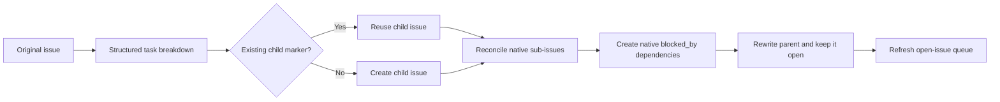

# Workflows

This page is for operators and contributors who need to understand how Ralphie
routes issues, performs implementation and decomposition, and delivers the
result. It is the authoritative description of workflow semantics and diagrams;
see the [documentation index](README.md) for setup, CLI, safety, and recovery
references. For the source-level trigger-to-exit sequence, see the
[end-to-end execution trace](end-to-end-execution.md).

> [!CAUTION]
> The default `lgtm` workflow commits and pushes directly to the selected
> branch. The `pr` workflow also mutates GitHub by creating and merging a pull
> request. Use [dry-run](safety.md#dry-run-validation) for mutation-free
> validation before running either delivery mode.

## Routing overview

Before normal execution, every matching open issue is checked by a read-only,
schema-validated grounding session. Actionable issues then receive a complexity
score from 0 through 5. An issue whose prerequisite is still open, or which
otherwise needs human attention, is left open and recorded with its reason. The
`halt` policy stops at that handled boundary by default; `continue` advances
with the next queue item without closing or marking the issue complete.

```mermaid
flowchart TD
    A[Open GitHub issue] --> Z[Structured readiness check]
    Z -->|Needs attention or open dependency| Q{onNeedsAttention policy}
    Q -->|halt (default)| Y1[Handled stop, exit 2, resume later]
    Q -->|continue| Y[Defer, leave open, continue queue]
    Z -->|Actionable or apparently resolved| B[Structured complexity assessment]
    B -->|0–3| C[Implementation session]
    C --> D[Deterministically stage changes]
    D -->|Changes present| V[Deterministic verification]
    V -->|Passed| E[Fresh review session]
    V -->|Command failed| R[Fresh verification-fix session]
    R --> D
    D -->|No changes| N[Fresh structured resolution verification]
    N -->|Resolved with evidence| O[Close issue as completed]
    N -->|Unresolved or uncertain| P[Fail and leave issue open]
    E -->|Approved and reverified| F[Structured commit message]
    E -->|Changes requested| G[Fresh review-fix session]
    G --> D
    E -->|Five reviews exhausted| H[Preserve diagnostics and restore checkout]
    B -->|4–5| I[Structured decomposition]
    H --> I
    I --> J[Create and cross-link child issues]
    J --> K[Rewrite and close original issue]
    K --> L[Refresh issue queue]
    F --> M[Commit and non-force push]
    M --> O
```

## Implementation workflow: complexity 0–3

1. Capture the exact clean branch and commit as an issue checkpoint.
2. Ask a fresh Pi session to implement the issue.
3. Stage every change deterministically and capture the exact staged diff.
4. Run deterministic verification. If a command exits non-zero, give its
   bounded output and the staged diff to a fresh fix session, then restage and
   retry up to five times.
5. Ask a separate session for a schema-validated review only after verification
   passes.
6. If changes are requested, give the review to a fresh fix session and repeat
   staging and review.
7. Stop after approval or five review attempts. Reverify immediately before
   commit; if repair changes an approved tree, review the repaired tree again.
8. Generate a validated commit message and commit the changes.
9. In `lgtm` mode, recheck the remote and push the commit without force, then
   close the source issue after the push is verified. In `pr` mode, create a
   feature branch, push it, open a pull request linked with `Closes #<issue>`,
   publish the review results, wait for every check on the exact head SHA to
   pass, re-read the pull request, and merge it only while the head is
   unchanged so GitHub closes the issue.

When implementation produces no changes, a fresh read-only session must prove
that the current checkout already resolves the issue and return concrete
evidence. A proven resolution is completed and closed; an unresolved or
uncertain result fails safely and remains open. If the review budget is
exhausted, Ralphie preserves the patch and review diagnostics, restores the
clean checkpoint, and sends the issue through decomposition.

The boundary between agent work and deterministic operations stays explicit
throughout the loop:

```mermaid
sequenceDiagram
    participant R as Ralphie
    participant GH as GitHub
    participant G as Git
    participant O as Pi

    R->>G: Capture clean branch checkpoint
    R->>G: Verify destination and remote base
    R->>O: Start fresh implementation session
    O-->>R: Edit the checkout
    R->>G: Stage all changes and read exact diff

    alt Changes present
        loop Until approved or five reviews
            R->>G: Run deterministic verification
            opt Verification command fails and repair budget remains
                R->>O: Start fresh verification-fix session
                O-->>R: Update the checkout
                R->>G: Restage and rerun verification
            end
            R->>O: Start fresh structured-review session
            O-->>R: Return approved or changes requested
            opt Changes requested and budget remains
                R->>O: Start fresh review-fix session
                O-->>R: Update the checkout
                R->>G: Restage changes and read exact diff
            end
        end
        R->>G: Reverify the exact approved staged tree
    alt Review approved: lgtm mode
            R->>O: Generate structured commit message
            R->>G: Commit exact staged tree
            R->>G: Revalidate destination, HEAD, and remote base
            R->>G: Push selected branch without force
            G->>GH: Send branch update
            GH-->>G: Accept or return authoritative policy rejection
            R->>GH: Close issue as completed
        else Review approved: pr mode
            R->>O: Generate structured commit message
            R->>G: Commit exact staged tree on feature branch
            R->>GH: Open matching PR with Closes #issue; persist head SHA
            R->>GH: Publish review comments
            R->>GH: Wait for checks on head SHA, re-read, then merge
            GH-->>R: Confirm merge; GitHub closes linked issue
        else Review budget exhausted
            R->>G: Preserve patch and restore checkpoint
            R->>GH: Continue through decomposition
        end
    else No changes
        R->>O: Start fresh structured resolution verification
        O-->>R: Return status and concrete evidence
        opt Resolved
            R->>GH: Close issue as completed
        end
    end
```

## Decomposition workflow: complexity 4–5

1. Ask Pi to split the issue into the next set of independently actionable
   tasks and declare their dependencies.
2. Create child issues in deterministic order with their stable markers.
3. Attach each created or recovered child to the original issue as a **native
   GitHub sub-issue**, reconciling against GitHub's reported hierarchy.
4. Represent each declared `dependsOn` edge as a **native GitHub
   `blocked_by` dependency** and persist the dependency mapping artifact.
5. Rewrite the original issue as the tracking parent and **keep it open**;
   it is never closed as a duplicate merely because it was decomposed.

Stable markers and persisted child mappings make the workflow retry-safe: a
resumed run discovers previously created children instead of duplicating them,
and native relationships are reconciled idempotently. Eligible children can
enter the main implementation loop during the same run; the decomposed parent
stays out of the queue because it is a tracking issue, not executable work.



The decomposition Pi session is read-only and returns an
`issueBreakdownDecisionSchema` result containing at least two independently
actionable 0–3 children, stable keys, and an acyclic dependency graph. The
breakdown is persisted before the first GitHub mutation.

Each child receives a stable marker containing root, parent, key, and depth.
Ralphie discovers those markers and reconciles them with the persisted mapping
before creating anything. Thus a lost create response, a restart, or a partial
linking failure can resume without blindly duplicating children. Creation,
number recording, linking, native sub-issue attachment, dependency creation,
and the parent rewrite are separate recoverable mutations; a child already
attached to the wrong parent, or a native relationship that disagrees with a
child's marker, halts with a recovery diagnostic instead of silently
reparenting or duplicating issues.

The decomposed parent remains open as the native tracking issue and exposes
GitHub's completion progress for its sub-issues. It is not queued again, and it
is closed as `completed` only when its child work is finished: completing the
final child reconciles its parent immediately, and every non-dry-run run also
reconciles decomposed parents it discovers or refreshes, so a parent whose
final child closed in a previous run is completed on a later run. The open-issue
queue is refreshed after decomposition; newly eligible children can run during
the same invocation. If dependencies remain open after the queue is exhausted,
the run persists active state and fails instead of processing blocked work.

A direct complexity 4–5 route returns `decomposed`. Review exhaustion returns an
`escalated` outcome containing the recovery diagnostic path and, after
successful decomposition, the created child numbers. Both transitions refresh
the queue.

### Platform support for native sub-issues and dependencies

Native sub-issues and `blocked_by` dependencies are GitHub REST features that
require a compatible host: `github.com`, or GitHub Enterprise Server versions
that ship the sub-issues and issue-dependencies endpoints. Ralphie treats them
as required for decomposition:

- Creating, recovering, or linking children fails with an actionable error
  naming the missing platform capability when an endpoint is unavailable or the
  token lacks issue write permission. There is **no body-link fallback**: Ralphie
  never silently degrades to body-only hierarchy semantics.
- The compatibility check is implicit and per-operation: the first relationship
  read or write against an unsupported server surfaces the error, so a dry run
  or a run on an unsupported host fails at decomposition instead of producing a
  different, undocumented hierarchy.
- Recovery metadata (stable markers and the persisted key/dependency mappings)
  remains the idempotency record regardless of platform support, so a run
  resumed on a compatible host reconciles correctly.
- To verify host support before a run: `gh api repos/{owner}/{repo}/issues/1/sub_issues`
  and `gh api repos/{owner}/{repo}/issues/1/dependencies/blocked_by` should
  return `200` (an empty list) rather than `404`.

## Delivery modes

| Mode | Issue checkout | Delivery | Source issue closure |
| --- | --- | --- | --- |
| `lgtm` | Selected base branch | Commit and non-force push directly to that branch; verify remote SHA and clean checkout | Close directly as `completed` after verified delivery. |
| `pr` | `ralphie/issue-<number>` in the main checkout | Push feature branch, create/find matching PR, persist its number and head SHA, publish stored review attempts as marked comments, wait for checks on the exact head SHA to pass, re-read the PR, and invoke the expected-head merge only when the head is unchanged | PR body contains `Closes #<issue>`; GitHub closes the issue on merge. A failed, cancelled, timed-out, absent, unknown, changed-head, closed, or unmergeable gate retains the feature branch and PR, leaves the issue open, and persists recoverable run state. The serial run restores the base checkout afterward. |
| `--dry-run` | Prepared normal checkout | Ground the issue, then assess complexity and report implementation or decomposition when actionable; report already-resolved and needs-attention routes otherwise. A decomposition dry run also performs the read-only breakdown session and reports the intended native sub-issue hierarchy, children to create or reuse, and dependency edges. No implementation, decomposition, delivery, commit, push, checkout, issue, or PR mutation | No issue is closed. The result is `skipped` except needs-attention, which remains a needs-attention outcome. |

The direct-push path never uses force. A push rejection is authoritative: the
created commit and artifacts are retained, the run halts, and resume can
reconcile a commit that may already have reached the remote.

The `pr` delivery is gated: once the matching pull request is created or
found, its number and head SHA are persisted, review attempts are published
idempotently, and the read-only check observer polls checks for that exact SHA
until it reaches its documented green state. The PR is re-read immediately
before merging — a changed head discards the saved decision. Failed,
cancelled, timed-out, no-pipelines, unknown, changed-head, closed, or
unmergeable gates never merge and never close the source issue; the feature
branch and PR are retained with an active, recoverable closure gate in run
state. Resuming such a run locates the existing matching PR, continues
polling, re-verifies saved green evidence against the current head,
re-observes failed gates on rerun, and reconciles an already-merged PR without
another merge call.

## Modes and queue behavior

The top-level `--mode` defaults to `issues`. Issue work is sequential. With the
default `created:asc` sort, issues are processed oldest-first; `--max-issues`
is charged when an issue is dequeued, not when it succeeds. When no branch is
configured, Ralphie uses `main` when it exists and otherwise `master`.

The `maintain-issues` mode is reserved for deterministic issue maintenance. It
accepts shared issue selection options and uses `--duplicate-action link` by
default; `close` is also accepted. Its maintenance executor is intentionally
not wired yet, so selecting this mode fails closed rather than running the
issue implementation pipeline. Issue workflow and implementation-only options
are rejected in this mode.

The `get-pipelines-green` mode is selected explicitly and keeps its retry
settings separate from issue options:

```bash
bunx @beremaran/ralphie owner/repository --mode get-pipelines-green \
  --max-attempts 3 --pipeline-timeout 10m
```

`--pipeline-timeout` accepts a positive integer followed by `s`, `m`, or `h`.
Mode-specific implementation and pipeline options cannot be mixed between
modes.

For command syntax and all defaults, see the [CLI reference](cli-reference.md).
For workspace, Git, and GitHub guardrails, see [Safety](safety.md). For resume
and failure boundaries, see [Operations and recovery](operations-and-recovery.md).
