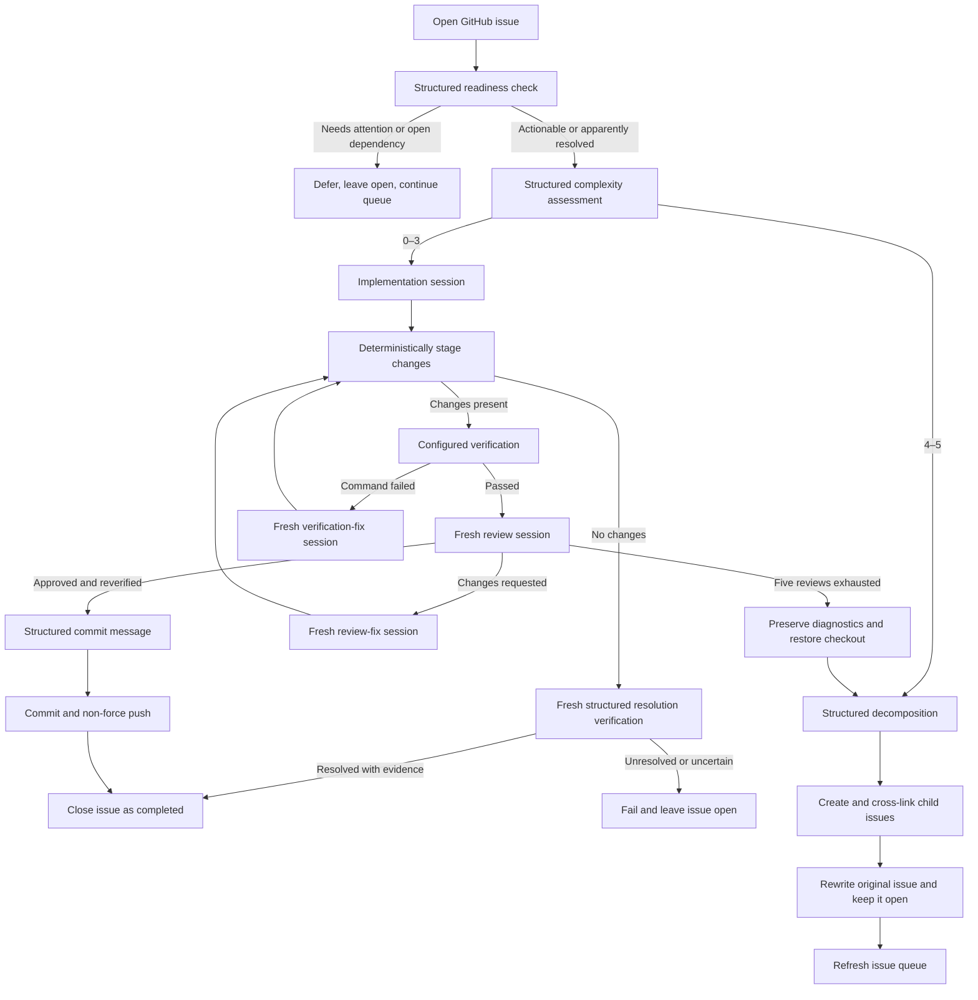
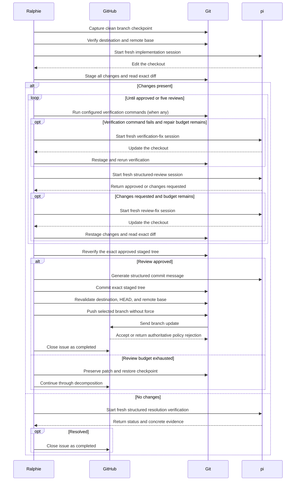
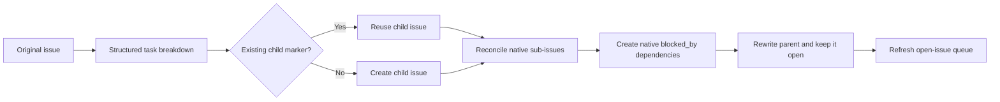

# Workflows

This page is for operators and contributors who need to understand how Ralphie
routes issues, performs implementation and decomposition, and delivers the
result. It is the authoritative description of workflow semantics and diagrams;
see the [documentation index](README.md) for setup, CLI, safety, and recovery
references.

> [!CAUTION]
> Ralphie commits and pushes directly to the selected branch. Read the
> [safety model](safety.md) and validate against a repository you control before
> enabling delivery mutations.

## Routing overview

Before normal execution, every matching open issue is checked by a read-only,
schema-validated grounding session. Actionable issues then receive a complexity
score from 0 through 5. An issue whose prerequisite is still open, or which
otherwise needs human attention, is left open and recorded with its reason
while Ralphie continues with the next queue item, without closing or marking
the issue complete. The grounding prompt pins the exact checked-out commit so
evidence is never mistaken for a newer revision.

## Implementation workflow: complexity 0–3

1. Capture the exact clean branch and commit as an issue checkpoint.
2. Ask a fresh pi session to implement the issue and require a schema-valid
   completion result; prose or premature model termination is not completion.
3. Stage every change deterministically and capture the exact staged diff.
4. Run the configured deterministic verification commands, when any. If a
   command exits non-zero, give its bounded output and the staged diff to a
   fresh fix session, then restage and retry up to five times.
5. Ask a separate session for a schema-validated review after verification
   passes or is skipped (no `--verify-command` configured).
6. If changes are requested, give the review to a fresh fix session and repeat
   staging and review.
7. Stop after approval or five review attempts. Reverify immediately before
   commit; if repair changes an approved tree, review the repaired tree again.
8. Generate a validated commit message — the subject is non-empty and at most
   72 characters, with an optional body — and commit the changes.
9. Recheck the remote and push the commit without force, then close the
   source issue after the push is verified.

When implementation produces no changes, a fresh read-only session must prove
that the current checkout already resolves the issue and return concrete
evidence. A proven resolution is completed and closed. An unresolved result is
fed back to a fresh implementation session for up to
`--implementation-attempts` attempts. Only an exhausted
retry budget fails the issue. If the review budget is
exhausted, Ralphie preserves the patch and review diagnostics, restores the
clean checkpoint, and sends the issue through decomposition.

Grounding's `already_resolved` disposition is tentative. A fresh verifier must
confirm it before completion; an `unresolved` result corrects the route to
actionable, proceeds through complexity assessment, and supplies its summary
and evidence to the first implementation session. Invalid output or verifier
infrastructure failure still fails closed.

The boundary between agent work and deterministic operations stays explicit
throughout the loop:

## Decomposition workflow: complexity 4–5

1. Ask pi to split the issue into the next set of independently actionable
   tasks and declare their dependencies.
2. Create child issues in deterministic order with their stable markers.
3. Attach each created or recovered child to the original issue as a **native
   GitHub sub-issue**, reconciling against GitHub's reported hierarchy.
4. Represent each declared `dependsOn` edge as a **native GitHub
   `blocked_by` dependency** and persist the dependency mapping artifact.
5. Rewrite the original issue as the tracking parent and **keep it open**;
   it is never closed as a duplicate merely because it was decomposed.

Stable markers and persisted child mappings make the workflow retry-safe: a
retry discovers previously created children instead of duplicating them,
and native relationships are reconciled idempotently. Eligible children can
enter the main implementation loop during the same run; the decomposed parent
stays out of the queue because it is a tracking issue, not executable work.

The decomposition pi session is read-only and returns an
`issueBreakdownDecisionSchema` result containing at least two independently
actionable 0–3 children, stable keys, and an acyclic dependency graph. The
breakdown is persisted before the first GitHub mutation.

Each child receives a stable marker containing root, parent, key, and depth.
The positive `--max-decomposition-depth` setting (default `3`) bounds recursive
splitting and is persisted in run state. If direct complexity routing or review
exhaustion would exceed it, Ralphie does not attempt another breakdown: it
leaves the issue open, records `decomposition_limit_reached` needs attention,
and continues independent queued work. The issue is not marked complete, so
its dependents remain blocked.
Ralphie discovers those markers and reconciles them with any persisted mapping
before creating anything. Thus a lost create response or a partial linking
failure does not blindly duplicate children. Creation,
number recording, linking, native sub-issue attachment, dependency creation,
and the parent rewrite are separate mutations; a child already
attached to the wrong parent, or a native relationship that disagrees with a
child's marker, halts with a recovery diagnostic instead of silently
reparenting or duplicating issues.

The decomposed parent remains open as the native tracking issue and exposes
GitHub's completion progress for its sub-issues. It is not queued again, and it
is closed as `completed` only when its child work is finished: completing the
final child reconciles its parent immediately, and every run also
reconciles decomposed parents it discovers or refreshes, so a parent whose
final child closed in a previous run is completed on a later run. The open-issue
queue is refreshed after decomposition; newly eligible children can run during
the same invocation. If dependencies remain open after the queue is exhausted,
Ralphie records each blocked issue as a needs-attention outcome and leaves it
pending instead of handing it to an agent, then drains later work and completes
the run. Blocked issues remain open.

A direct complexity 4–5 route returns `decomposed`. Review exhaustion returns an
`escalated` outcome containing the recovery diagnostic path and, after
successful decomposition, the created child numbers. Both transitions refresh
the queue.

### Platform support for native sub-issues and dependencies

Native sub-issues and `blocked_by` dependencies are GitHub REST features required
for decomposition. Ralphie's current GitHub client targets `github.com` only;
GitHub Enterprise Server is not supported. There is **no body-link fallback**:
Ralphie never silently degrades to body-only hierarchy semantics.

- Creating, recovering, or linking children fails with an actionable error
  naming the missing platform capability when an endpoint is unavailable or the
  token lacks issue write permission.
- The compatibility check is per live operation: the first relationship read or
  write against an unsupported endpoint surfaces the error.
- Recovery metadata (stable markers and the persisted key/dependency mappings)
  remains the idempotency record, so a run can continue after a recoverable
  relationship failure without blindly duplicating children.
- To verify the required `github.com` endpoints before a live run:
  `gh api repos/{owner}/{repo}/issues/1/sub_issues` and
  `gh api repos/{owner}/{repo}/issues/1/dependencies/blocked_by` should return
  `200` (an empty list) rather than `404`.

## Delivery

| Issue checkout | Delivery | Source issue closure |
| --- | --- | --- |
| Selected base branch | Commit and non-force push directly to that branch; verify remote SHA and clean checkout | Close directly as `completed` after verified delivery. |

The direct-push path never uses force. A push rejection is authoritative: the
created commit and artifacts are retained, the run halts, and a later run
re-evaluates the still-open issue from a fresh checkout. Inspect the retained
workspace before the next run removes it.

## Queue behavior

Issue work is sequential. With the default `created:asc` sort, issues are
processed oldest-first. When no branch is configured, Ralphie uses `main` when
it exists and otherwise `master`.

For command syntax and all defaults, see the [CLI reference](cli-reference.md).
For workspace, Git, and GitHub guardrails, see [Safety](safety.md). For
interruption and failure boundaries, see
[Operations and recovery](operations-and-recovery.md).
