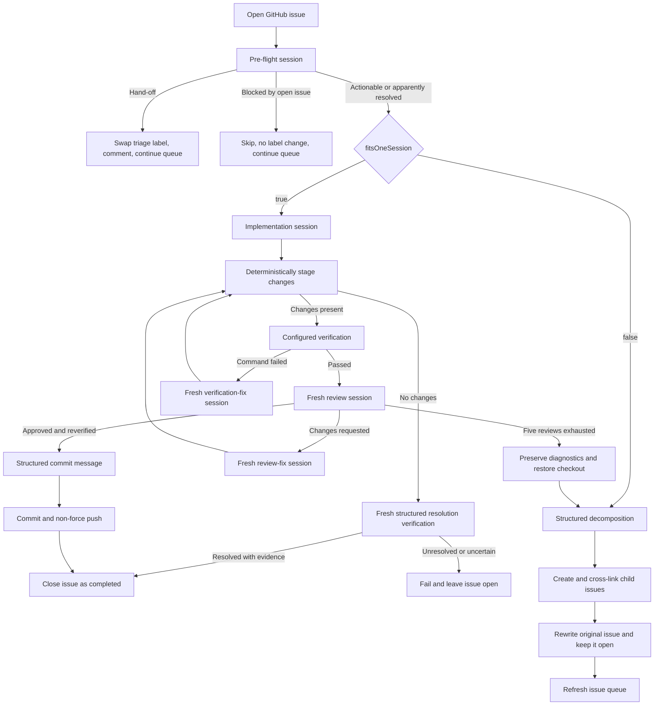
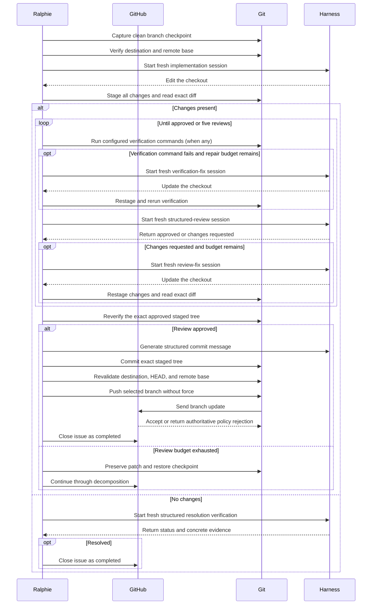
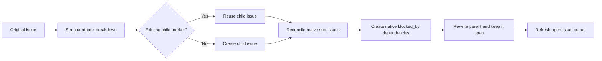

# Workflows

This page is for operators and contributors who need to understand how Ralphie
routes issues, performs implementation and decomposition, and delivers the
result. It is the authoritative description of workflow semantics and diagrams;
see the [documentation index](README.md) for setup, CLI, safety, and recovery
references.

> [!CAUTION]
> Ralphie commits and pushes directly to the selected branch. Read the
> [safety model](safety.md) and validate against a repository you control before
> enabling delivery mutations.

## Routing overview

### Intake

Ralphie processes open issues that carry the label `labels.ready-for-agent`
maps to (default `ready-for-agent`) and every label listed in
`intake.requireLabels`. Issues without them are never read.

### Pre-flight

Each issue gets exactly one read-only, schema-validated `preflight` session.
It returns one disposition:

- `actionable` with `fitsOneSession`: `true` routes to implementation, `false`
  routes to decomposition.
- `already_resolved`: tentative; see below.
- `blocked` with the numbers of the open issues it waits on: the issue is
  skipped for this run with no label or other GitHub change, and is picked up
  again on a later run once the blockers close.
- `hand_off` with a reason, evidence and questions: the issue is handed
  off (see [Hand-offs](#hand-offs)) while Ralphie continues with the next
  queue item.

The prompt pins the exact checked-out commit so evidence is never mistaken for
a newer revision. An actionable result is retained as an artifact, so a
restart does not repeat the session.

```mermaid
flowchart TD
    A[Open GitHub issue] --> Z[Pre-flight session]
    Z -->|Hand-off| Y[Swap triage label, comment, continue queue]
    Z -->|Blocked by open issue| W[Skip, no label change, continue queue]
    Z -->|Actionable or apparently resolved| B{fitsOneSession}
    B -->|true| C[Implementation session]
    C --> D[Deterministically stage changes]
    D -->|Changes present| V[Configured verification]
    V -->|Passed| E[Fresh review session]
    V -->|Command failed| R[Fresh verification-fix session]
    R --> D
    D -->|No changes| N[Fresh structured resolution verification]
    N -->|Resolved with evidence| O[Close issue as completed]
    N -->|Unresolved or uncertain| P[Fail and leave issue open]
    E -->|Approved and reverified| F[Structured commit message]
    E -->|Changes requested| G[Fresh review-fix session]
    G --> D
    E -->|Five reviews exhausted| H[Preserve diagnostics and restore checkout]
    B -->|false| I[Structured decomposition]
    H --> I
    I --> J[Create and cross-link child issues]
    J --> K[Rewrite original issue and keep it open]
    K --> L[Refresh issue queue]
    F --> M[Commit and non-force push]
    M --> O
```

## Implementation workflow

1. Capture the exact clean branch and commit as an issue checkpoint.
2. Ask a fresh `implementer` session to run the vendored `/implement` skill
   (which drives `/tdd`) with an overlay: do not commit, leave changes in the
   working tree, skip the closing code review. The session must return
   `{status: done | needs_attention, summary, commitMessage, needsAttention?}`;
   prose or premature model termination is not completion. A `needs_attention`
   result is routed as a hand-off request. The latest issue comment that starts
   with `## Agent Brief` is the contract: it is included in full and is exempt
   from comment trimming, with the body and other comments as background.
   Without a brief the issue body is the contract.
3. Stage every change deterministically and capture the exact staged diff.
4. Run the configured deterministic verification commands, when any. If a
   command exits non-zero, give its bounded output and the staged diff to a
   fresh fix session, then restage and retry up to `limits.verificationFixes` times (default five).
5. After verification passes or is skipped (no `verify` commands configured),
   create a local candidate commit on top of the checkpoint. Candidate commits
   are never pushed.
6. Run the review gate: a standards reviewer and a spec reviewer start in
   parallel as read-only sessions on the checkpoint-to-candidate range, using
   the vendored `/code-review` axes. Read-only Claude sessions have no shell,
   so Ralphie puts the fixed point, commit list and range diff in each prompt;
   the reviewers read other files with their file tools. The standards reviewer
   gets the repository's standards sources (`AGENTS.md`, `CLAUDE.md`,
   `CONTRIBUTING.md`, `CODING_STANDARDS.md`, `GLOSSARY.md`, `docs/adr`,
   `docs/agents`) and the smell baseline; the spec reviewer gets the Agent
   Brief, or the issue body when there is none. Each returns structured
   findings and Ralphie computes the verdict. A hard documented-standard
   violation and any missing, partial, wrong or scope-creep spec finding
   block. Smells never block.
7. If the gate blocks, give the findings to a fresh fix session, restage,
   reverify and add another candidate commit, then review again.
8. Stop after approval or `limits.reviewRounds` review attempts (default five).
   On approval, squash all candidate commits (soft reset to the checkpoint)
   and reverify the final tree. If repair changes the approved tree, review the
   repaired tree again.
9. Create the single issue commit with the implementer's commit message,
   validated when the result is received (subject non-empty and at most 72
   characters, optional body). No separate commit-message session runs. Exactly
   one created commit is delivered per issue.
10. Recheck the remote and push the commit without force, then close the
   source issue after the push is verified.

When implementation produces no changes, a fresh read-only session must prove
that the current checkout already resolves the issue and return concrete
evidence. A proven resolution is completed and closed. An unresolved result is
fed back to a fresh implementation session for up to
`limits.implementationAttempts` attempts. Only an exhausted
retry budget fails the issue. If the review budget is
exhausted, Ralphie preserves the patch and review diagnostics, restores the
clean checkpoint, and sends the issue through decomposition.

Pre-flight's `already_resolved` disposition is tentative. A fresh verifier must
confirm it before completion; an `unresolved` result corrects the route to
actionable, proceeds to implementation, and supplies its summary
and evidence to the first implementation session. Invalid output or verifier
infrastructure failure still fails closed.

The boundary between agent work and deterministic operations stays explicit
throughout the loop:

```mermaid
sequenceDiagram
    participant R as Ralphie
    participant GH as GitHub
    participant G as Git
    participant P as Harness

    R->>G: Capture clean branch checkpoint
    R->>G: Verify destination and remote base
    R->>P: Start fresh implementation session
    P-->>R: Edit the checkout
    R->>G: Stage all changes and read exact diff

    alt Changes present
        loop Until approved or five reviews
            R->>G: Run configured verification commands (when any)
            opt Verification command fails and repair budget remains
                R->>P: Start fresh verification-fix session
                P-->>R: Update the checkout
                R->>G: Restage and rerun verification
            end
            R->>P: Start fresh structured-review session
            P-->>R: Return approved or changes requested
            opt Changes requested and budget remains
                R->>P: Start fresh review-fix session
                P-->>R: Update the checkout
                R->>G: Restage changes and read exact diff
            end
        end
        R->>G: Reverify the exact approved staged tree
    alt Review approved
            R->>P: Generate structured commit message
            R->>G: Commit exact staged tree
            R->>G: Revalidate destination, HEAD, and remote base
            R->>G: Push selected branch without force
            G->>GH: Send branch update
            GH-->>G: Accept or return authoritative policy rejection
            R->>GH: Close issue as completed
        else Review budget exhausted
            R->>G: Preserve patch and restore checkpoint
            R->>GH: Continue through decomposition
        end
    else No changes
        R->>P: Start fresh structured resolution verification
        P-->>R: Return status and concrete evidence
        opt Resolved
            R->>GH: Close issue as completed
        end
    end
```

## Hand-offs

Anything that needs a human becomes a hand-off, and hand-offs are always on.
Ralphie replaces the issue's triage state label (the issue ends with exactly
one of the five, named by the `labels` mapping), posts one comment that
starts with the AI disclaimer `> *This was generated by AI during triage.*`,
and records a `hand-off` outcome. Because the issue no longer carries the
agent-ready label, the next run's intake skips it until a human relabels it.

| Reason | State label | Comment |
| --- | --- | --- |
| `missing_information`, `conflicting_requirements`, `cannot_reproduce`, `outdated_premise` | `needs-info` | Triage Notes: what was established, what is still needed from the reporter. |
| `implementation_exhausted` (implementation attempts or verification repairs ran out) | `ready-for-human` | `## Hand-off` write-up: reason, summary, what was tried, what a human must decide, and the diagnostics location. |
| `decomposition_limit_reached` (review never converged at the depth limit) | `ready-for-human` | Same write-up. |
| `external_dependency` reported by a session | `ready-for-human` | Same write-up. |

Exhausted attempts preserve a diagnostic patch and restore the clean checkout
before the hand-off, like the other recovery paths. An open-blocker skip (from
pre-flight or from queue order) is not a hand-off and changes nothing on
GitHub. The write-up deliberately avoids the `## Agent Brief` heading, which
marks the contract an implementer works from. The recovery details are in
[Operations and recovery](operations-and-recovery.md#hand-off-handling).

## Decomposition workflow

1. Ask a `decomposer` session to split the issue into the next set of independently actionable
   tasks and declare their dependencies.
2. Create child issues in deterministic order with their stable markers.
3. Attach each created or recovered child to the original issue as a **native
   GitHub sub-issue**, reconciling against GitHub's reported hierarchy.
4. Represent each declared `dependsOn` edge as a **native GitHub
   `blocked_by` dependency** and persist the dependency mapping artifact.
5. Rewrite the original issue as the tracking parent and **keep it open**;
   it is never closed as a duplicate merely because it was decomposed.

Stable markers and persisted child mappings make the workflow retry-safe: a
retry discovers previously created children instead of duplicating them,
and native relationships are reconciled idempotently. Eligible children can
enter the main implementation loop during the same run; the decomposed parent
stays out of the queue because it is a tracking issue, not executable work.

```mermaid
flowchart LR
    A[Original issue] --> B[Structured task breakdown]
    B --> C{Existing child marker?}
    C -->|Yes| D[Reuse child issue]
    C -->|No| E[Create child issue]
    D --> F[Reconcile native sub-issues]
    E --> F
    F --> G[Create native blocked_by dependencies]
    G --> H[Rewrite parent and keep it open]
    H --> I[Refresh open-issue queue]
```

The decomposition session is read-only and returns an
`issueBreakdownDecisionSchema` result containing at least two independently
actionable 0–3 children, stable keys, and an acyclic dependency graph. The
breakdown is persisted before the first GitHub mutation.

Each child receives a stable marker containing root, parent, key, and depth.
The positive `limits.maxDecompositionDepth` setting (default `3`) bounds recursive
splitting and is persisted in run state. If direct pre-flight routing or review
exhaustion would exceed it, Ralphie does not attempt another breakdown: it
hands the issue off as `ready-for-human` with reason
`decomposition_limit_reached` and continues independent queued work. The
issue is not marked complete, so its dependents remain blocked.
Ralphie discovers those markers and reconciles them with any persisted mapping
before creating anything. Thus a lost create response or a partial linking
failure does not blindly duplicate children. Creation,
number recording, linking, native sub-issue attachment, dependency creation,
and the parent rewrite are separate mutations; a child already
attached to the wrong parent, or a native relationship that disagrees with a
child's marker, halts with a recovery diagnostic instead of silently
reparenting or duplicating issues.

The decomposed parent remains open as the native tracking issue and exposes
GitHub's completion progress for its sub-issues. It is not queued again, and it
is closed as `completed` only when its child work is finished: completing the
final child reconciles its parent immediately, and every run also
reconciles decomposed parents it discovers or refreshes, so a parent whose
final child closed in a previous run is completed on a later run. The open-issue
queue is refreshed after decomposition; newly eligible children can run during
the same invocation. If dependencies remain open after the queue is exhausted,
Ralphie records each blocked issue as a skipped outcome naming its open
blockers and leaves it pending instead of handing it to an agent, then drains
later work and completes the run. Blocked issues remain open and keep their
labels.

A pre-flight `fitsOneSession: false` route returns `decomposed`. Review exhaustion returns an
`escalated` outcome containing the recovery diagnostic path and, after
successful decomposition, the created child numbers. Both transitions refresh
the queue.

### Platform support for native sub-issues and dependencies

Native sub-issues and `blocked_by` dependencies are GitHub REST features required
for decomposition. Ralphie's current GitHub client targets `github.com` only;
GitHub Enterprise Server is not supported. There is **no body-link fallback**:
Ralphie never silently degrades to body-only hierarchy semantics.

- Creating, recovering, or linking children fails with an actionable error
  naming the missing platform capability when an endpoint is unavailable or the
  token lacks issue write permission.
- The compatibility check is per live operation: the first relationship read or
  write against an unsupported endpoint surfaces the error.
- Recovery metadata (stable markers and the persisted key/dependency mappings)
  remains the idempotency record, so a run can continue after a recoverable
  relationship failure without blindly duplicating children.
- To verify the required `github.com` endpoints before a live run:
  `gh api repos/{owner}/{repo}/issues/1/sub_issues` and
  `gh api repos/{owner}/{repo}/issues/1/dependencies/blocked_by` should return
  `200` (an empty list) rather than `404`.

## Delivery

| Issue checkout | Delivery | Source issue closure |
| --- | --- | --- |
| Selected base branch | Commit and non-force push directly to that branch; verify remote SHA and clean checkout | Close directly as `completed` after verified delivery. |

The direct-push path never uses force. A push rejection is authoritative: the
created commit and artifacts are retained, the run halts, and a later run
re-evaluates the still-open issue from a fresh checkout. Inspect the retained
workspace before the next run removes it.

## Queue behavior

Issue work is sequential. With the default `created:asc` sort, issues are
processed oldest-first. When no branch is configured, Ralphie uses `main` when
it exists and otherwise `master`.

For command syntax and all defaults, see the [CLI reference](cli-reference.md).
For workspace, Git, and GitHub guardrails, see [Safety](safety.md). For
interruption and failure boundaries, see
[Operations and recovery](operations-and-recovery.md).
